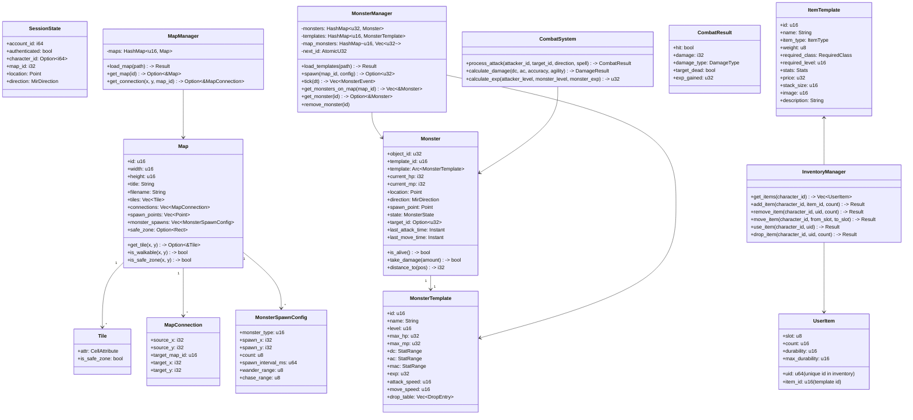
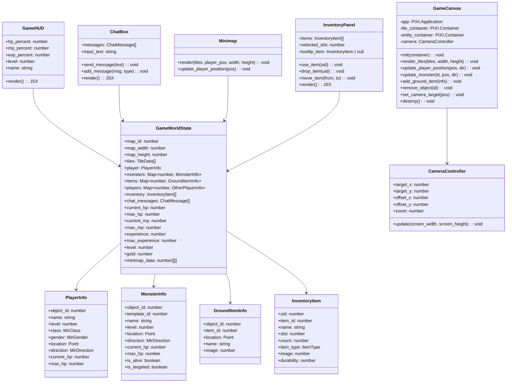
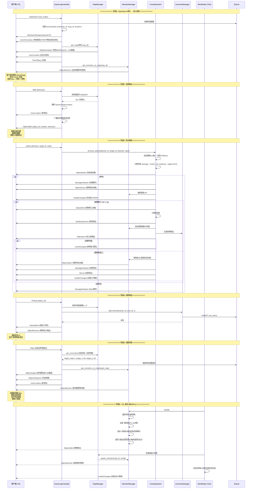
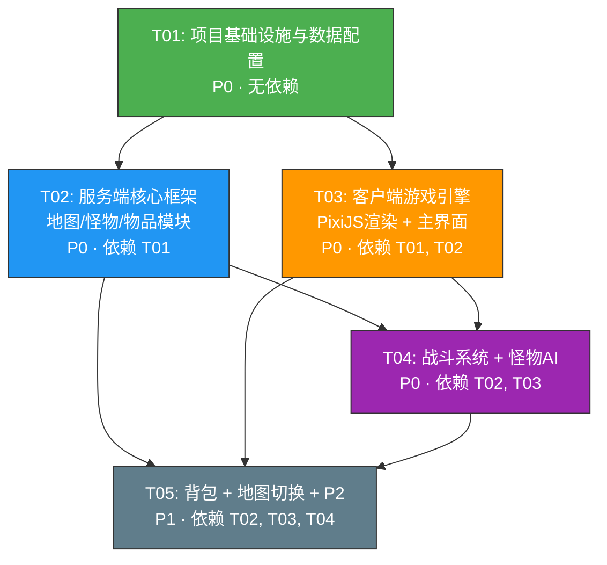

# Crystal Mir2 — 核心玩法系统架构设计 + 任务分解

> **作者**: Bob (Architect)  
> **项目**: Crystal Mir2 — 从零复刻经典《热血传奇》MMORPG  
> **阶段**: T03 — 核心玩法系统 (地图/怪物/战斗/背包/切换)  
> **日期**: 2025-07  
> **状态**: 定稿

---

## 目录

1. [Part A: 系统设计](#part-a-系统设计)
   - [1. 实现方案](#1-实现方案)
   - [2. 文件列表](#2-文件列表)
   - [3. 数据结构和接口（类图）](#3-数据结构和接口类图)
   - [4. 程序调用流程（时序图）](#4-程序调用流程时序图)
   - [5. 待明确事项](#5-待明确事项)
2. [Part B: 任务分解](#part-b-任务分解)
   - [6. 依赖包列表](#6-依赖包列表)
   - [7. 任务列表](#7-任务列表)
   - [8. 共享知识](#8-共享知识)
   - [9. 任务依赖图](#9-任务依赖图)

---

# Part A: 系统设计

---

## 1. 实现方案

### 1.1 核心技术挑战

| 挑战 | 说明 | 解决策略 |
|------|------|----------|
| **地图数据量大** | 一张地图可达 100×100 = 10000 tiles，每个 tile 有 CellAttribute + 安全区标记 | JSON 全量加载，服务端启动时一次性解析，StartGame 后通过 `MapInformation` 包推送 tile 数据 |
| **怪物 AI 实时性** | 每个怪物需独立巡逻/追击/返回行为，但性能不能过度消耗 | Tick-based（200ms/tick），每 tick 遍历活跃怪物执行简单有限状态机（FSM），仅处理玩家附近（<20格）的怪物 |
| **战斗同步** | 攻击必须防作弊（验证距离/方向/冷却），且流畅反馈 | 客户端发起 → 服务端严格验证 → 批量广播结果包（ObjectAttack + DamageIndicator + Struck） |
| **背包持久化** | 背包操作频繁（捡/用/丢/整理），需原子性操作 | 使用 SQLite 事务，背包操作先更新内存缓存再异步 flush 到 DB，仅在关键节点（切地图/登出）强制落盘 |

### 1.2 框架选型

#### Rust 服务端

| 组件 | 技术选型 | 理由 |
|------|----------|------|
| **异步运行时** | Tokio（已有） | 项目已配置，actor 模型天然适合游戏服务器 |
| **二进制序列化** | binrw（已有） | Shared crate 中所有枚举已 derive BinRead/BinWrite |
| **数据库** | SQLx + SQLite（已有） | 沿用现有方案，背包/角色数据直接持久化 |
| **JSON 解析** | serde_json（已有） | workspace 已依赖，用于加载地图/怪物/物品 JSON 配置文件 |
| **随机数** | fastrand（已有 - 在 types.rs 的 StatRange 中使用） | 轻量随机，用于伤害波动和掉落概率 |
| **地图格式** | JSON（自定义，参照 Tiled Map Editor 风格） | 人类可读、易调试，后续可迁移到 Tiled `.json` 导出格式 |
| **怪物/物品模板** | JSON 配置文件 | 数据驱动，修改无需重新编译 |

#### TypeScript 客户端

| 组件 | 技术选型 | 理由 |
|------|----------|------|
| **UI 框架** | React 19 + MUI v6（已有） | 现有组件体系，HUD/面板/对话框复用 MUI |
| **2D 渲染** | **PixiJS v8**（已在 package.json 中） | 比原始 Canvas 2D API 提供更高效的 tile 渲染、精灵管理和摄像机控制 |
| **状态管理** | React hooks + useReducer（现有 useGameState 模式） | 轻量、无额外依赖，沿用现有 hook 模式 |
| **布局** | Tailwind CSS + MUI sx（已有） | 用于 HUD 面板/按钮/覆盖层布局，Canvas 渲染由 PixiJS 负责 |

### 1.3 架构模式

```
┌──────────────────────────────────────────────────────────┐
│                    客户端 (TypeScript)                      │
│  ┌──────────┐  ┌──────────┐  ┌──────────┐  ┌──────────┐  │
│  │ GamePage  │  │ GameHUD  │  │ GameCanvas│  │  Panels  │  │
│  │ (路由入口)│  │(状态条+  │  │(PixiJS)  │  │(背包/角色│  │
│  │          │  │ 聊天+按钮)│  │(地图+单位)│  │ /技能)   │  │
│  └────┬─────┘  └────┬─────┘  └────┬─────┘  └────┬─────┘  │
│       │              │             │              │        │
│       └──────────────┴─────────────┴──────────────┘        │
│                          │                                  │
│                   useGameWorld Hook                         │
│                    (游戏状态管理)                             │
│                          │                                  │
│                   useConnection Hook                        │
│                 (WebSocket + Packet 派发)                    │
└──────────────────────────┬───────────────────────────────┘
                           │ WebSocket Binary
                           │ [PacketID:u16][Len:u16][Payload]
┌──────────────────────────┴───────────────────────────────┐
│                    服务端 (Rust + Tokio)                    │
│                                                           │
│  ┌───────────────┐   ┌───────────────┐                    │
│  │ PacketRouter   │   │ SessionManager│                    │
│  │ (注册表分发)   │   │ (连接管理)    │                    │
│  └───────┬───────┘   └───────┬───────┘                    │
│          │                    │                            │
│  ┌───────┴───────────────────┴───────┐                    │
│  │        GameLogicHandler            │                    │
│  │   (所有游戏包处理函数入口)           │                    │
│  └───────┬───────┬───────┬───────┬───┘                    │
│          │       │       │       │                        │
│  ┌───────┴┐ ┌────┴────┐ ┌┴──────┐ ┌┴────────┐            │
│  │ Map    │ │ Monster │ │Combat │ │ Item     │            │
│  │Manager │ │Manager  │ │System │ │Manager   │            │
│  │(加载/  │ │(刷新/AI)│ │(伤害/ │ │(模板/背  │            │
│  │ 阻挡/  │ │         │ │ 死亡) │ │ 包/掉落) │            │
│  │ 切换)  │ │         │ │       │ │          │            │
│  └────────┘ └─────────┘ └───────┘ └──────────┘            │
│                                                           │
│  ┌──────────────────────────────────────────────────┐     │
│  │              WorldState (全局 Tick 驱动)           │     │
│  │   每 200ms 触发: 怪物AI → 刷新检查 → 安全区回血   │     │
│  └──────────────────────────────────────────────────┘     │
│                                                           │
│  ┌──────────┐  ┌─────────────────┐  ┌────────────────┐   │
│  │ SQLite   │  │ data/maps/*.json│  │ data/monsters  │   │
│  │(角色/背包│  │ (地图数据)       │  │ .json (模板)   │   │
│  │ 存档)    │  │                 │  │ data/items.json│   │
│  └──────────┘  └─────────────────┘  └────────────────┘   │
└──────────────────────────────────────────────────────────┘
```

### 1.4 怪物 AI 有限状态机

```
              ┌─────────────┐
              │   Idle(出生) │
              └──────┬──────┘
                     │ spawn timer
              ┌──────▼──────┐
              │   Patrol    │ ◄───────┐
              │ (随机走动)   │         │
              └──────┬──────┘         │
                     │ 玩家进入警戒范围  │ 超出返回半径
              ┌──────▼──────┐         │
              │   Chase     │─────────┘
              │ (追击玩家)   │
              └──────┬──────┘
                     │ 近战攻击距离
              ┌──────▼──────┐
              │   Attack    │
              │ (攻击玩家)   │
              └──────┬──────┘
                     │ HP ≤ 0
              ┌──────▼──────┐
              │    Dead     │ → 延迟 → 回到 Idle(重生)
              └─────────────┘
```

---

## 2. 文件列表

### 2.1 共享库 (Shared crate)

| 文件 | 操作 | 说明 |
|------|------|------|
| `Shared/src/packets/server.rs` | **修改** | 新增: ObjectMonsterPacket, ObjectAttackPacket, StruckPacket, ObjectStruckPacket, DamageIndicatorPacket, HealthChangedPacket, DeathPacket, ObjectDiedPacket, GainExperiencePacket, LevelChangedPacket, MapChangedPacket, ObjectTeleportInPacket, ObjectItemPacket, GainedItemPacket, UserInformationPacket, ObjectWalkPacket |
| `Shared/src/packets/client.rs` | **修改** | 新增: PickUpPacket (已有占位，确认完整), UseItemPacket, DropItemPacket, MoveItemPacket (已有占位，确认完整) |
| `Shared/src/lib.rs` | 不改 | 现有 pub mod 自动包含新包 |

### 2.2 服务端 (Server)

| 文件 | 操作 | 说明 |
|------|------|------|
| `Server/src/lib.rs` | **修改** | 新增 `pub mod map; pub mod monster; pub mod combat; pub mod item; pub mod game;` |
| `Server/src/config.rs` | **修改** | ServerConfig 扩展 `game` 部分: map_dir, monster_data_path, item_data_path, tick_rate_ms(已有) |
| `Server/src/database/mod.rs` | **修改** | 新增迁移: inventory 表, storage 表 |
| `Server/src/database/models.rs` | **修改** | 新增: UserItem (背包物品模型), InventorySlot 等 |
| `Server/src/database/repository.rs` | **修改** | 新增: InventoryRepository (背包CRUD) |
| `Server/src/network/handler.rs` | **修改** | GameLogicHandler 全面升级：替换所有桩实现为真实逻辑，注册 Walk/Run/Attack/Chat/Turn/PickUp/MoveItem/UseItem/DropItem handler |
| `Server/src/network/mod.rs` | **修改** | 新增 `pub mod` 引用（如需要） |
| `Server/src/network/session_manager.rs` | **修改** | 扩展 SessionState: 添加 `character_id`, `map_id`, `location` 等字段（现有已有 character_id，补充 map/location） |
| `Server/src/map/mod.rs` | **新建** | `MapManager` (地图注册表), `Map` (单张地图数据), `MapConnection` (连接点) |
| `Server/src/map/loader.rs` | **新建** | JSON 地图加载器: 解析地图文件 → Map struct |
| `Server/src/monster/mod.rs` | **新建** | `MonsterManager` (怪物注册表/刷新调度), `Monster` (运行时怪物实例), `MonsterTemplate` (模板) |
| `Server/src/monster/spawner.rs` | **新建** | 按地图配置定时刷新怪物 |
| `Server/src/monster/ai.rs` | **新建** | 怪物 AI: 巡逻(Patrol)/追击(Chase)/返回(Return) 有限状态机 |
| `Server/src/combat/mod.rs` | **新建** | 攻击处理入口: 验证距离/冷却 → 执行伤害 → 广播结果 + 处理死亡 |
| `Server/src/combat/damage.rs` | **新建** | 伤害公式: 物理伤害/命中判定/经验计算 |
| `Server/src/item/mod.rs` | **新建** | `ItemManager` (物品模板注册表), 物品模板定义 |
| `Server/src/item/inventory.rs` | **新建** | 背包操作: add_item, remove_item, move_item, use_item, drop_item |
| `Server/src/item/drops.rs` | **新建** | 掉落表: 配置驱动 → 概率计算 → 生成掉落物品 |
| `Server/src/game/mod.rs` | **新建** | `WorldState` (全局游戏世界状态), 全局 tick 循环 (驱动怪物 AI + 刷新 + 安全区回血) |

### 2.3 数据文件 (data/)

| 文件 | 操作 | 说明 |
|------|------|------|
| `Server/data/maps/map_0.json` | **新建** | 新手村地图 (30×30): 建筑/围墙/空地/安全区/出生点/连接点 |
| `Server/data/maps/map_1.json` | **新建** | 野外练级地图 (50×50): 草地/树林/阻挡/怪物刷新区/连接点 |
| `Server/data/monsters.json` | **新建** | 怪物模板: 稻草人(Scarecrow), 鹿(Deer), 半兽人(Oma), 毒蜘蛛(Spider) |
| `Server/data/items.json` | **新建** | 物品模板: 金创药(HP药水), 魔法药(MP药水), 基本武器/防具等 |

### 2.4 客户端 (Client)

| 文件 | 操作 | 说明 |
|------|------|------|
| `Client/src/App.tsx` | **修改** | GamePage 从占位改为真实组件 |
| `Client/src/components/GamePage.tsx` | **新建** | 游戏主界面: 组合 GameCanvas + GameHUD + Minimap + Panels |
| `Client/src/components/GameCanvas.tsx` | **新建** | PixiJS 游戏场景: tile 地图渲染 + 玩家/怪物/NPC 精灵 + 摄像机跟随 |
| `Client/src/components/GameHUD.tsx` | **新建** | 顶部 HUD: 角色名/等级/HP条/MP条/经验条/设置按钮 |
| `Client/src/components/ChatBox.tsx` | **新建** | 聊天框: 消息列表 + 输入框 + 发送 |
| `Client/src/components/ActionBar.tsx` | **新建** | 功能按钮栏: 背包/角色/技能/设置按钮 |
| `Client/src/components/Minimap.tsx` | **新建** | 小地图: Canvas 缩略图 + 玩家位置标记 |
| `Client/src/components/InventoryPanel.tsx` | **新建** | 背包面板: 6×8 网格 + 物品图标 + Tooltip |
| `Client/src/components/CharacterPanel.tsx` | **新建** | 角色面板: 装备槽 + 属性数值 |
| `Client/src/components/SettingsPanel.tsx` | **新建** | 设置面板: 音效/画面/退出 (占位) |
| `Client/src/components/SkillPanel.tsx` | **新建** | 技能面板 (占位) |
| `Client/src/hooks/useGameWorld.ts` | **新建** | 核心游戏 Hook: 管理地图/玩家/怪物/物品状态 + 网络包处理 |
| `Client/src/network/packets/server_packets.ts` | **修改** | 新增解析器: ObjectMonster, ObjectAttack, Struck, ObjectStruck, DamageIndicator, HealthChanged, Death, ObjectDied, GainExperience, LevelChanged, MapChanged, ObjectTeleportIn, ObjectItem, GainedItem, UserInformation, ObjectWalk |
| `Client/src/network/packets/client_packets.ts` | **修改** | 新增: UseItemClientPacket, DropItemClientPacket, PickUpClientPacket (完善) |
| `Client/src/types/enums.ts` | **修改** | 确保所有游戏相关枚举 (MonsterType 等) 已在 |

---

## 3. 数据结构和接口（类图）

### 3.1 服务端核心数据结构



### 3.2 客户端核心数据结构



### 3.3 新增服务端包定义

```mermaid
classDiagram
    class UserInformationPacket {
        +object_id: u32
        +name: String
        +class: MirClass
        +gender: MirGender
        +level: u16
        +hp: u32
        +mp: u32
        +max_hp: u32
        +max_mp: u32
        +experience: u64
        +max_experience: u64
        +gold: u64
        +location: Point
        +direction: MirDirection
    }

    class ObjectMonsterPacket {
        +object_id: u32
        +monster_id: u16
        +name: String
        +level: u16
        +location: Point
        +direction: MirDirection
        +max_hp: u32
        +current_hp: u32
    }

    class ObjectAttackPacket {
        +object_id: u32
        +direction: MirDirection
        +spell: Spell
    }

    class StruckPacket {
        +damage: i32
        +damage_type: DamageType
    }

    class ObjectStruckPacket {
        +object_id: u32
        +damage: i32
        +damage_type: DamageType
    }

    class DamageIndicatorPacket {
        +object_id: u32
        +damage: i32
        +damage_type: DamageType
    }

    class HealthChangedPacket {
        +hp: u32
        +mp: u32
        +max_hp: u32
        +max_mp: u32
    }

    class DeathPacket {
        +experience_lost: u32
        +gold_lost: u32
    }

    class ObjectDiedPacket {
        +object_id: u32
        +monster_id: u16
    }

    class GainExperiencePacket {
        +exp_amount: u32
        +total_exp: u64
    }

    class LevelChangedPacket {
        +level: u16
        +max_hp: u32
        +max_mp: u32
    }

    class MapChangedPacket {
        +map_id: u16
        +width: u16
        +height: u16
        +title: String
        +filename: String
    }

    class ObjectTeleportInPacket {
        +object_id: u32
        +location: Point
        +direction: MirDirection
    }

    class ObjectItemPacket {
        +object_id: u32
        +item_id: u16
        +location: Point
        +count: u16
    }

    class GainedItemPacket {
        +item_id: u16
        +count: u16
        +inventory_slot: u8
    }

    class ObjectWalkPacket {
        +object_id: u32
        +location: Point
        +direction: MirDirection
    }
```



---

## 4. 程序调用流程（时序图）

### 4.1 完整游戏流程: StartGame → 进入地图 → 移动 → 攻击 → 拾取 → 地图切换



---

## 5. 待明确事项

| 编号 | 问题 | 影响模块 | 决策 |
|------|------|----------|------|
| Q-01 | **地图 JSON 格式的详细 schema？** 是否需要完全兼容 Tiled Map Editor 的 .json 导出格式？ | 地图系统 | **采用 Tiled 兼容格式**。Tiled 导出为 `{width, height, layers[{data[]}], tilesets[]}`，`data` 数组使用 2D 索引编码 tile ID，阻挡/安全区可通过自定义 tile 属性或额外字段标记。这样便于使用 Tiled 编辑地图 |
| Q-02 | **地图首次加载方式？** StartGame 时推送全量 tile 数据还是分块加载？小地图数据是否单独推送？ | 地图系统、游戏主界面 | **StartGame 时全量推送**（MVP 阶段地图 ≤ 100×100 = 10000 tiles，数据约 20KB-40KB）。小地图由客户端从 tile 数据采样生成，无需单独推送 |
| Q-03 | **Tile 渲染资源？** 使用纯色方块还是准备基础 sprite 图？ | 客户端渲染 | **MVP 阶段使用 PixiJS 绘图生成彩色方块**：草地=绿、道路=棕、墙壁=灰、水=蓝、安全区=淡绿。后续接入 sprite sheet |
| Q-04 | **怪物攻击 AI 行为？** 近战怪物是"走到玩家身边+攻击"还是简化版？ | 怪物系统、战斗系统 | **MVP 实现近战怪物**：追击→近战距离停止→攻击。远程怪物延后到 P2。怪物攻击频率 1-2秒/次 |
| Q-05 | **伤害公式的具体参数？** 直接使用 PRD 提供的简化版？ | 战斗系统 | **使用 PRD 公式**：物理伤害 = max(1, DC.random() - AC/2)。命中判定：准确度 vs 敏捷度（简化：命中率 = min(95, 50 + (accuracy - agility) × 5)%） |
| Q-06 | **物品图标资源？** 开发阶段使用什么占位？ | 背包系统 | **使用 emoji 占位**：武器🗡️、防具🛡️、药水🧪、金币💰、材料📦。正式资源后替换 |
| Q-07 | **初始地图数量？** MVP 阶段配置几张？ | 地图系统 | **至少 2 张**：map_0 新手村（安全区+NPC 占位）+ map_1 野外练级地图（怪物刷新+连接点）。满足地图切换测试需求 |
| Q-08 | **背包 UI 操作方式？** 拖拽还是右键菜单？ | 背包系统 | **MVP 使用点击选中+按钮操作**：点击物品选中 → 使用/丢弃按钮。拖拽整理延后到 P2 |
| Q-09 | **同地图其他玩家的可见范围？** 全地图广播还是视野限制？ | 网络同步 | **MVP 全地图广播**（简单实现，≤50 同时在线时性能可接受）。视野限制延后 |
| Q-10 | **游戏循环 Tick 速率？** | 怪物系统 | **200ms/tick**（5 tick/s），配置在 `GameConfig.tick_rate_ms` 中，运行时可通过配置调整 |

---

# Part B: 任务分解

---

## 6. 依赖包列表

### 6.1 Rust 服务端 (Cargo.toml — workspace 级别)

所有依赖已在 `Cargo.toml` workspace 中声明：
- `serde_json` — 已存在，用于 JSON 地图/怪物/物品配置文件解析
- `fastrand` — 已存在（在 types.rs StatRange 中使用），用于伤害随机/掉落概率

**无需新增任何 Rust crate 依赖。**

### 6.2 TypeScript 客户端 (Client/package.json)

| 包名 | 版本 | 状态 | 用途 |
|------|------|------|------|
| `pixi.js` | ^8.0.0 | **已有** | 2D 游戏引擎：tile 地图渲染、精灵管理、摄像机 |
| `@mui/material` | ^6.0.0 | **已有** | HUD、面板、按钮、布局组件 |
| `react` | ^19.0.0 | **已有** | UI 框架 |
| `zustand` 或 `useReducer` | - | **不新增** | 沿用现有 hook + useReducer 管理游戏状态 |

**无需新增任何 npm 依赖。**

---

## 7. 任务列表

### 7.1 任务总览

| ID | 名称 | 模块 | 优先级 | 依赖 | 文件数 |
|----|------|------|--------|------|--------|
| T01 | 项目基础设施与数据配置 | 全项目 | P0 | 无 | 10 |
| T02 | 服务端核心框架 — 地图/怪物/物品模块 | 服务端 | P0 | T01 | 14 |
| T03 | 客户端游戏引擎 — PixiJS 渲染 + 主界面 | 客户端 | P0 | T01, T02 | 12 |
| T04 | 战斗系统 + 怪物 AI | 服务端+客户端 | P0 | T02, T03 | 10 |
| T05 | 背包系统 + 地图切换 + P2 完善 | 全项目 | P1 | T02, T03, T04 | 10 |

### 7.2 任务详情

---

#### T01: 项目基础设施与数据配置

- **优先级**: P0
- **依赖**: 无
- **操作类型**: 新建 + 修改

**目标**：搭建所有数据文件和扩展配置，作为后续模块的基础。

**需修改/新建的文件**：

| 文件 | 操作 | 说明 |
|------|------|------|
| `Server/src/config.rs` | **修改** | 扩展 `GameConfig`: 添加 `map_dir: String`, `monster_data_path: String`, `item_data_path: String` 字段 |
| `Server/src/lib.rs` | **修改** | 新增 `pub mod map; pub mod monster; pub mod combat; pub mod item; pub mod game;` 声明 |
| `Server/src/database/mod.rs` | **修改** | 新增 `inventory` 表迁移：`user_items(id, character_id, item_id, slot, count, durability, max_durability)` |
| `Server/src/database/models.rs` | **修改** | 新增 `UserItem` struct (DB model), `ItemSlot` 等 |
| `Server/src/database/repository.rs` | **修改** | 新增 `InventoryRepository`: `get_items`, `add_item`, `remove_item`, `update_slot`, `clear_inventory` |
| `Server/data/maps/map_0.json` | **新建** | 新手村地图 30×30：含出生点、安全区、建筑阻挡、连接点到 map_1 |
| `Server/data/maps/map_1.json` | **新建** | 野外练级地图 50×50：地形变化、怪物刷新配置、连接点到 map_0 |
| `Server/data/monsters.json` | **新建** | 4 种怪物模板：稻草人(Lv1)、鹿(Lv1)、半兽人(Lv3)、毒蜘蛛(Lv5) |
| `Server/data/items.json` | **新建** | 6 种物品模板：金创药(小)、魔法药(小)、木剑、布衣、金币、蜡烛 |
| `Server/src/game/mod.rs` | **新建** | `WorldState` 骨架：全局 tick 循环（调用 monster tick），安全区回血 stub |

---

#### T02: 服务端核心框架 — 地图/怪物/物品模块

- **优先级**: P0
- **依赖**: T01
- **操作类型**: 新建 + 大量修改

**目标**：实现服务端地图加载/阻挡检测、怪物数据管理、物品模板管理三大基础设施，并升级 GameLogicHandler。

**需修改/新建的文件**：

| 文件 | 操作 | 说明 |
|------|------|------|
| `Server/src/map/mod.rs` | **新建** | `MapManager`: `load_all()` 加载所有 JSON 地图, `get_map()`, `get_connection()`, `is_walkable()` |
| `Server/src/map/loader.rs` | **新建** | `load_map_from_json(path) -> Map`: 解析 Tiled 兼容 JSON，构建 Tile 数组 |
| `Server/src/monster/mod.rs` | **新建** | `MonsterTemplate` 加载器, `Monster` 运行时结构, `MonsterManager` 注册表 |
| `Server/src/monster/spawner.rs` | **新建** | 按 `MonsterSpawnConfig` 定时刷新怪物到地图指定坐标（不生成在阻挡格上） |
| `Server/src/monster/ai.rs` | **新建** | `MonsterAI::tick()`: Patrol(随机游走)/Chase(追击)/Return(返回) 状态机 |
| `Server/src/item/mod.rs` | **新建** | `ItemManager`: 从 JSON 加载物品模板, `get_template(id)` |
| `Server/src/item/inventory.rs` | **新建** | `InventoryManager`: add/remove/move/use/drop 操作，调用 InventoryRepository |
| `Server/src/item/drops.rs` | **新建** | `DropTable`: 根据配置概率计算掉落物品 |
| `Server/src/network/handler.rs` | **修改** | GameLogicHandler 全面升级：Walk(阻挡检测+广播)、Run(同Walk加速)、Attack(调Combat)、Chat(同地图广播)、PickUp(调Inventory)、Turn、LogOut |
| `Server/src/network/session_manager.rs` | **修改** | SessionState 扩展 `map_id`, `location`, `direction` 字段 |

---

#### T03: 客户端游戏引擎 — PixiJS 渲染 + 主界面

- **优先级**: P0
- **依赖**: T01, T02
- **操作类型**: 大量新建 + 修改

**目标**：实现游戏主界面全部 UI 组件 + PixiJS 场景渲染 + 游戏 Hook 状态管理。

**需修改/新建的文件**：

| 文件 | 操作 | 说明 |
|------|------|------|
| `Client/src/App.tsx` | **修改** | GamePage 从占位组件切换为真实 GamePage 组件 |
| `Client/src/components/GamePage.tsx` | **新建** | 游戏主界面布局：顶层容器组合 GameCanvas + GameHUD + ChatBox + ActionBar + Minimap + Panels |
| `Client/src/components/GameCanvas.tsx` | **新建** | PixiJS 场景：`initPixiApp()` → 创建 Application → tile 渲染 → 精灵管理 → 摄像机跟随 |
| `Client/src/components/GameHUD.tsx` | **新建** | 顶部 HUD：角色名/等级 + HP 条 + MP 条 + 经验条（半透明浮动覆盖层） |
| `Client/src/components/ChatBox.tsx` | **新建** | 聊天框组件：消息列表（滚动）+ 输入框 + 发送按钮 |
| `Client/src/components/ActionBar.tsx` | **新建** | 功能按钮栏：背包/角色/技能/设置 四个图标按钮 |
| `Client/src/components/Minimap.tsx` | **新建** | 小地图：从 tile 数据采样缩略图，Canvas 2D 渲染 + 玩家绿点 |
| `Client/src/hooks/useGameWorld.ts` | **新建** | 核心 Hook：`GameWorldState` 管理地图/玩家/怪物/物品状态 + 注册网络包监听 + 处理所有游戏包 |
| `Client/src/network/packets/server_packets.ts` | **修改** | 新增解析器：`parseUserInformation`, `parseObjectMonster`, `parseObjectWalk`, `parseMapChanged`, `parseObjectTeleportIn` 等 |
| `Client/src/network/packets/client_packets.ts` | **修改** | 新增 `UseItemClientPacket`, `DropItemClientPacket` |
| `Client/src/types/packets.ts` | **修改** | 确保障 ServerPacketIds/ClientPacketIds 完整（已有全部 opcode） |
| `Client/src/types/enums.ts` | **修改** | 确保 `MonsterType`, `ItemType`（已有）可在运行时使用 |

---

#### T04: 战斗系统 + 怪物 AI

- **优先级**: P0
- **依赖**: T02, T03
- **操作类型**: 新建 + 修改

**目标**：实现完整的战斗循环（攻击→伤害→死亡→经验）和怪物 AI（巡逻/追击/返回）。

**需修改/新建的文件**：

| 文件 | 操作 | 说明 |
|------|------|------|
| `Server/src/combat/mod.rs` | **新建** | `CombatSystem`: `process_attack()` 入口 → 验证距离+冷却 → 调用 damage 模块 → 广播结果包 |
| `Server/src/combat/damage.rs` | **新建** | `calculate_damage()`: 命中判定 + 物理伤害公式 + 经验计算 |
| `Server/src/monster/ai.rs` | **修改** | AI tick 完善：追击时向玩家移动、近战攻击目标、返回出生点 |
| `Server/src/monster/spawner.rs` | **修改** | Spawner 完善：响应怪物死亡事件、延迟后重新刷新 |
| `Server/src/monster/mod.rs` | **修改** | 添加 `take_damage()`, `is_alive()`, `attack_target()` 等方法 |
| `Server/src/item/drops.rs` | **修改** | 掉落生成：怪物死亡时按掉落表生成 `ObjectItem` 广播 |
| `Server/src/network/handler.rs` | **修改** | 完善 Attack handler（调用 CombatSystem），完善 LogOut handler（保存背包数据） |
| `Client/src/hooks/useGameWorld.ts` | **修改** | 添加战斗包处理：`ObjectAttack` 触发动画、`DamageIndicator` 显示飘字、`Struck` 更新血条、`ObjectDied` 移除精灵、`GainExperience` 更新经验条、`LevelChanged` 显示升级 |
| `Client/src/components/GameCanvas.tsx` | **修改** | 添加战斗动画：攻击动作(闪烁)、受击(闪红)、死亡(渐隐/移除)、伤害飘字(DIV覆盖层) |
| `Client/src/components/GameHUD.tsx` | **修改** | 经验条随 `GainExperience` 包实时更新；升级时显示特效提示 |

---

#### T05: 背包系统 + 地图切换 + P2 完善

- **优先级**: P1
- **依赖**: T02, T03, T04
- **操作类型**: 新建 + 修改

**目标**：实现背包 UI、物品操作（拾取/使用/丢弃）、地图切换（连接点传送）、以及 P2 优化功能。

**需修改/新建的文件**：

| 文件 | 操作 | 说明 |
|------|------|------|
| `Client/src/components/InventoryPanel.tsx` | **新建** | 6×8 背包网格 UI：点击选中 → 使用/丢弃按钮 → Tooltip 悬停显示详情 |
| `Client/src/components/CharacterPanel.tsx` | **新建** | 角色面板：装备槽位(武器/衣服/头盔等) + 属性数值(DC/MC/SC/AC/MAC/等级/经验) |
| `Client/src/components/SettingsPanel.tsx` | **新建** | 设置面板（占位）：音效/画面/退出按钮 |
| `Client/src/components/SkillPanel.tsx` | **新建** | 技能面板（占位） |
| `Client/src/components/GamePage.tsx` | **修改** | 集成所有面板组件（背包/角色/技能/设置），统一快捷键管理（B/C/V/Esc） |
| `Client/src/components/GameCanvas.tsx` | **修改** | 添加传送特效（闪烁出现）、地板物品精灵渲染、鼠标点击选取怪物 |
| `Client/src/hooks/useGameWorld.ts` | **修改** | 添加背包操作处理（`GainedItem`/`UseItem`/`DropItem`）、地图切换处理（`MapChanged` → 清除旧状态 → 加载新地图） |
| `Server/src/map/transition.rs` | **新建** | 地图切换逻辑：`handle_map_transition(session, connection)` → 更新 DB 坐标 → 推送新地图包 |
| `Server/src/network/handler.rs` | **修改** | 完善 PickUp/UseItem/DropItem/MoveItem handler；Walk handler 增加边界连接点检测 → 触发地图切换 |
| `Server/src/game/mod.rs` | **修改** | 完善安全区回血逻辑（每秒恢复 1% HP/MP → 广播 HealthChanged） |

---

## 8. 共享知识

### 8.1 坐标系约定

- 所有坐标使用 **左上角原点 (0, 0)**，X 轴向右，Y 轴向下
- 格子坐标 = tile 索引，每个 tile 对应一个 `CellAttribute`
- 方向编号：0=上,1=右上,2=右,3=右下,4=下,5=左下,6=左,7=左上（已在 `MirDirection` 枚举中定义）

### 8.2 方向偏移量计算表

| 方向 | delta_x | delta_y |
|------|---------|---------|
| Up (0) | 0 | -1 |
| UpRight (1) | 1 | -1 |
| Right (2) | 1 | 0 |
| DownRight (3) | 1 | 1 |
| Down (4) | 0 | 1 |
| DownLeft (5) | -1 | 1 |
| Left (6) | -1 | 0 |
| UpLeft (7) | -1 | -1 |

### 8.3 包格式约定

- 所有包使用 `[PacketID: u16 LE][Length: u16 LE][Payload: u8[Length]]` 格式
- 字符串编码：`[length: u16 LE][UTF-8 bytes]`
- 方向编码：`u8`（0-7 对应 MirDirection 枚举值）
- 坐标编码：`i32 LE × 2`（x 在前，y 在后）

### 8.4 对象 ID 分配约定

| 对象类型 | ID 范围 | 分配器 |
|----------|---------|--------|
| 玩家 (Session) | 1 - 9999 | SessionManager.next_id (AtomicU32) |
| 怪物 (Monster) | 10000 - 59999 | MonsterManager.next_id (AtomicU32) |
| 地上物品 (GroundItem) | 60000 - 99999 | 临时分配，物品被拾取后 ID 可回收 |

### 8.5 伤害公式

```
物理命中率 = min(95, max(5, 50 + (攻击者准确度 - 目标敏捷度) * 5)) (%)
物理伤害   = max(1, DC.random() - target.AC / 2)
经验值     = monster.exp (配置中的固定值，不受组队/等级惩罚影响)
升级所需经验 = level * 100 + 50
```

### 8.6 攻击距离判定

- 近战攻击：曼哈顿距离 ≤ 1（相邻格）
- 远程攻击（P2）：曼哈顿距离 ≤ 8
- 怪物近战：曼哈顿距离 ≤ 1
- 攻击冷却：至少 500ms（服务端验证）

### 8.7 怪物警戒/返回距离

- 警戒范围：5 格（玩家进入此范围，怪物开始追击）
- 追击返回范围：10 格（超出此距离，怪物放弃并返回出生点）
- 巡逻间隔：2-4 秒随机

### 8.8 地图 JSON 格式 (Tiled 兼容)

```json
{
  "width": 30,
  "height": 30,
  "tilewidth": 32,
  "tileheight": 32,
  "layers": [
    {
      "name": "ground",
      "type": "tilelayer",
      "width": 30,
      "height": 30,
      "data": [0, 0, 1, 1, 2, ...]
    }
  ],
  "properties": [
    {"name": "map_id", "type": "int", "value": 0},
    {"name": "title", "type": "string", "value": "新手村"},
    {"name": "connections", "type": "string", "value": "[{\"sx\":28,\"sy\":15,\"tm\":1,\"tx\":2,\"ty\":15}]"},
    {"name": "spawns", "type": "string", "value": "[{\"mt\":0,\"sx\":15,\"sy\":10,\"cnt\":3,\"int\":8000}]"},
    {"name": "safe_zone", "type": "string", "value": "{\"x\":5,\"y\":5,\"w\":10,\"h\":10}"}
  ]
}
```

Tile data 编码规则：
- 0-999: 地形 tile 索引（0=草地, 1=道路, 2=墙壁, 3=水, 10=安全区）
- Tile 的 CellAttribute 通过 tileset 配置映射（0=Walk, 1=Wall, 2=LowWall）

### 8.9 怪物模板 JSON 格式

```json
[
  {"id": 0, "name": "稻草人", "level": 1, "max_hp": 30, "dc": {"min": 2, "max": 4}, "ac": 2, "exp": 10, "image": 0, "attack_speed": 1500, "move_speed": 2000},
  {"id": 1, "name": "鹿", "level": 1, "max_hp": 20, "dc": {"min": 1, "max": 3}, "ac": 1, "exp": 8, "image": 1, "attack_speed": 2000, "move_speed": 1500},
  {"id": 2, "name": "半兽人", "level": 3, "max_hp": 60, "dc": {"min": 5, "max": 9}, "ac": 5, "exp": 25, "image": 2, "attack_speed": 1800, "move_speed": 2000},
  {"id": 3, "name": "毒蜘蛛", "level": 5, "max_hp": 45, "dc": {"min": 7, "max": 12}, "ac": 3, "exp": 40, "image": 3, "attack_speed": 1200, "move_speed": 1800}
]
```

### 8.10 物品模板 JSON 格式

```json
[
  {"id": 0, "name": "金创药(小)", "type": "Potion", "level": 1, "hp_restore": 40, "weight": 1, "stack_size": 99, "price": 50, "image": 0},
  {"id": 1, "name": "魔法药(小)", "type": "Potion", "level": 1, "mp_restore": 30, "weight": 1, "stack_size": 99, "price": 40, "image": 1},
  {"id": 2, "name": "木剑", "type": "Weapon", "level": 1, "dc": {"min": 2, "max": 5}, "weight": 5, "required_class": 0, "price": 100, "image": 2},
  {"id": 3, "name": "布衣", "type": "Armour", "level": 1, "ac": 2, "weight": 3, "required_class": 0, "price": 80, "image": 3},
  {"id": 4, "name": "金币", "type": "Nothing", "level": 1, "stack_size": 65535, "image": 4},
  {"id": 5, "name": "蜡烛", "type": "Torch", "level": 1, "weight": 1, "price": 10, "image": 5}
]
```

---

## 9. 任务依赖图



### 并行执行策略

```
T01 (基础设施) ─────────── 基础，必须先完成
       │
       ├──→ T02 (服务端核心) ──→ 可与 T03 并行
       │
       └──→ T03 (客户端引擎) ──→ 可与 T02 并行
                │
                ├──→ T04 (战斗+AI) ──── 依赖 T02+T03，需顺序执行
                │
                └──→ T05 (背包+切换+P2) ─ 依赖 T02+T03+T04，最后执行
```

**建议执行流程**：
1. T01 → 数据文件和配置（1 天）
2. T02（服务端）+ T03（客户端）→ 队内两人并行开发（2-3 天）
3. T04 → 战斗和怪物 AI，T02 完成后开始（1.5 天）
4. T05 → 背包/切换/P2，最后集成（1.5 天）

**总预估工期**: 6-7 天（含集成测试）
