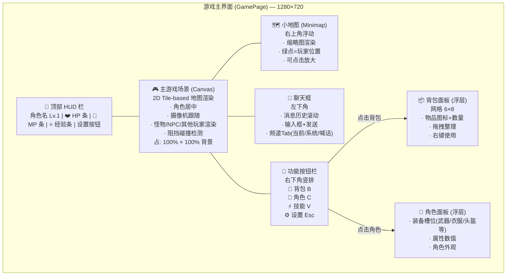
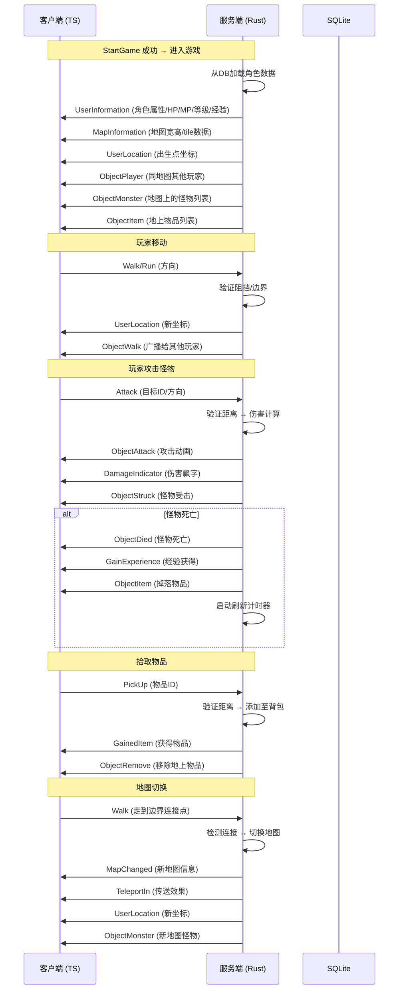

# Crystal Mir2 核心玩法系统 — 增量 PRD

> **作者**：许清楚（Xu）— Product Manager  
> **版本**：v1.0  
> **日期**：2025-07-18  
> **状态**：草稿  

---

## 1. 项目信息

| 字段 | 内容 |
|------|------|
| **项目名称** | crystal_mir2_gameplay |
| **项目背景** | 从零复刻经典《热血传奇》的 MMORPG，已完成 Auth 系统（登录/注册/角色 CRUD/StartGame）和网络基础架构 |
| **编程语言** | 服务端 Rust（tokio + warp + SQLite），客户端 TypeScript（Vite + React + MUI + Tailwind CSS），共享库 Rust（binrw 编解码） |
| **增量范围** | 6 大核心玩法模块：地图系统、游戏主界面、怪物系统、战斗系统、背包与物品系统、地图切换/传送 |
| **原始需求** | 在现有 Auth + 网络基础上，实现玩家进入游戏后的核心玩法循环：进入地图 → 看到场景 → 移动 → 遭遇怪物 → 战斗 → 拾取物品 → 切换地图 |

---

## 2. 产品定义

### 2.1 产品目标

1. **实现完整的游戏内体验闭环**：玩家从 StartGame 成功后，能无缝进入游戏场景，看到地图、自由移动、与怪物战斗、拾取物品，形成"进入→探索→战斗→成长"的核心循环。
2. **建立可扩展的服务端游戏框架**：以模块化方式设计地图、怪物、战斗、物品等系统，确保各模块松耦合、可独立测试，为后续技能、组队、行会等系统铺路。
3. **提供沉浸式的经典传奇 HUD 体验**：客户端游戏界面还原传奇风格布局——场景 Canvas 渲染、血蓝经验条、小地图、聊天框、功能按钮栏——让玩家第一眼就能认出"这是传奇"。

### 2.2 用户故事

| ID | 角色 | 功能 | 收益 |
|----|------|------|------|
| US-01 | 玩家 | 进入游戏后看到 2D 地图场景，角色在地图上显示 | 获得视觉沉浸感，知道自己身处何地 |
| US-02 | 玩家 | 使用键盘/鼠标点击控制角色在地图上行走和跑步 | 自由探索游戏世界 |
| US-03 | 玩家 | 在屏幕角落看到小地图，了解当前区域的缩略图 | 快速定位自己位置和周围地形 |
| US-04 | 玩家 | 在游戏主界面看到自己的 HP/MP 血蓝条、经验条、角色名和等级 | 实时掌握角色状态 |
| US-05 | 玩家 | 使用聊天框发送文字消息并看到其他玩家的发言 | 与其他玩家社交互动 |
| US-06 | 玩家 | 在游戏场景中看到怪物在地图上巡逻 | 感受到"活的世界"，有可挑战的目标 |
| US-07 | 玩家 | 点击怪物或按攻击键发起攻击 | 与怪物进行战斗交互 |
| US-08 | 玩家 | 击杀怪物后获得经验值，偶尔掉落物品 | 获得成长反馈和战利品惊喜 |
| US-09 | 玩家 | 按 B 键打开背包，查看已拥有的物品 | 管理自己的道具 |
| US-10 | 玩家 | 拾取地上掉落的物品放入背包 | 收集战利品 |
| US-11 | 玩家 | 走到地图边界/传送门时自动切换到另一张地图 | 探索更大的游戏世界 |
| US-12 | 玩家 | 在游戏主界面通过按钮打开角色面板、背包、技能和设置界面 | 方便地进行各种游戏操作 |

---

## 3. 技术规范

### 3.1 需求池

#### P0 — 本次迭代必须完成

| 编号 | 模块 | 需求描述 | 验收标准 |
|------|------|----------|----------|
| R-001 | 🗺️ 地图系统 | **地图数据加载**：服务端从 JSON 配置文件加载地图数据（tile grid、阻挡区域、安全区、出生点） | 服务启动时加载所有地图；地图数据包含 `width` `height`、每个 tile 的 `CellAttribute`（Walk/HighWall/LowWall）、安全区标记 |
| R-002 | 🗺️ 地图系统 | **地图信息推送**：StartGame 成功后服务端推送 `MapInformation` 包，客户端据此渲染地图 | 客户端收到地图宽高、tile 属性数组后能够渲染出基础地图画面 |
| R-003 | 🎮 游戏主界面 | **游戏场景入口**：StartGame 响应成功后，客户端切换到 GamePage，全屏显示游戏场景 | 从 LoadingPage 自动进入 GamePage；游戏场景占满视口 |
| R-004 | 🎮 游戏主界面 | **角色状态 HUD**：界面顶部/左上角显示角色名、等级、HP 条、MP 条、经验条 | HP/MP 以条形图显示当前值/最大值；经验条显示当前进度百分比；数据来自 `UserInformation` 包 |
| R-005 | 🎮 游戏主界面 | **聊天框**：界面左下角显示聊天区域，支持输入发送和接收消息 | 聊天框可滚动显示历史消息；支持回车发送；服务端 Chat handler 已就绪（需升级为广播到同地图玩家） |
| R-006 | 🎮 游戏主界面 | **功能按钮栏**：界面右下角或底部显示背包/角色/技能/设置等图标按钮 | 至少 4 个功能按钮，点击后打开对应面板（面板初始可为空占位） |
| R-007 | 👾 怪物系统 | **怪物数据结构**：服务端定义 Monster 数据结构和怪物模板（名称、等级、HP/MP、攻击力、防御等） | Monster 结构存放在服务端，可从配置文件加载模板 |
| R-008 | 👾 怪物系统 | **怪物刷新（Spawner）**：服务端按地图配置定时刷新怪物到指定坐标 | 怪物在地图出生点生成；刷新间隔可配置；怪物不生成在阻挡格上 |
| R-009 | 👾 怪物系统 | **怪物巡逻 AI**：怪物在出生点周围随机移动（巡逻） | 怪物每 2-4 秒随机选择一个相邻可行走格移动；不穿过阻挡区域 |
| R-010 | 👾 怪物系统 | **怪物广播**：服务端将地图上怪物的位置/状态广播给同地图玩家 | 客户端收到 `ObjectMonster` 包后在对应坐标渲染怪物 |
| R-011 | ⚔️ 战斗系统 | **攻击指令**：玩家选中怪物后点击/按攻击键发起攻击 | 客户端发送 `Attack` 包（含方向+目标ID）；服务端验证距离和合法性 |
| R-012 | ⚔️ 战斗系统 | **伤害计算**：服务端执行经典 Mir2 伤害公式 | 物理伤害 = 攻击力随机值 - 防御力/2（最低 1）；暴击/命中判定基于准确 vs 敏捷 |
| R-013 | ⚔️ 战斗系统 | **攻击广播**：攻击结果广播给同地图所有玩家 | 客户端收到 `ObjectAttack`（动画）+ `DamageIndicator`（飘字）+ `Struck`/`ObjectStruck`（受击） |
| R-014 | ⚔️ 战斗系统 | **怪物死亡**：怪物 HP ≤ 0 时执行死亡流程 | 怪物播放死亡动画→从地图移除→延迟后重新刷新；广播 `ObjectDied` 包 |
| R-015 | ⚔️ 战斗系统 | **经验分配**：击杀怪物后玩家获得经验值 | 服务端计算经验值并更新角色经验；广播 `GainExperience` + `LevelChanged`（如升级） |

#### P1 — 本次迭代应该完成

| 编号 | 模块 | 需求描述 | 验收标准 |
|------|------|----------|----------|
| R-016 | 🗺️ 地图系统 | **阻挡检测**：服务端验证玩家/怪物移动是否合法（不可走入阻挡格） | 移动前检查目标格 `CellAttribute`，阻挡则拒绝移动 |
| R-017 | 🗺️ 地图系统 | **摄像机跟随**：客户端摄像机跟随玩家角色，地图滚动 | 玩家角色始终在屏幕中心附近；地图随角色移动平滑滚动 |
| R-018 | 🗺️ 地图系统 | **小地图（Minimap）**：客户端渲染小地图缩略图，显示玩家位置 | 小地图在屏幕右上角；显示当前地图简化 tile 颜色；绿点表示玩家位置 |
| R-019 | 🎮 游戏主界面 | **小地图 UI 组件**：将 minimap 集成到 HUD 布局中 | 固定位置、可点击放大/缩小（可选） |
| R-020 | 👾 怪物系统 | **怪物追击 AI**：玩家进入怪物警戒范围后，怪物追击玩家 | 警戒半径可配置（默认 5 格）；追击时不穿过阻挡 |
| R-021 | 👾 怪物系统 | **怪物返回 AI**：追击超出巡逻范围后怪物返回出生点 | 返回半径可配置（默认 10 格）；回到出生点后恢复巡逻 |
| R-022 | ⚔️ 战斗系统 | **玩家死亡**：玩家 HP=0 时处理死亡 | 广播 `Death` 包；玩家回到城镇复活点；HP/MP 回满 |
| R-023 | ⚔️ 战斗系统 | **怪物掉落物品**：怪物死亡时按掉落表生成物品掉落在地上 | 掉落表可配置（物品ID + 概率）；地上掉落物以 `ObjectItem` 包广播 |
| R-024 | 🎒 背包系统 | **物品模板数据库**：服务端定义 Item 模板数据（ID、名称、类型、属性等） | 物品模板从 JSON 或 SQLite 加载；模板包含基础属性 |
| R-025 | 🎒 背包系统 | **背包存储**：每个角色关联一个背包（Inventory），存储在数据库中 | 背包容量初始 46 格；每个格子存储物品 ID + 数量 + 持久度 |
| R-026 | 🎒 背包系统 | **背包 UI**：客户端以网格布局展示背包内容 | 6×8 网格；每格显示物品图标和数量；支持点击查看 tooltip |
| R-027 | 🎒 背包系统 | **拾取物品**：玩家走到地上物品上按 F 键或点击拾取 | 拾取请求发送 `PickUp` 包；服务端验证距离后将物品放入背包；广播 `GainedItem` + 移除地上物品 |
| R-028 | 🏙️ 地图切换 | **地图连接点配置**：地图文件中定义连接点（入口坐标→目标地图+目标坐标） | 连接点包含 source_x/y, target_map, target_x/y |
| R-029 | 🏙️ 地图切换 | **边界传送**：玩家走到地图边界时自动触发地图切换 | 检测玩家坐标触及连接点；服务端切换地图并推送新地图信息；广播 `MapChanged` + `TeleportIn` |
| R-030 | 🏙️ 地图切换 | **坐标同步**：玩家在地图间移动时服务端同步位置 | 每次切换成功后服务端推送 `UserLocation` 包更新坐标 |

#### P2 — 本次迭代最好完成

| 编号 | 模块 | 需求描述 | 验收标准 |
|------|------|----------|----------|
| R-031 | 🗺️ 地图系统 | **安全区显示**：客户端渲染地图时安全区用特殊颜色标记 | 地图 tile 渲染时安全区格使用绿色/蓝色调 |
| R-032 | 🗺️ 地图系统 | **安全区回血**：玩家在安全区时自动恢复 HP/MP | 每秒恢复 1% HP/MP；广播 `HealthChanged` |
| R-033 | 👾 怪物系统 | **怪物受击反馈**：怪物被攻击时播放受击动画/效果 | 客户端收到 `ObjectStruck` 后怪物闪烁/抖动；服务端更新怪物 HP |
| R-034 | ⚔️ 战斗系统 | **经验飘字**：击杀怪物后在怪物位置显示 "+Exp" 飘字 | 客户端收到 `GainExperience` 后在对应坐标显示动画飘字 |
| R-035 | 🎒 背包系统 | **丢弃物品**：玩家可从背包拖出物品丢弃到地上 | 客户端发送 `DropItem` 包；服务端从背包移除并在地上生成 `ObjectItem` |
| R-036 | 🎒 背包系统 | **使用物品**：右键/双击使用背包中的消耗品（药水等） | 客户端发送 `UseItem` 包；服务端执行效果（回血/回蓝）并减少数量 |
| R-037 | 🎒 背包系统 | **物品提示 Tooltip**：鼠标悬停物品时显示详细属性信息 | Tooltip 显示物品名称、类型、属性、描述、重量等 |
| R-038 | 🎮 游戏主界面 | **角色面板**：按 C 键或点击角色按钮打开面板，查看详细属性 | 面板显示：基础属性（DC/MC/SC/AC/MAC）、装备槽位、角色名/等级/职业 |
| R-039 | 🏙️ 地图切换 | **传送点特效**：客户端在传送门位置渲染特殊效果 | 传送门位置粒子/闪烁效果，提示玩家此处可传送 |
| R-040 | 🎮 游戏主界面 | **Loading 过渡**：地图切换时显示简短的加载过渡画面 | 切换地图时短暂显示"加载中..."，完成后无缝切换 |

---

### 3.2 UI 设计草图 — 游戏主界面布局（Wireframe）

以下为游戏主界面（GamePage）的 Mermaid 线框图，展示 1280×720 分辨率下的标准布局：



**布局说明**：

```
┌─────────────────────────────────────────────────────────────┐
│  [角色名 Lv.1]  ████████████ HP 60/60  ████████ MP 30/30   │
│                  ████████ EXP 0/100               [⚙️设置]   │
├──────────────────────────────────────────────────┬──────────┤
│                                                  │  🗺️小地图  │
│              🎮 游戏场景 (Canvas)                │          │
│                                                  │          │
│         🕺 玩家 (居中)          👾 怪物           │          │
│                                                   │          │
│                            👾 怪物                 │          │
│                                                   │          │
│                                                   │          │
├──────────────────────────────────┬───────────────┤          │
│ 💬 聊天框                        │               │          │
│ [系统] 欢迎来到传奇世界           │               │          │
│ [当前] 玩家1: 有人吗              │  [👜] 背包    │          │
│ [当前] 玩家2: 组队刷怪？         │  [👤] 角色    │          │
│ ┌────────────────────┐ [发送]   │  [⚡] 技能    │          │
│ │ 输入聊天内容...     │          │  [⚙️] 设置    │          │
│ └────────────────────┘          │               │          │
└──────────────────────────────────┴───────────────┴──────────┘
```

**说明**：
- **游戏场景**（Canvas）占大部分区域，2D tile 渲染，角色居中，摄像机跟随
- **顶部 HUD** 半透明浮动覆盖，显示核心角色状态
- **右上角小地图** 浮动显示，半透明背景
- **左下角聊天框** 半透明浮动，可折叠/调整大小
- **右下角功能按钮** 竖排图标按钮，点击弹出对应面板（MUI Dialog/Drawer）

---

### 3.3 数据流架构



---

## 4. 实现建议（提供给架构师参考）

### 4.1 推荐模块结构

```
Server/src/
├── main.rs                      # 入口（不变）
├── lib.rs                       # pub mod map, monster, combat, item, ...
├── config.rs                    # ServerConfig（扩展地图配置路径）
├── database/
│   ├── mod.rs
│   ├── models.rs                # + Monster, Item, Inventory 模型
│   └── repository.rs            # + 物品/背包 CRUD
├── auth/mod.rs                  # 不变
├── network/
│   ├── mod.rs
│   ├── server.rs
│   ├── handler.rs               # PacketRouter + GameLogicHandler（升级）
│   ├── session.rs
│   └── session_manager.rs
├── map/                         # 🆕 地图模块
│   ├── mod.rs                   # MapManager, Map struct
│   ├── loader.rs                # JSON 地图加载
│   ├── tile.rs                  # Tile/CellAttribute
│   └── transition.rs            # 地图连接点
├── monster/                     # 🆕 怪物模块
│   ├── mod.rs                   # MonsterManager, Monster struct
│   ├── spawner.rs               # 刷新调度器
│   └── ai.rs                    # 巡逻/追击/返回 AI
├── combat/                      # 🆕 战斗模块
│   ├── mod.rs                   # 攻击处理入口
│   └── damage.rs                # 伤害计算公式
├── item/                        # 🆕 物品模块
│   ├── mod.rs                   # ItemManager, 物品模板
│   ├── inventory.rs             # 背包操作
│   └── drops.rs                 # 掉落表
└── game/                        # 🆕 游戏循环/世界管理
    └── mod.rs                   # WorldState, 全局 ticker
```

### 4.2 关键技术决策

| 决策 | 选项 | 建议 |
|------|------|------|
| 地图格式 | .map / JSON / Tiled | **JSON 格式**（最易实现和调试，后续可迁移） |
| 地图渲染 | Canvas 2D / PixiJS / CSS Grid | **Canvas 2D API**（原生、轻量，足够 2D tile 渲染） |
| 怪物 AI 执行 | Tick-based / Event-based | **Tick-based**（服务端每秒 2-4 tick，驱动怪物 AI 和刷新） |
| 攻击目标选择 | 客户端点击 → 服务端验证 | 客户端发送攻击方向和目标 ID，服务端验距离和视野 |
| 背包存储 | SQLite / 内存 | **SQLite**（持久化，沿用已有数据库方案） |

---

## 5. 待确认问题清单

| 编号 | 问题 | 影响模块 | 建议决策人 |
|------|------|----------|------------|
| Q-01 | **地图 JSON 格式的详细 schema ？** 是否需要参考 Tiled Map Editor 的格式以便使用现有工具编辑？ | 地图系统 | 架构师 |
| Q-02 | **地图首次加载方式？** StartGame 时一次性推送全量 tile 数据，还是分块动态加载？小地图数据单独推送？ | 地图系统、游戏主界面 | 架构师 |
| Q-03 | **Tile 渲染资源？** 初始阶段使用纯色方块代替 tile 贴图，还是需要准备一套基础 sprite 图？ | 客户端渲染 | 前端开发 |
| Q-04 | **怪物攻击 AI 行为？** 是否先实现近战怪物的"走到玩家身边+攻击"，远程怪延后？ | 怪物系统、战斗系统 | 架构师 |
| Q-05 | **伤害公式的具体参数？** 需要确认 Mir2 经典公式的具体数值，还是先采用简化版（攻击-防御/2）？ | 战斗系统 | 主理人/策划 |
| Q-06 | **物品图标的资源来源？** 开发阶段是否使用占位色块/emoji 代替，等美术资源到位后再替换？ | 背包系统 | 前端开发 |
| Q-07 | **初始地图数量？** MVP 阶段配置几张地图？（建议至少 2 张：新手村 + 野外练级地图，可测试地图切换） | 地图系统 | 主理人 |
| Q-08 | **背包 UI 中物品操作方式？** 拖拽（drag & drop）是否在 MVP 阶段实现？还是先用右键菜单简化？ | 背包系统 | 主理人/前端开发 |
| Q-09 | **同地图其他玩家的可见范围？** 是否实现视野（View Range）限制，还是简单广播全地图对象？ | 网络同步 | 架构师 |
| Q-10 | **游戏循环 Tick 速率？** 推荐 200ms/tick（5 tick/s），是否合理？是否应设为可配置？ | 怪物系统 | 架构师 |

---

## 6. 附录

### 6.1 现有 Opcode 预映射

以下 Opcode 已在 `packet_id.rs` 中定义，可直接用于本次迭代：

| Opcode | 名称 | 用途 | 优先级 |
|--------|------|------|--------|
| ServerOpcode::MapInformation (17) | 地图信息 | 推送地图宽高和 tile 数据 | P0 |
| ServerOpcode::UserInformation (21) | 用户信息 | 推送角色属性/HP/MP/等级 | P0 |
| ServerOpcode::UserLocation (23) | 用户位置 | 推送/确认坐标 | P0 |
| ServerOpcode::ObjectPlayer (24) | 对象-玩家 | 同步其他玩家 | P1 |
| ServerOpcode::ObjectRemove (26) | 移除对象 | 移除地图上的对象 | P1 |
| ServerOpcode::ObjectWalk (28) | 行走动画 | 广播行走动画 | P1 |
| ServerOpcode::Chat (30) | 聊天 | 聊天消息 | P0 |
| ServerOpcode::ObjectMonster (71) | 怪物 | 同步怪物状态 | P0 |
| ServerOpcode::ObjectAttack (72) | 攻击动画 | 广播攻击动画 | P0 |
| ServerOpcode::Struck (73) | 受击 | 受击反馈 | P0 |
| ServerOpcode::ObjectStruck (74) | 对象受击 | 广播受击动画 | P0 |
| ServerOpcode::DamageIndicator (75) | 伤害飘字 | 显示伤害数字 | P0 |
| ServerOpcode::HealthChanged (77) | HP/MP 变化 | 更新血蓝条 | P0 |
| ServerOpcode::Death (80) | 死亡 | 角色死亡 | P1 |
| ServerOpcode::ObjectDied (81) | 对象死亡 | 广播死亡动画 | P0 |
| ServerOpcode::GainExperience (85) | 获得经验 | 经验值更新 | P0 |
| ServerOpcode::LevelChanged (87) | 等级变化 | 升级通知 | P0 |
| ServerOpcode::MapChanged (98) | 地图切换 | 切换地图通知 | P1 |
| ServerOpcode::ObjectTeleportIn (100) | 传送出现 | 传送动画 | P1 |
| ServerOpcode::ObjectItem (64) | 地上物品 | 掉落物同步 | P1 |
| ServerOpcode::GainedItem (66) | 获得物品 | 拾取反馈 | P1 |
| ClientOpcode::PickUp (35) | 拾取 | 客户端拾取请求 | P1 |
| ClientOpcode::Attack (47) | 攻击 | 客户端攻击请求 | P0 |

### 6.2 参考资源

- 经典 Mir2 伤害公式：物理伤害 = max(1, DC.random() - target.AC / 2)
- 经验值计算公式：`level_up_exp = level * 100 + 50`（可配置）
- 怪物刷新时间：普通怪 5-10 秒，精英怪 30-60 秒（可配置）
