# Crystal（传奇2引擎）Rust + TypeScript 重写 — 架构设计文档

> **作者**: 高见远（架构师）
> **版本**: v1.0
> **日期**: 2025-07-17
> **状态**: 初始草案

---

## 目录

1. [总体架构](#1-总体架构)
2. [数据流设计](#2-数据流设计)
3. [关键模块设计](#3-关键模块设计)
4. [通信协议](#4-通信协议)
5. [任务分解（MVP 里程碑）](#5-任务分解mvp-里程碑)
6. [共享知识](#6-共享知识)
7. [待明确事项](#7-待明确事项)

---

## 1. 总体架构

### 1.1 系统模块总览

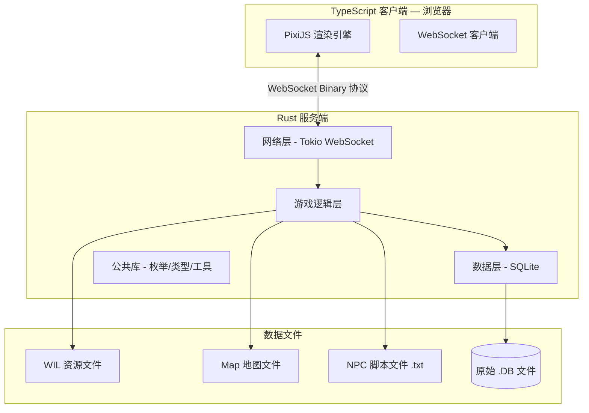

### 1.2 Rust 服务端模块架构

```mermaid
graph TB
    subgraph 入口
        main[main.rs]
        config[config.rs]
    end

    subgraph 网络层[network/]
        ws_server[ws_server.rs<br/>WebSocket 服务端<br/>tokio_tungstenite]
        connection[connection.rs<br/>MirConnection<br/>GameStage 状态机]
        packet[packet.rs<br/>Packet trait<br/>编解码/序列化]
        packet_defs[packet_defs.rs<br/>所有 Packet 结构体]
    end

    subgraph 游戏逻辑层[game/]
        envir[envir.rs<br/>主循环 Process<br/>定时器系统<br/>全局数据列表]
        map[map.rs<br/>地图加载/碰撞/门系统/AOI]
        respawn[respawn.rs<br/>怪物刷新管理器]
    end

    subgraph 游戏对象层[objects/]
        map_object[map_object.rs<br/>MapObject trait<br/>抽象基类]
        human[human.rs<br/>HumanObject<br/>角色公共逻辑]
        player[player.rs<br/>PlayerObject<br/>玩家完整实现]
        monster[monster.rs<br/>MonsterObject<br/>怪物工厂+基础AI]
        npc_obj[npc.rs<br/>NPCObject]
        item_obj[item_object.rs<br/>ItemObject 地上物品]
        buff[buff.rs<br/>Buff 系统]
        monsters[monsters/*.rs<br/>200+ AI 实现]
    end

    subgraph NPC 脚本引擎[npc/]
        script[script.rs<br/>脚本解析器<br/>Lexer→Parser→AST]
        actions[actions.rs<br/>脚本动作实现]
        checks[checks.rs<br/>脚本条件检查]
    end

    subgraph 战斗系统[combat/]
        damage[damage.rs<br/>伤害计算引擎]
        magic[magic.rs<br/>技能系统]
        poison[poison.rs<br/>毒/冰冻/麻痹]
    end

    subgraph 物品系统[items/]
        item[mod.rs<br/>物品基础逻辑]
        sets[sets.rs<br/>套装效果]
    end

    subgraph 数据库层[db/]
        db_mod[mod.rs<br/>Database trait]
        sqlite[sqlite.rs<br/>SQLite 实现]
        account[models/account.rs]
        character[models/character.rs]
        item_model[models/item.rs]
        monster_model[models/monster.rs]
        magic_model[models/magic.rs]
        map_model[models/map.rs]
        npc_model[models/npc.rs]
    end

    subgraph 公共模块[shared/]
        enums[enums.rs<br/>核心枚举]
        types[types.rs<br/>共享类型]
        utils[utils.rs<br/>数学/寻路工具]
    end

    main --> config
    main --> ws_server
    main --> envir
    ws_server --> connection
    connection --> packet
    packet --> packet_defs
    envir --> map
    envir --> respawn
    envir --> map_object
    envir --> player
    envir --> monster
    envir --> npc_obj
    envir --> item_obj
    envir --> buff
    envir --> damage
    envir --> magic
    envir --> item
    envir --> script
    envir --> db_mod
    monster --> monsters
    script --> actions
    script --> checks
    player --> human
    human --> map_object
    monster --> map_object
    npc_obj --> map_object
    item_obj --> map_object
    db_mod --> sqlite
    sqlite --> account
    sqlite --> character
    sqlite --> item_model
    sqlite --> monster_model
    sqlite --> magic_model
    sqlite --> map_model
    sqlite --> npc_model
```

### 1.3 TypeScript 客户端模块架构

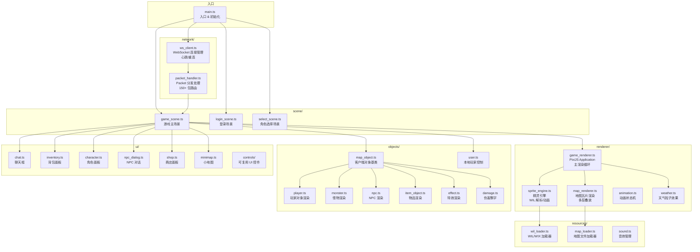

### 1.4 通信架构

```mermaid
graph LR
    subgraph 浏览器
        TS[TypeScript 客户端]
        PixiJS[PixiJS 渲染]
    end

    subgraph WebSocket[WebSocket 连接]
        WS[ws://host:7000<br/>Binary 帧]
        KeepAlive[心跳 Ping/Pong]
    end

    subgraph Rust 服务端
        WS_Server[Tokio WebSocket Server<br/>端口 7000]
        Session[Session 管理器<br/>GameStage 状态机]
        Game[游戏逻辑处理器]
        DB[(SQLite)]
    end

    TS -->|ClientPackets<br/>30+ 种| WS
    WS -->|ServerPackets<br/>50+ 种(MVP)| TS
    WS_Server -->|每连接一个 Task| Session
    Session -->|Packet 路由| Game
    Game -->|CRUD| DB

    TS -.->|Ping/Pong| WS
```

---

## 2. 数据流设计

### 2.1 Rust 服务端主循环流程

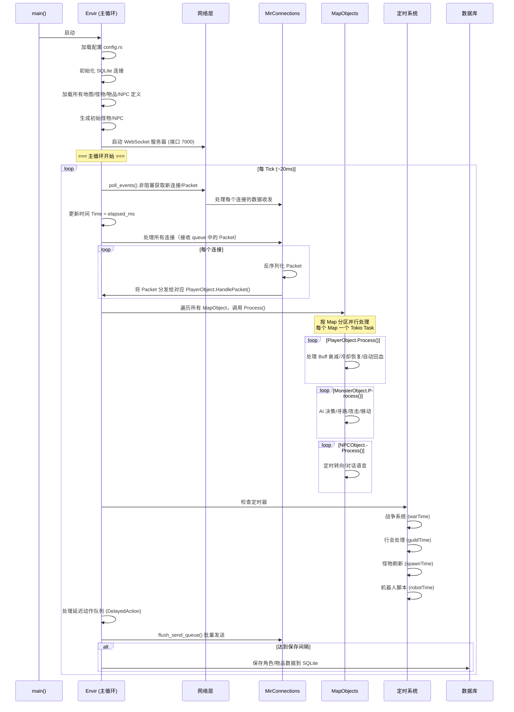

### 2.2 玩家输入处理数据流（从浏览器点击到服务端响应）

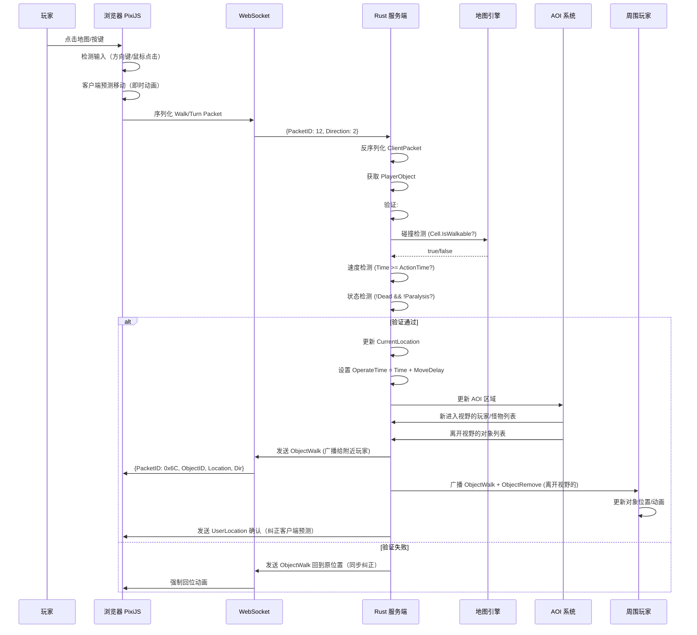

### 2.3 NPC 交互完整数据流

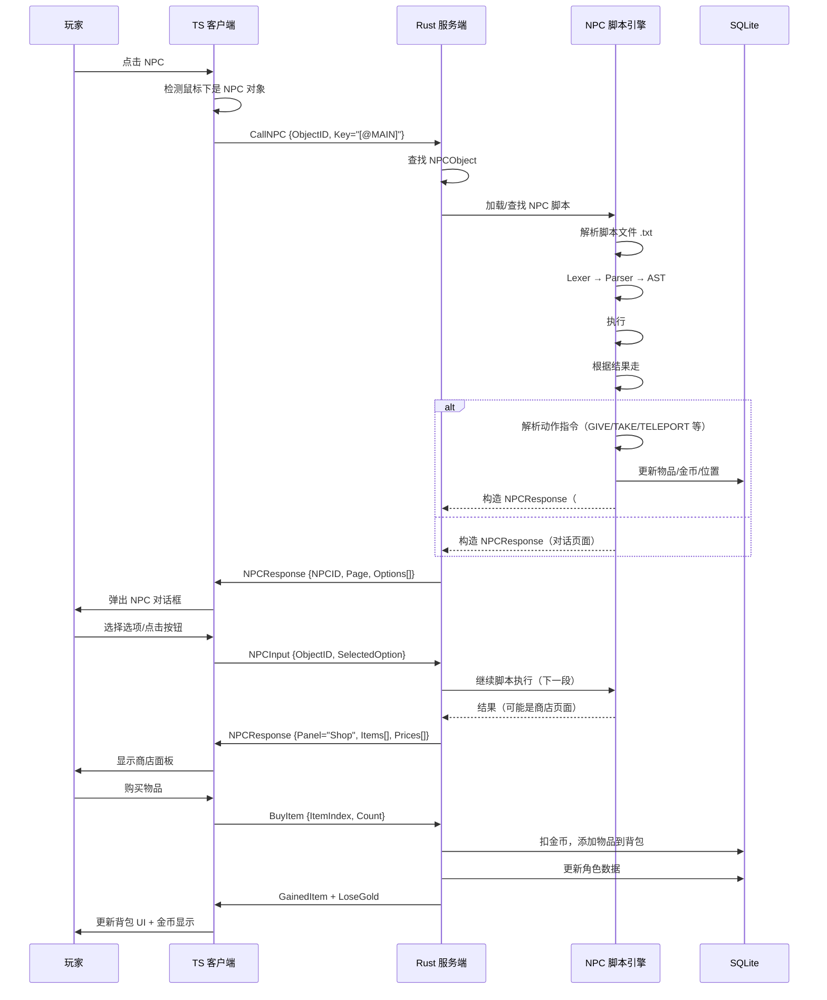

---

## 3. 关键模块设计

### 3.1 网络层

#### 3.1.1 Packet 编解码方案

**Rust 端（serde 自定义序列化）**:

```rust
// Packet trait — 所有数据包的统一接口
pub trait Packet: Sized {
    fn packet_id() -> u16;
    fn decode(data: &[u8]) -> Result<Self>;
    fn encode(&self) -> Vec<u8>;
}

// 宏自动生成编解码（手动实现关键包优化）
// 编码格式：完全镜像 C# BinaryWriter/BinaryReader 语义
// 以保证协议兼容性
```

**TypeScript 端（DataView + ArrayBuffer）**:

```typescript
// Packet 基类
abstract class Packet {
    abstract packetId: number;
    abstract decode(view: DataView, offset: number): number; // 返回新 offset
    abstract encode(): ArrayBuffer;
}

// 用 DataView 精确控制字节序（小端）和布局
// BufferPool 减少 GC 压力
```

**协议格式**:

```
[2 bytes: PacketID][N bytes: Payload]

所有多字节值使用 **小端序**（Little Endian）
字符串编码：Pascal 风格（4 字节长度前缀 + UTF-8 内容）
时间编码：Unix 毫秒时间戳 (i64)
布尔值：1 字节 (0x00 / 0x01)
```

#### 3.1.2 WebSocket 连接生命周期

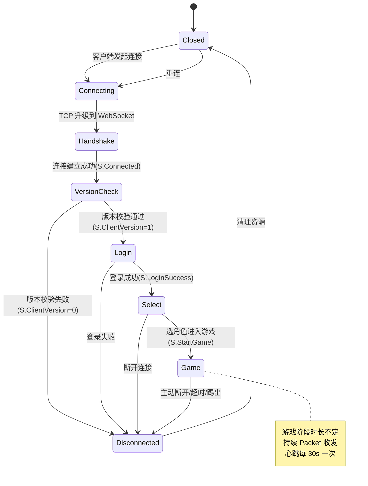

**连接超时检测**:

| 阶段 | 超时时间 | 触发动作 |
|------|---------|---------|
| Login | 30s | 断开连接 |
| Select | 60s | 断开连接 |
| Game | 最后 Packet 后 60s | 标记离线，30s 后清理 |
| Game（离线中） | 标记后 30s | 完全断开 |

### 3.2 游戏对象继承体系

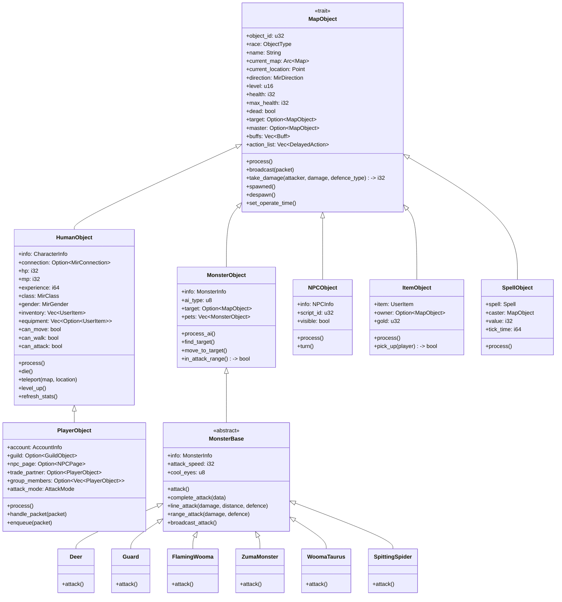

### 3.3 地图系统

#### 3.3.1 地图加载策略

```rust
// Map 结构体
pub struct Map {
    pub info: MapInfo,
    pub width: u16,
    pub height: u16,
    pub cells: Vec<Vec<Cell>>,        // 碰撞网格
    pub doors: Vec<Door>,             // 门系统
    pub players: Vec<PlayerObject>,   // 当前地图玩家
    pub npcs: Vec<NPCObject>,         // 当前地图 NPC
    pub respawns: Vec<MapRespawn>,    // 刷新点
    pub monsters: Vec<MonsterObject>, // 当前地图怪物
    pub thread_id: u8,                // 归属线程/actor ID
}

pub struct Cell {
    pub attribute: CellAttribute, // Walk/Fly/Water/HighWall/LowWall/Room
    pub valid: bool,
    pub objects: Vec<MapObject>, // 本格对象列表
}

pub enum CellAttribute {
    Walk,       // 可行走
    Fly,        // 可飞行
    Water,      // 水面
    HighWall,   // 高墙（不可攻击跨越）
    LowWall,    // 低墙（可攻击跨越）
    Room,       // 室内
}
```

**地图格式兼容**：MVP 支持 3 种最常见格式（格式 0/1/2），使用魔数检测自动识别。

#### 3.3.2 碰撞检测

```rust
impl Map {
    // 基础碰撞检测
    pub fn can_walk(&self, x: u16, y: u16, object: &MapObject) -> bool {
        if x >= self.width || y >= self.height { return false; }
        let cell = &self.cells[x as usize][y as usize];
        if !cell.valid { return false; }
        if cell.attribute != CellAttribute::Walk { return false; }
        // 门检测：如果门关闭则不可通行
        if let Some(door) = self.get_door(x, y) {
            if door.state == DoorState::Closed { return false; }
        }
        // 对象阻挡检测（高优先级）
        for obj in &cell.objects {
            if obj.blocking() && obj.object_id != object.object_id {
                return false;
            }
        }
        true
    }
}
```

#### 3.3.3 视野管理（AOI）

地图采用 **Grid-Based AOI**（与原始 Crystal 相同，基于 DataRange 常量）：

```rust
// AOI 范围常量
pub const DATA_RANGE: u16 = 14; // 原始 Crystal 值：14 格
pub const AOI_RANGE: u16 = 14;

// AOI 管理
impl Map {
    // 获取某个位置视野内的所有玩家
    pub fn get_aoi_players(&self, center: Point) -> Vec<&PlayerObject> {
        self.players.iter()
            .filter(|p| in_range(center, p.current_location, AOI_RANGE))
            .collect()
    }

    // 玩家移动时更新 AOI
    pub fn on_player_move(&mut self, player: &PlayerObject, old: Point, new: Point) {
        let old_aoi = get_aoi_rect(old, AOI_RANGE);
        let new_aoi = get_aoi_rect(new, AOI_RANGE);
        // 离开视野 → 发送 ObjectRemove
        // 进入视野 → 发送 GetInfo + 位置同步
        // 都在视野内 → 发送移动包
    }
}
```

### 3.4 怪物 AI 框架

#### 3.4.1 AI 引擎架构

```rust
// AI 引擎 trait
pub trait MonsterAI: Send + Sync {
    fn process(&mut self, monster: &mut MonsterObject, envir: &Envir);

    // 可选：AI 特殊攻击实现
    fn attack(&mut self, monster: &mut MonsterObject) -> bool;
    fn find_target(&mut self, monster: &mut MonsterObject) -> Option<MapObject>;
    fn move_to_target(&mut self, monster: &mut MonsterObject);
    fn in_attack_range(&self, monster: &MonsterObject, target: &MapObject) -> bool;
}

// 状态机
pub enum AIState {
    Idle,           // 空闲/巡逻
    Roam,           // 随机移动
    Chase,          // 追击目标
    Attack,         // 攻击
    Flee,           // 逃跑
    Return,         // 返回出生点
    Dead,           // 死亡
}

// 通用 AI 参数
pub struct AICommonParams {
    pub view_range: u16,          // 视野范围
    pub chase_range: u16,         // 追击范围
    pub flee_health_pct: u8,      // 逃跑血量百分比
    pub cool_eyes: u8,            // 冷却时间（Tick）
    pub attack_speed: i32,        // 攻击速度
}
```

#### 3.4.2 MVP 5 种基础 AI

| AI 类型 | AI ID | 行为描述 | 怪物示例 |
|---------|-------|---------|---------|
| 近战攻击 | AI 0-2 | 发现目标→靠近→近战攻击→追击 | Deer, Guard |
| 远程攻击 | AI 4,8 | 发现目标→保持距离→远程攻击 | SpittingSpider, AxeSkeleton |
| 巡逻/被动 | AI 0(被动) | 随机走动，不主动攻击 | Hen, Scarecrow |
| BOSS 级 | AI 11,17 | 多阶段攻击、召唤、范围技能 | WoomaTaurus, ZumaTaurus |
| 召唤物 | AI 18 | 跟随主人→攻击主人目标 | Shinsu |

```rust
// MonsterObject.ProcessAI 核心逻辑
impl MonsterObject {
    pub fn process_ai(&mut self) {
        match self.ai_state {
            AIState::Idle => {
                // 视野内发现敌人？
                if let Some(target) = self.find_target() {
                    self.target = Some(target);
                    self.ai_state = AIState::Chase;
                } else if self.should_roam() {
                    self.ai_state = AIState::Roam;
                }
            }
            AIState::Roam => {
                self.random_walk();
                if let Some(target) = self.find_target() {
                    self.target = Some(target);
                    self.ai_state = AIState::Chase;
                }
                self.roam_counter -= 1;
                if self.roam_counter <= 0 {
                    self.ai_state = AIState::Idle;
                }
            }
            AIState::Chase => {
                if self.target.is_none() || self.target.as_ref().unwrap().dead {
                    self.target = None;
                    self.ai_state = AIState::Idle;
                    return;
                }
                if self.in_attack_range() {
                    self.ai_state = AIState::Attack;
                } else if self.out_of_chase_range() {
                    self.target = None;
                    self.ai_state = AIState::Return;
                } else {
                    self.move_to_target();
                }
            }
            AIState::Attack => {
                if self.can_attack() {
                    self.execute_ai_attack();
                }
                if !self.in_attack_range() {
                    self.ai_state = AIState::Chase;
                }
            }
            AIState::Return => {
                self.move_to_spawn();
                if self.at_spawn() {
                    self.ai_state = AIState::Idle;
                }
            }
            AIState::Flee => {
                self.move_away_from_target();
                if self.health_recovered() {
                    self.ai_state = AIState::Idle;
                }
            }
            AIState::Dead => {}
        }
    }
}
```

### 3.5 NPC 脚本引擎

#### 3.5.1 解析器架构

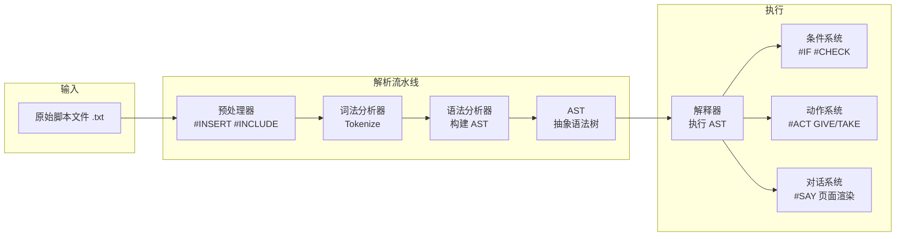

#### 3.5.2 脚本结构

```rust
// NPC 脚本结构
pub struct NPCScript {
    pub script_id: u32,
    pub file_name: String,
    pub sections: Vec<NPCSection>,    // [@MAIN], [@BUY], [@SELL] 等
    pub goods: Vec<UserItem>,         // 商店物品
    pub craft_goods: Vec<RecipeInfo>, // 合成配方
}

// NPC 段落
pub struct NPCSection {
    pub key: String,        // @MAIN, @BUY 等
    pub segments: Vec<NPCSegment>,
}

pub struct NPCSegment {
    pub conditions: Vec<NPCCondition>, // #IF 块
    pub actions: Vec<NPCAction>,       // #ACT 块
    pub say_text: String,              // #SAY 块
}

// 条件
pub enum NPCCondition {
    CheckLevel(u16),
    CheckGold(u32),
    CheckItem { name: String, count: u32 },
    CheckClass(MirClass),
    CheckGender(MirGender),
    // ... 30+ 种条件
}

// 动作
pub enum NPCAction {
    GiveItem { name: String, count: u32 },
    TakeItem { name: String, count: u32 },
    GiveGold(u32),
    TakeGold(u32),
    Teleport { map: String, x: u16, y: u16 },
    GiveExp(u64),
    // ... 40+ 种动作
}
```

### 3.6 数据库层

#### 3.6.1 Database Trait

```rust
#[async_trait]
pub trait Database: Send + Sync {
    // 账户
    async fn create_account(&self, account: NewAccount) -> Result<AccountInfo>;
    async fn get_account(&self, id: &str) -> Result<Option<AccountInfo>>;
    async fn verify_login(&self, id: &str, password: &str) -> Result<Option<AccountInfo>>;

    // 角色
    async fn create_character(&self, account_id: i32, info: NewCharacter) -> Result<CharacterInfo>;
    async fn get_characters(&self, account_id: i32) -> Result<Vec<CharacterInfo>>;
    async fn get_character(&self, char_id: i32) -> Result<Option<CharacterInfo>>;
    async fn save_character(&self, info: &CharacterInfo) -> Result<()>;
    async fn delete_character(&self, char_id: i32) -> Result<()>;

    // 物品实例
    async fn save_user_item(&self, item: &UserItem) -> Result<()>;
    async fn delete_user_item(&self, unique_id: u64) -> Result<()>;

    // 游戏定义（只读缓存）
    async fn load_all_items(&self) -> Result<Vec<ItemInfo>>;
    async fn load_all_monsters(&self) -> Result<Vec<MonsterInfo>>;
    async fn load_all_maps(&self) -> Result<Vec<MapInfo>>;
    async fn load_all_npcs(&self) -> Result<Vec<NPCInfo>>;
    async fn load_all_magics(&self) -> Result<Vec<MagicInfo>>;

    // 一次性迁移
    async fn migrate_from_legacy(&self, legacy_path: &str) -> Result<MigrationReport>;
}
```

#### 3.6.2 数据模型概览

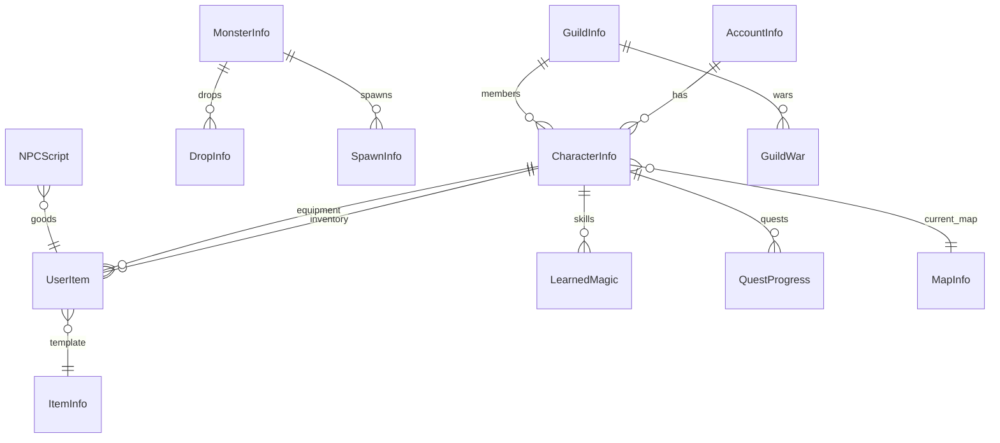

### 3.7 战斗系统

#### 3.7.1 伤害计算公式

```rust
pub struct DamageCalculator;

impl DamageCalculator {
    /// 物理攻击伤害计算
    pub fn calc_physical_damage(
        attacker: &MapObject,
        defender: &MapObject,
        skill_multiplier: f32,
    ) -> DamageResult {
        // 1. 基础攻击力
        let min_dc = attacker.stats[Stat::MinDC];
        let max_dc = attacker.stats[Stat::MaxDC];
        let base_damage = attacker.get_attack_power(min_dc, max_dc);

        // 2. 技能倍率
        let skill_damage = (base_damage as f32 * skill_multiplier) as i32;

        // 3. 幸运/诅咒系统
        let final_attack = self.apply_luck(attacker, skill_damage);

        // 4. 命中检测
        let (defence, hit) = defender.get_armour(DefenceType::ACAgility, attacker);
        if !hit {
            return DamageResult { damage: 0, damage_type: DamageType::Miss };
        }

        // 5. 最终伤害 = 攻击 - 防御（最小 0）
        let damage = (final_attack - defence).max(0);

        // 6. 暴击检测
        if self.is_critical(attacker) {
            return DamageResult {
                damage: damage * 2,
                damage_type: DamageType::Critical,
            };
        }

        DamageResult { damage, damage_type: DamageType::Hit }
    }
}

pub struct DamageResult {
    pub damage: i32,
    pub damage_type: DamageType,
}
```

#### 3.7.2 Buff/Debuff 系统

```rust
pub struct Buff {
    pub buff_type: BuffType,     // 类型 ID
    pub owner: usize,            // 施加者 ObjectID
    pub duration_ms: i64,        // 持续毫秒
    pub start_time: i64,         // 开始时间
    pub stats: Stats,            // 属性修正
    pub visible: bool,           // 是否显示图标
    pub properties: BuffProperty, // RemoveOnDeath/Stackable/Replace
}

impl Buff {
    // 是否已过期
    pub fn expired(&self, current_time: i64) -> bool {
        current_time >= self.start_time + self.duration_ms
    }

    // Buff 叠加策略
    pub fn stack(
        existing: &mut Vec<Buff>,
        new_buff: Buff,
    ) {
        if new_buff.properties.contains(BuffProperty::Replace) {
            // 替换模式：移除同类型旧 Buff
            existing.retain(|b| b.buff_type != new_buff.buff_type);
            existing.push(new_buff);
        } else if new_buff.properties.contains(BuffProperty::Stackable) {
            // 叠加模式：最多叠加 N 层
            if existing.len() < MAX_BUFF_STACK {
                existing.push(new_buff);
            }
        } else {
            // 忽略模式：已有同类型时不叠加
            if !existing.iter().any(|b| b.buff_type == new_buff.buff_type) {
                existing.push(new_buff);
            }
        }
    }
}
```

---

## 4. 通信协议

### 4.1 协议头格式定义

**WebSocket 帧结构**（每个 Binary Message 包含一个 Packet）：

```
Byte 0-1:   PacketID (u16, 小端序)
Byte 2-N:   Payload (结构因 PacketID 而异)
```

**String 编码约定**：
```
Byte 0-3:   String Length (i32, 小端序, 包含终止符)
Byte 4-N:   UTF-8 编码字符串内容
Byte N:     NULL 终止符 (0x00)
```

**时间编码**：Unix 毫秒时间戳 `i64`（小端序）

**版本协商**：

```
客户端 → 服务端:  ClientVersion { VersionHash: [u8; 32] }
服务端 → 客户端:  ClientVersionResult { Result: u8 }
  Result: 0=版本不匹配, 1=版本匹配
```

### 4.2 ServerPackets 分类清单（MVP 约 50 种）

#### 连接与基础（6 种）

| PacketID | 名称 | 方向 | 载荷 | 说明 |
|----------|------|------|------|------|
| 0 | Connected | S→C | 空 | 连接成功确认 |
| 1 | ClientVersion | S→C | Result: byte | 版本校验结果 |
| 2 | Disconnect | S→C | Reason: byte | 断开连接原因 |
| 3 | KeepAlive | S→C | Time: i64 | 心跳 |
| 4 | NewAccount | S→C | Result: byte | 注册结果 |
| 5 | ChangePassword | S→C | Result: byte | 改密结果 |

#### 登录与角色（8 种）

| PacketID | 名称 | 载荷 | 说明 |
|----------|------|------|------|
| 6 | LoginSuccess | Count: byte, Characters[...] | 角色列表 |
| 7 | LoginError | Error: byte | 登录失败原因 |
| 8 | NewCharacter | Result: byte | 创建角色结果 |
| 9 | DeleteCharacter | Result: byte | 删除角色结果 |
| 10 | StartGame | MapIndex: i32 | 进入游戏 |
| 11 | MapInformation | MapIndex, Width, Height, FileName | 地图信息 |
| 12 | UserInformation | 完整角色状态 | 角色全部信息 |
| 13 | AccountInfo | AccountInfo 结构 | 账户信息 |

#### 移动与位置（5 种）

| PacketID | 名称 | 载荷 | 说明 |
|----------|------|------|------|
| 20 | ObjectWalk | ObjectID, X, Y, Direction | 对象行走 |
| 21 | ObjectRun | ObjectID, X, Y, Direction | 对象跑步 |
| 22 | ObjectTurn | ObjectID, Direction, Location | 对象转向 |
| 23 | UserLocation | Location, Direction | 位置确认 |
| 24 | ObjectRemove | ObjectID | 移除对象 |

#### 对象信息（6 种）

| PacketID | 名称 | 载荷 | 说明 |
|----------|------|------|------|
| 30 | ObjectPlayer | 完整玩家信息 | 玩家进入视野 |
| 31 | ObjectMonster | 怪物信息 | 怪物进入视野 |
| 32 | ObjectNPC | NPC 信息 | NPC 进入视野 |
| 33 | ObjectItem | ItemObject 信息 | 物品出现在地上 |
| 34 | ObjectGold | Gold 信息 | 金币出现在地上 |
| 35 | ObjectEffect | Effect 类型, 位置 | 特效显示 |

#### 战斗（7 种）

| PacketID | 名称 | 载荷 | 说明 |
|----------|------|------|------|
| 40 | ObjectAttack | ObjectID, Dir, Loc, Spell | 攻击动画 |
| 41 | ObjectStruck | ObjectID, AttackerID | 被击中反馈 |
| 42 | DamageIndicator | DamageType, Damage, Loc | 伤害飘字 |
| 43 | Death | Direction, Location | 死亡动画 |
| 44 | ObjectDied | ObjectID, Dir, Loc | 对象死亡广播 |
| 45 | ObjectHealth | ObjectID, Percent, Exp | 血条/经验 |
| 46 | StruckEffect | EffectType | 打击特效 |

#### 物品与背包（8 种）

| PacketID | 名称 | 载荷 | 说明 |
|----------|------|------|------|
| 50 | GainedItem | UserItem | 获得物品 |
| 51 | GainedGold | Gold: u32 | 获得金币 |
| 52 | LoseItem | Grid, UniqueID | 移除物品 |
| 53 | LoseGold | Gold: u32 | 失去金币 |
| 54 | MoveItem | Grid, From, To | 移动物品 |
| 55 | EquipItem | Grid, Slot | 装备物品 |
| 56 | UnequipItem | Slot, Grid | 卸下装备 |
| 57 | RefreshItem | UserItem | 刷新物品状态 |

#### NPC 交互（5 种）

| PacketID | 名称 | 载荷 | 说明 |
|----------|------|------|------|
| 60 | NPCResponse | NPCID, Page | NPC 对话页面 |
| 61 | NPCSay | NPCID, Message | NPC 说话 |
| 62 | NPCGoods | Items[] | NPC 商品列表 |
| 63 | SellList | Items[] | 出售列表 |
| 64 | NPCUpdate | NPCID, State | NPC 状态更新 |

#### 聊天与系统（5 种）

| PacketID | 名称 | 载荷 | 说明 |
|----------|------|------|------|
| 70 | Chat | Message, Type | 聊天消息 |
| 71 | ObjectChat | ObjectID, Message, Type | 对象说话 |
| 72 | SystemMessage | Message, Type | 系统消息 |
| 73 | TimeUpdate | Time: i64 | 游戏时间同步 |
| 74 | UserStats | Stats 结构 | 角色属性面板 |

### 4.3 ClientPackets 分类清单（MVP 约 30 种）

#### 连接与账户（7 种）

| PacketID | 名称 | 载荷 | 说明 |
|----------|------|------|------|
| 0 | ClientVersion | VersionHash: byte[] | 发送版本哈希 |
| 1 | Disconnect | 空 | 主动断开 |
| 2 | KeepAlive | Time: i64 | 心跳 |
| 3 | NewAccount | AccountID, Password, ... | 注册新账号 |
| 4 | ChangePassword | AccountID, OldPW, NewPW | 修改密码 |
| 5 | Login | AccountID, Password | 登录 |
| 6 | Logout | 空 | 登出 |

#### 角色管理（4 种）

| PacketID | 名称 | 载荷 | 说明 |
|----------|------|------|------|
| 10 | NewCharacter | Name, Gender, Class | 创建角色 |
| 11 | DeleteCharacter | CharacterIndex | 删除角色 |
| 12 | StartGame | CharacterIndex | 选择角色进入游戏 |
| 13 | CancelStartGame | 空 | 取消进入 |

#### 移动（3 种）

| PacketID | 名称 | 载荷 | 说明 |
|----------|------|------|------|
| 20 | Walk | Direction | 行走 |
| 21 | Run | Direction | 跑步 |
| 22 | Turn | Direction | 转向 |

#### 战斗（3 种）

| PacketID | 名称 | 载荷 | 说明 |
|----------|------|------|------|
| 30 | Attack | Direction, Spell | 攻击/技能 |
| 31 | RangeAttack | Direction, TargetID | 远程攻击 |
| 32 | Block | Direction | 格挡（刺客） |

#### 物品操作（5 种）

| PacketID | 名称 | 载荷 | 说明 |
|----------|------|------|------|
| 40 | MoveItem | Grid, From, To | 移动物品 |
| 41 | PickUpItem | 空 | 拾取地上物品 |
| 42 | DropItem | Grid, Count | 丢弃物品 |
| 43 | EquipItem | Grid, Slot | 装备 |
| 44 | UnequipItem | Slot, Grid | 卸下 |

#### NPC 交互（4 种）

| PacketID | 名称 | 载荷 | 说明 |
|----------|------|------|------|
| 50 | CallNPC | ObjectID, Key | 呼叫 NPC |
| 51 | NPCInput | ObjectID, SelectedOption | NPC 选择 |
| 52 | BuyItem | ItemIndex, Count | 购买物品 |
| 53 | SellItem | Grid, Count | 出售物品 |

#### 聊天与杂项（4 种）

| PacketID | 名称 | 载荷 | 说明 |
|----------|------|------|------|
| 60 | Chat | Message, Type | 发送聊天 |
| 61 | UpdateAttackMode | Mode | 切换攻击模式 |
| 62 | UpdatePetMode | Mode | 切换宠物模式 |
| 63 | RequestInfo | RequestType | 请求信息刷新 |

### 4.4 协议版本协商机制

```
C: 连接 WebSocket
S: Connected (空包)
C: ClientVersion { VersionHash: sha256("crystal-mir2-v1.0.0") }
S: ClientVersionResult { Result: 1 }  // 如果版本匹配
   或
S: Disconnect { Reason: 0 }            // 版本不匹配

// 版本号定义
pub const PROTOCOL_VERSION: u16 = 1;
pub const MIN_PROTOCOL_VERSION: u16 = 1;

// 版本协商后，后续所有包使用协商的协议版本编解码
// 协议扩展：在 VersionHash 中嵌入能力位标记
// bit 0: 支持 Binary 协议
// bit 1: 支持 JSON 混合
// bit 2: 支持压缩
```

---

## 5. 任务分解（MVP 里程碑）

### 5.1 项目结构一览

```
crystal-mir2/
├── Cargo.toml                    # Rust 工作区
├── server/                       # Rust 服务端
│   ├── Cargo.toml
│   └── src/
│       ├── main.rs
│       ├── config.rs
│       ├── shared/
│       │   ├── mod.rs
│       │   ├── enums.rs
│       │   └── types.rs
│       ├── network/
│       │   ├── mod.rs
│       │   ├── ws_server.rs
│       │   ├── connection.rs
│       │   └── packet.rs
│       ├── db/
│       │   ├── mod.rs
│       │   ├── sqlite.rs
│       │   └── models/
│       │       ├── mod.rs
│       │       ├── account.rs
│       │       ├── character.rs
│       │       ├── item.rs
│       │       └── monster.rs
│       ├── game/
│       │   ├── mod.rs
│       │   ├── envir.rs
│       │   ├── map.rs
│       │   └── respawn.rs
│       ├── objects/
│       │   ├── mod.rs
│       │   ├── map_object.rs
│       │   ├── human.rs
│       │   ├── player.rs
│       │   ├── monster.rs
│       │   ├── npc.rs
│       │   └── item_object.rs
│       ├── combat/
│       │   ├── mod.rs
│       │   └── damage.rs
│       ├── items/
│       │   └── mod.rs
│       └── npc/
│           ├── mod.rs
│           ├── script.rs
│           ├── actions.rs
│           └── checks.rs
│
├── client/                       # TypeScript 客户端
│   ├── package.json
│   ├── tsconfig.json
│   ├── vite.config.ts
│   ├── index.html
│   └── src/
│       ├── main.ts
│       ├── App.tsx
│       ├── network/
│       │   ├── ws_client.ts
│       │   └── packet_handler.ts
│       ├── scene/
│       │   ├── game_scene.ts
│       │   ├── login_scene.ts
│       │   └── select_scene.ts
│       ├── renderer/
│       │   ├── game_renderer.ts
│       │   ├── map_renderer.ts
│       │   └── sprite_engine.ts
│       ├── objects/
│       │   ├── map_object.ts
│       │   ├── player.ts
│       │   ├── monster.ts
│       │   ├── npc.ts
│       │   └── item_object.ts
│       ├── ui/
│       │   ├── chat.ts
│       │   ├── inventory.ts
│       │   ├── character.ts
│       │   ├── npc_dialog.ts
│       │   ├── shop.ts
│       │   ├── minimap.ts
│       │   └── controls/
│       └── resources/
│           ├── wil_loader.ts
│           └── map_loader.ts
│
├── tools/                        # 工具
│   └── db-migrator/              # 数据库迁移工具
│       ├── Cargo.toml
│       └── src/main.rs
│
└── docs/
    ├── PRD-rewrite.md
    └── ARCHITECTURE.md            # 本文档
```

### 5.2 MVP 任务分解

#### T01：项目基础设施 + 共享定义（P0 — 大）

**源文件**:
- `Cargo.toml` — Rust 工作区配置（tokio, sqlx, serde, tungstenite, log, env-logger）
- `server/Cargo.toml` — 服务端依赖清单
- `server/src/main.rs` — 入口，启动 Tokio runtime，加载配置，启动 Envir
- `server/src/config.rs` — 配置系统（TOML 文件 + 环境变量覆盖）
- `server/src/shared/mod.rs`, `enums.rs`, `types.rs` — 核心枚举（MirClass, ObjectType, ItemType, MirDirection, MirAction, ServerPacketIds, ClientPacketIds, 等）和共享类型（Point, Stats, 等）
- `client/package.json` — Vite + React + PixiJS + TypeScript 项目配置
- `client/tsconfig.json`, `client/vite.config.ts` — 构建配置
- `client/index.html` — HTML 入口
- `client/src/main.ts` — 客户端入口

**依赖**: 无（第一个任务）

**验收标准**:
1. `cargo build` 编译通过，依赖下载成功
2. 核心枚举完整迁移（至少 30 个关键枚举，覆盖 ObjectType/MirClass/MirDirection/MirAction/ServerPacketIds/ClientPacketIds/PoisonType/AttackMode）
3. 共享类型 Point、Stats、CellAttribute 等定义完成
4. 客户端 `npm run dev` 启动成功，空白 PixiJS 画布显示
5. 配置系统可加载 TOML 配置文件（服务器端口、数据库路径等）

---

#### T02：网络层 + 协议编解码（P0 — 大）

**源文件**:
- `server/src/network/mod.rs` — 网络模块
- `server/src/network/ws_server.rs` — WebSocket 服务端（tokio_tungstenite + accept_async）
- `server/src/network/connection.rs` — MirConnection：GameStage 状态机，并发收发队列
- `server/src/network/packet.rs` — Packet trait + 宏 + 编解码器
- `server/src/network/packet_defs.rs` — MVP 需要的所有 Packet 结构体定义（~50 ServerPackets + ~30 ClientPackets）
- `client/src/network/ws_client.ts` — WebSocket 客户端，连接/重连/心跳
- `client/src/network/packet_handler.ts` — Packet 路由分发，ServerPackets → Handler 映射

**依赖**: T01

**验收标准**:
1. Rust 端可以接受 WebSocket 连接，完成握手
2. MirConnection 状态机（Closed→Connecting→VersionCheck→Login→Select→Game）
3. MVP 所有 80 种 Packet 结构体定义完成（C# ByteBuffer ↔ Rust binary 字节一致）
4. Packet 编解码器支持：u8/u16/i32/i64/字符串/布尔/枚举
5. 客户端 WebSocket 连接成功，Packet 收发回环测试通过
6. KeepAlive 心跳机制工作（服务端每 30s Ping，客户端 Pong）
7. 连接超时检测与断开清理
8. 单元测试：每种 Packet 的 decode(encode(packet)) == packet

---

#### T03：数据库层 + 数据迁移（P0 — 中）

**源文件**:
- `server/src/db/mod.rs` — Database trait 完整定义
- `server/src/db/sqlite.rs` — SQLite 实现（sqlx + async）
- `server/src/db/models/account.rs` — 账户模型 + 迁移 SQL
- `server/src/db/models/character.rs` — 角色模型（属性/背包/装备/技能）
- `server/src/db/models/item.rs` — 物品定义 + 用户物品实例
- `server/src/db/models/monster.rs` — 怪物定义
- `server/src/db/models/magic.rs` — 技能定义
- `tools/db-migrator/src/main.rs` — 二进制 .DB → SQLite 迁移工具

**依赖**: T01

**验收标准**:
1. Database trait 完整定义（async，全 MVP 方法）
2. SQLite 实现通过 migrate 脚本创建所有表（账户/角色/物品实例/物品定义/怪物定义/技能定义）
3. CRUD：创建账户、验证登录、创建角色、保存角色、加载角色
4. CRUD：物品实例的创建/保存/删除
5. 迁移工具可以将 Crystal 原版 .DB 文件转换为 SQLite 数据库
6. 迁移后数据完整性校验（字段值与原版一致）

---

#### T04：游戏核心引擎 + 地图系统（P0 — 大）

**源文件**:
- `server/src/game/mod.rs` — 游戏模块
- `server/src/game/envir.rs` — Envir 主循环（Process 方法，定时器系统，全局数据列表）
- `server/src/game/map.rs` — Map 结构体，地图加载（3 种格式），Cell 碰撞网格，门系统
- `server/src/game/respawn.rs` — 怪物刷新管理器
- `server/src/objects/mod.rs` — 对象模块
- `server/src/objects/map_object.rs` — MapObject trait 完整定义（process/broadcast/take_damage/spawned/despawned）
- `server/src/objects/human.rs` — HumanObject 公共角色逻辑（属性/背包/装备框/等级/经验）
- `server/src/objects/player.rs` — PlayerObject 完整实现（连接绑定/Packet 处理/NPC 交互/攻击模式/组队）
- `server/src/objects/monster.rs` — MonsterObject + 怪物工厂 + 基础 AI 框架
- `server/src/objects/npc.rs` — NPCObject（位置/转向/对话触发）

**依赖**: T02, T03

**验收标准**:
1. Envir 主循环运行：处理连接、遍历对象、定时系统、保存
2. 地图加载成功（至少支持格式 0 和格式 1），碰撞网格正确
3. 玩家可登录→选角色→进入游戏（StartGame → MapInformation → UserInformation 流程）
4. 玩家/怪物/NPC 在正确的坐标生成，视野广播正常
5. Walk/Run/Turn 操作完整数据流：客户端发包→服务端验证→广播→客户端渲染
6. 位置验证正确（不可穿越墙壁/边界/阻挡对象）
7. 基础怪物生成（刷新管理器工作，怪物出现在地图上）

---

#### T05：MVP 完整游戏循环（P0 — 大）

**源文件**:
- `server/src/objects/monster.rs` — 5 种基础 AI 实现（近战/远程/巡逻/BOSS/召唤物）
- `server/src/objects/monsters/deer.rs` — 示例具体 AI（Deer = AI 1/2 近战）
- `server/src/objects/monsters/spitting_spider.rs` — 示例具体 AI（远程+毒）
- `server/src/objects/monsters/guard.rs` — 示例具体 AI（守卫型）
- `server/src/objects/item_object.rs` — 地上物品对象（掉落/拾取/消失）
- `server/src/combat/mod.rs` + `damage.rs` — 伤害计算引擎
- `server/src/items/mod.rs` — 物品系统（使用/装备/属性计算）
- `server/src/npc/mod.rs` + `script.rs` + `actions.rs` + `checks.rs` — NPC 脚本引擎
- `server/src/objects/buff.rs` — Buff 系统基础（MVP 实现 replace 模式）
- `client/src/scene/game_scene.ts` — 游戏主场景（整合所有子系统）
- `client/src/scene/login_scene.ts` — 登录场景
- `client/src/scene/select_scene.ts` — 角色选择场景
- `client/src/renderer/game_renderer.ts` — PixiJS 封装
- `client/src/renderer/map_renderer.ts` — 地图瓦片渲染
- `client/src/renderer/sprite_engine.ts` — WIL 精灵引擎
- `client/src/objects/map_object.ts` — 客户端对象基类
- `client/src/objects/player.ts` — 玩家对象（渲染/动画）
- `client/src/objects/user.ts` — 本地玩家控制
- `client/src/objects/monster.ts` — 怪物渲染
- `client/src/objects/npc.ts` — NPC 渲染
- `client/src/objects/item_object.ts` — 物品渲染
- `client/src/objects/damage.ts` — 伤害飘字
- `client/src/resources/wil_loader.ts` — WIL 加载器
- `client/src/resources/map_loader.ts` — 地图加载器
- `client/src/ui/chat.ts` — 聊天框
- `client/src/ui/inventory.ts` — 背包面板
- `client/src/ui/character.ts` — 角色面板
- `client/src/ui/npc_dialog.ts` — NPC 对话面板
- `client/src/ui/shop.ts` — 商店面板
- `client/src/ui/controls/` — 可复用 UI 控件

**依赖**: T04

**验收标准**:
1. **战斗系统**: 玩家攻击怪物→伤害计算→怪物反击→死亡→掉落物品
2. **5 种基础 AI**: 近战攻击（追击+攻击）、远程攻击（保持距离+远程）、巡逻（随机移动+被动反击）、BOSS（多阶段）、召唤物（跟随主人）
3. **物品系统**: 拾取地上物品→加入背包→装备/卸下→属性刷新
4. **NPC 脚本引擎**: 加载 .txt 脚本→解析[@MAIN]/#IF/#ACT/#SAY→执行对话→商店买卖
5. **客户端渲染**: 地图渲染正确（地面/装饰/建筑三层），精灵动画播放正常
6. **客户端 UI**: 聊天框输入显示、背包拖拽、角色面板、NPC 对话、商店
7. **完整流程**: 注册→登录→选角色→进游戏→跑地图→打怪→捡物品→找NPC对话→购买物品

---

### 5.3 任务依赖关系图

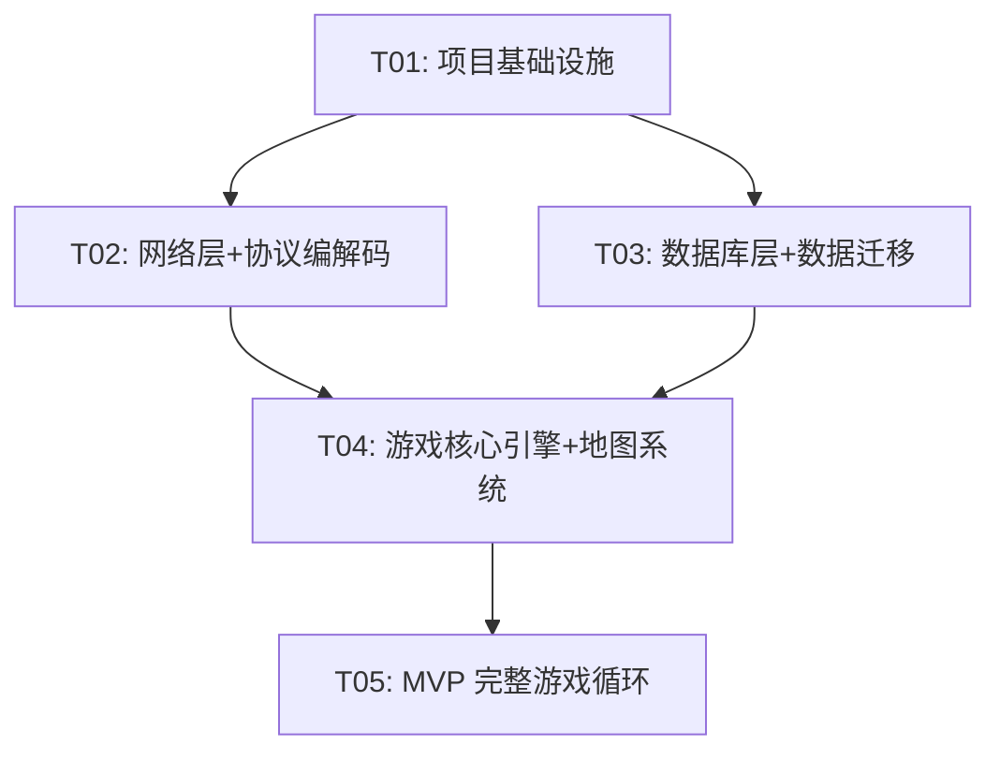

### 5.4 预计工作量

| 任务 | 预计人天 | 并行可能性 |
|------|---------|-----------|
| T01: 项目基础设施 | 2-3 天 | 单人 |
| T02: 网络层 | 5-7 天 | 可两人并行（Rust 端 + TS 端） |
| T03: 数据库层 | 4-5 天 | 单人 |
| T04: 游戏引擎 | 8-10 天 | 可多人并行（地图/对象/Envir 子任务） |
| T05: MVP 完整循环 | 10-15 天 | 多人并行 |
| **总计** | **约 30-40 天** | **2-3 人团队约 4-6 周** |

---

## 6. 共享知识

### 6.1 Rust 模块间接口约定

| 约定 | 规则 |
|------|------|
| **异步边界** | 网络层和数据库层使用 `async fn`；游戏主循环在同步上下文中通过 `block_on` 调用 DB |
| **共享状态** | Envir 是全局单例，内部使用 `Arc<RwLock<>>` 保护可变数据 |
| **Map 分区** | 每个 Map 一个 `tokio::sync::mpsc` channel 接收事件，独立 actor 处理 |
| **对象引用** | MapObject 间使用 `ObjectID: u32` 弱引用，不直接持有 `Arc<>` 防止循环引用 |
| **Packet 发送** | 所有 `PlayerObject.enqueue(packet)` 通过 channel 发给网络层批量发送 |
| **日志规范** | 使用 `log` crate + `env_logger`，级别：error/warn/info/debug/trace |
| **错误处理** | 使用 `anyhow::Result` 在公共边界，内部使用自定义 `GameError` 枚举 |

### 6.2 TypeScript 模块间接口约定

| 约定 | 规则 |
|------|------|
| **包管理** | 所有游戏包通过 `PacketHandler.onServerPacket(id, data)` 统一分发 |
| **游戏循环** | PixiJS `app.ticker.add(delta => update(delta))` 驱动 |
| **场景切换** | 通过 `SceneManager.switchTo(scene: Scene)` 统一管理 |
| **UI 通信** | UI 组件通过事件总线 `EventBus.emit/on` 与游戏逻辑通信 |
| **资源加载** | 资源通过 `AssetManager` 统一加载/缓存/释放 |
| **状态管理** | 客户端使用单例 `GameState` 保存所有运行时状态（玩家/背包/地图） |
| **渲染分层** | 渲染顺序：地面层→对象层→特效层→UI 层 |

### 6.3 跨语言协议约定

| 约定 | 规则 |
|------|------|
| **字节序** | 所有多字节值使用 **小端序**（Little Endian） |
| **字符串** | 4 字节长度前缀 (i32) + UTF-8 内容 + NULL 终止符 (0x00) |
| **枚举** | 所有枚举序列化为底层整数类型（byte/u16），按原始 C# 定义 |
| **时间** | Unix 毫秒时间戳（i64），与 C# `DateTime.UtcNow.Ticks` 不同 |
| **坐标** | Point { x: i32, y: i32 }，地图坐标从 (0,0) 开始 |
| **方向** | MirDirection: 0=Up, 1=UpRight, 2=Right, 3=DownRight, 4=Down, 5=DownLeft, 6=Left, 7=UpLeft |

### 6.4 命名规范与编码风格

#### Rust

| 项目 | 规范 |
|------|------|
| 模块 | `snake_case`（`map_object.rs`） |
| 类型 | `PascalCase`（`PlayerObject`） |
| 函数/方法 | `snake_case`（`process_ai`） |
| 常量 | `SCREAMING_SNAKE_CASE`（`DATA_RANGE`） |
| 枚举 | `PascalCase`（`MirDirection::Up`） |
| 错误类型 | `GameError`, `NetworkError` |
| 文件命名 | 每个类型一个文件，与类型名对应（小写） |

#### TypeScript

| 项目 | 规范 |
|------|------|
| 文件 | `snake_case.ts`（`map_renderer.ts`） |
| 类/类型 | `PascalCase`（`GameScene`） |
| 函数/方法 | `camelCase`（`handlePacket`） |
| 常量 | `SCREAMING_SNAKE_CASE` |
| 枚举 | `PascalCase`（`MirDirection.Up`） |
| 接口 | `I` 前缀可选，更推荐命名空间方式 |

### 6.5 关键 Rust Crate 选型

| 用途 | Crate | 版本 | 理由 |
|------|-------|------|------|
| 异步运行时 | tokio | 1.35+ | 业界标准异步运行时 |
| WebSocket | tokio-tungstenite | 0.21+ | Tokio 生态，纯 Rust |
| 数据库 | sqlx | 0.7+ | 编译时 SQL 检查，异步支持 |
| 序列化 | serde + serde_bytes | 1.0 | Rust 序列化标准 |
| 日志 | log + env_logger | 0.10 | 标准日志门面 |
| 配置 | toml + serde | 0.8 | TOML 格式配置 |
| 时间 | chrono | 0.4 | 时间处理 |
| 随机 | rand | 0.8 | 随机数生成 |
| 哈希 | sha2 | 0.10 | 版本哈希 |
| 错误处理 | anyhow + thiserror | 1.0 | 错误处理标准 |

### 6.6 关键 NPM Package 选型

| 用途 | Package | 版本 | 理由 |
|------|---------|------|------|
| 游戏框架 | pixi.js | 8.x | 2D 渲染性能最佳 |
| 构建工具 | vite | 5.x | 快速开发/热更新 |
| 语言 | typescript | 5.x | 类型安全 |
| React（UI） | react | 18.x | UI 框架 |
| MUI | @mui/material | 5.x | 组件库 |

---

## 7. 待明确事项

### 架构级待确认

| # | 问题 | 建议 | 影响范围 |
|---|------|------|---------|
| 1 | **Map actor 数量**：每个 Map 一个 Tokio task，还是按负载动态分配？ | 建议 MVP 每个 Map 一个 task，后续根据玩家数拆分 | T04 架构设计 |
| 2 | **碰撞检测精度**：原版使用 `Cell.Objects` 列表遍历，是否需要空间索引优化（四叉树）？ | MVP 保持与原版相同的 List 遍历，后续优化 | T04 map.rs |
| 3 | **NPC 脚本兼容度**：重写解析器是否 100% 兼容原版脚本语法？ | 建议核心语法兼容（#IF/#ACT/#SAY），边缘语法降级警告 | T05 script.rs |
| 4 | **WIL 资源策略**：服务端预处理还是 WASM 客户端解码？ | 建议 MVP 用纯 TS 解码（性能足够），后续 WASM 优化 | 客户端资源加载 |
| 5 | **数据库事务边界**：哪些操作需要事务包装？ | 建议：角色保存（背包+装备+属性在一个事务）、物品创建、金币转移 | T03 db 层 |
| 6 | **是否支持动态数据热加载**（改怪物属性不重启）？ | MVP 不支持，重启加载；后续支持 | T04 envir.rs |
| 7 | **怪物 AI 框架**是否支持脚本化（Lua/Rhai）？ | MVP 硬编码 Rust trait，后续考虑 Rhai 脚本化 | 怪物系统 |
| 8 | **日志/监控**：是否需要 OpenTelemetry 集成？ | MVP 仅 log 文件，后续集成 | 运维体系 |

### 游戏逻辑级待确认

| # | 问题 | 建议 | 影响范围 |
|---|------|------|---------|
| 9 | 5 种 MVP AI 具体是哪 5 种？ | 近战/远程/巡逻/BOSS/召唤（确认中） | T05 monster.rs |
| 10 | 物品使用效果（药水回复量等）参数来源？ | 从 ItemInfo 中读取，与原始 Crystal 公式一致 | T05 items/ |
| 11 | 怪物掉落表格式是否兼容原始 ?.txt 格式？ | 建议兼容 | T03 迁移工具 |
| 12 | 是否实现完整的安全区检测？ | 实现（InSafeZone 控制 PK/回血） | T04 map.rs |
| 13 | NPC 商店价格 1:1 还原原始计算公式？ | 是，PriceRate 逻辑移植 | T05 script.rs |

### 客户端级待确认

| # | 问题 | 建议 | 影响范围 |
|---|------|------|---------|
| 14 | PixiJS v7 还是 v8？ | 建议 v8（最新 LTS），注意 API 差异 | 客户端渲染 |
| 15 | 1x/2x 缩放如何处理（传奇原始 800x600）？ | 建议 CSS 缩放 + 视口自适应 | UI 布局 |
| 16 | 地图大地图（BigMap）MVP 是否需要？ | 不需要，仅小地图 | UI 范围 |
| 17 | 是否保留原始 BlendMode（LIGHT/LIGHTINV）效果？ | MVP 实现 NORMAL 模式，后续补充 | 渲染效果 |
| 18 | 音效 MVP 是否需要？ | 不需要 | 客户端范围 |

---

## 附录：原始 Crystal 架构参考

| 原始 C# 文件 | Rust/TS 对应 | 关键逻辑 |
|-------------|-------------|---------|
| `Server/MirEnvir/Envir.cs` | `server/src/game/envir.rs` | 主循环、定时器、全局数据列表、多线程管理 |
| `Server/MirObjects/MapObject.cs` | `server/src/objects/map_object.rs` | 抽象基类、Process/Broadcast/TakeDamage/Attacked |
| `Server/MirObjects/HumanObject.cs` | `server/src/objects/human.rs` | 角色属性、背包/装备、等级/经验、HP/MP |
| `Server/MirObjects/PlayerObject.cs` | `server/src/objects/player.rs` | 连接绑定、Packet 处理、NPC对话、交易/组队 |
| `Server/MirObjects/MonsterObject.cs` | `server/src/objects/monster.rs` | 怪物工厂、AI 分发、基础AI方法 |
| `Server/MirObjects/NPCObject.cs` | `server/src/objects/npc.rs` | NPC 交互、可见性、货物系统 |
| `Server/MirObjects/NPC/NPCScript.cs` | `server/src/npc/script.rs` | 脚本解析、条件/动作执行 |
| `Server/MirEnvir/Map.cs` | `server/src/game/map.rs` | 地图加载、Cell 碰撞、门系统、AOI |
| `Server/MirNetwork/MirConnection.cs` | `server/src/network/connection.rs` | GameStage 状态机、TCP/WebSocket 封装 |
| `Shared/Enums.cs` | `server/src/shared/enums.rs` + 客户端 | 所有游戏枚举 |
| `Shared/ServerPackets.cs` | `server/src/network/packet_defs.rs` | 服务端→客户端 150+ 数据包 |
| `Shared/ClientPackets.cs` | `server/src/network/packet_defs.rs` | 客户端→服务端 80+ 数据包 |
| `Server/MirDatabase/ItemInfo.cs` | `server/src/db/models/item.rs` | 物品模板定义 |
| `Server/MirDatabase/MonsterInfo.cs` | `server/src/db/models/monster.rs` | 怪物模板定义 |
| `Server/MirObjects/Monsters/*.cs` | `server/src/objects/monsters/*.rs` | 200+ 种怪物 AI 实现 |
