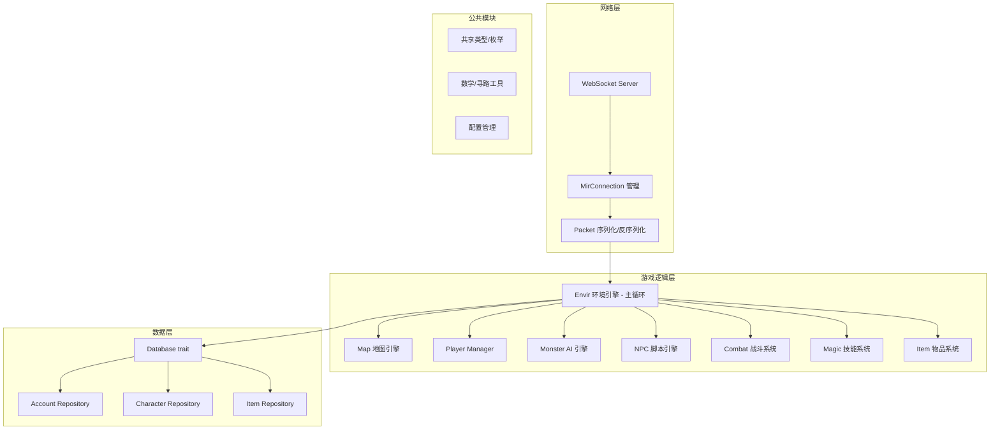
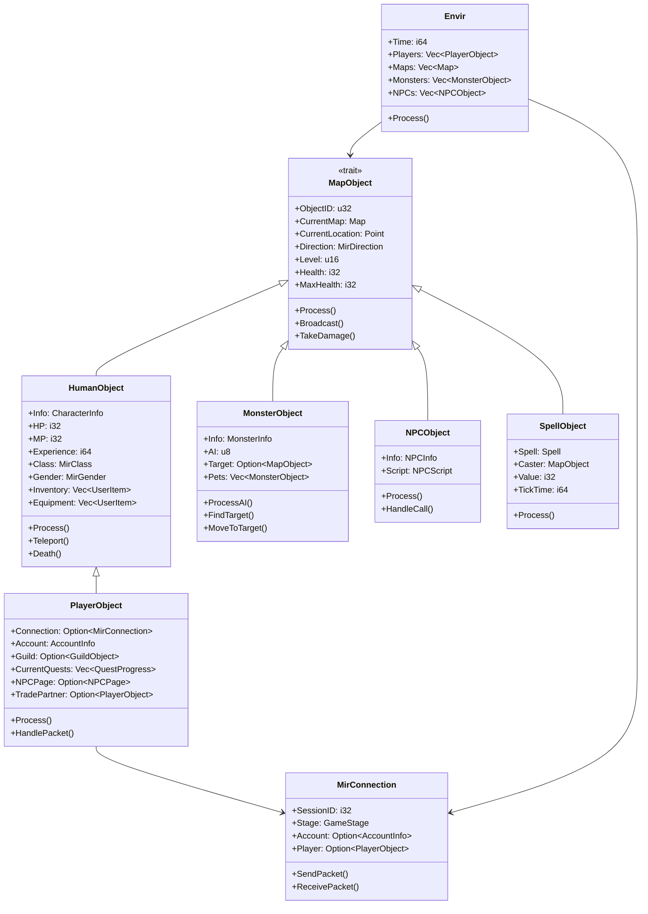
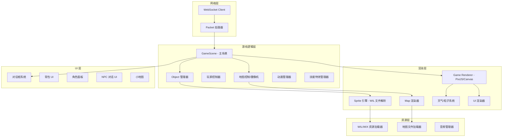
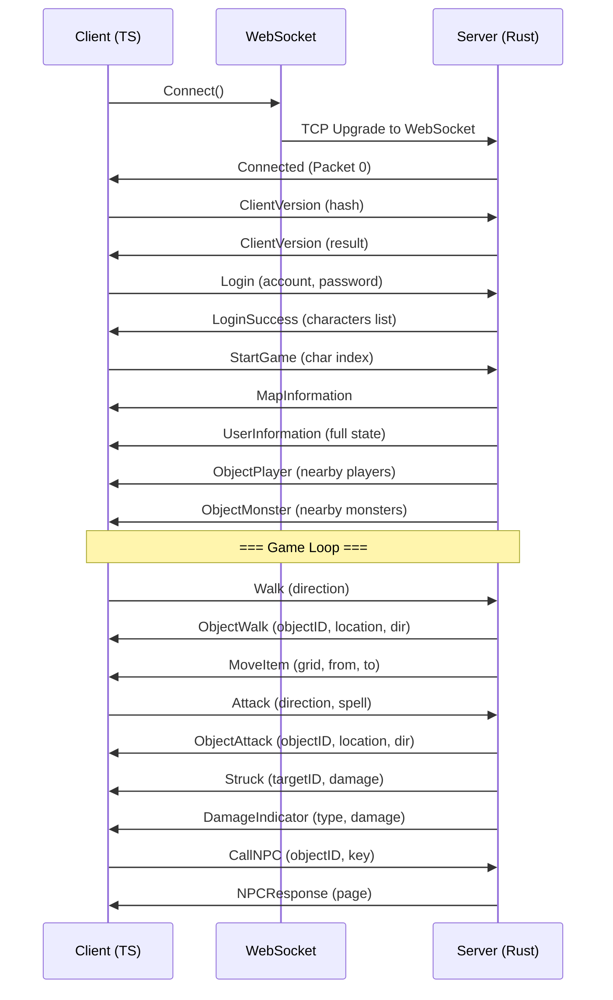
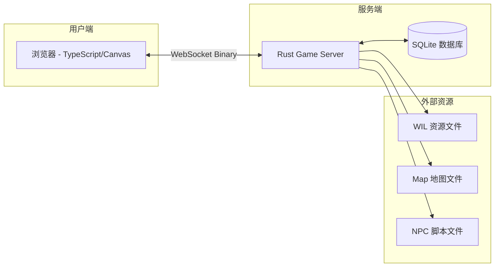
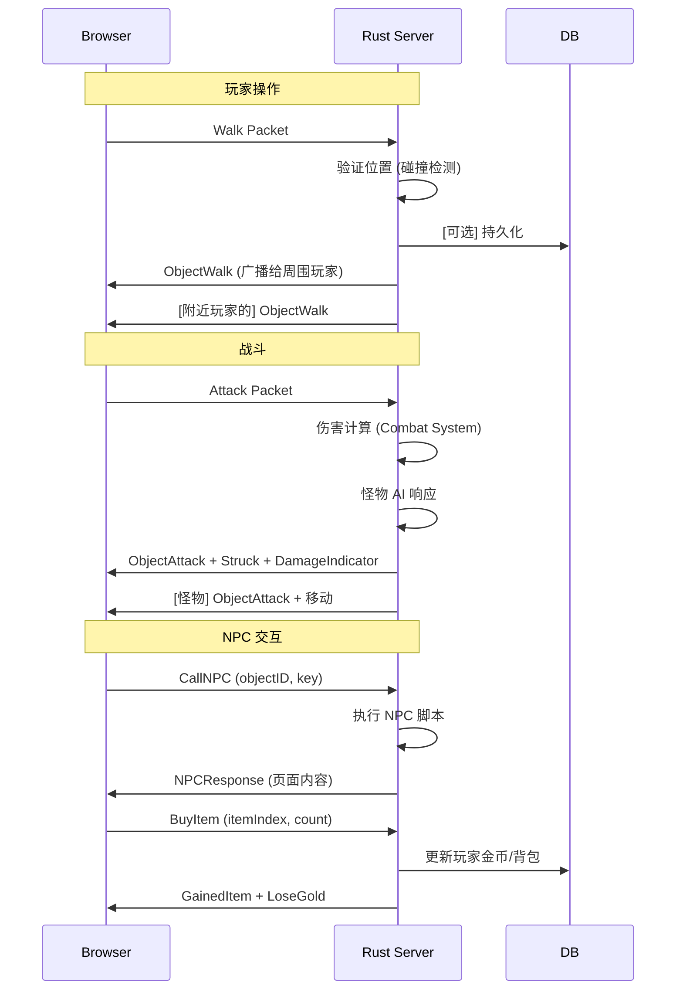

# Crystal（传奇2开源引擎）重写项目 — PRD

## 一、项目概述

### 1.1 项目背景

Crystal 是 Legend of Mir 2（传奇2）最广泛使用的开源引擎，由 LOMCN 社区维护至今。项目采用 C# .NET Framework + WinForms + DirectX 9（SlimDX）构建，当前代码量庞大且成熟。

### 1.2 重写目标

| 维度 | 现状 | 目标 |
|------|------|------|
| 服务端语言 | C# .NET Framework | **Rust**（高性能、内存安全、零成本抽象） |
| 客户端语言 | C# WinForms + SlimDX（DirectX 9） | **TypeScript**（Phaser.js/PixiJS，浏览器可玩） |
| 网络协议 | TCP Binary（自定义 Packet 序列化） | WebSocket + 二进制/JSON 混合 |
| 部署方式 | Windows 桌面应用 | 浏览器/跨平台 |
| 数据库 | 二进制文件（自定义 .DB 格式） | SQLite/PostgreSQL（可配置） |

### 1.3 核心设计原则

1. **单体服务器，水平扩展**：服务端暂保持单体架构，为未来微服务拆分预留接口
2. **协议兼容优先**：WebSocket 协议应精确保留原始 Binary 协议语义，方便未来兼容和调试
3. **模块化剥离**：数据库、网络、AI、NPC 脚本等模块要有清晰的 trait 边界
4. **无锁并发**：Rust 的 ownership + actor 模型替代 C# 的锁/ConcurrentQueue

---

## 二、代码库规模评估

| 度量 | 数据 |
|------|------|
| 服务端核心文件 | ~80+ 文件 |
| 客户端文件 | ~60+ 文件 |
| 共享协议文件 | ~10 文件 |
| 怪物 AI 类型 | **200+** 种独立 AI 脚本 |
| 法术种类 | ~100+ 种（5 职业 + 地图事件） |
| 怪物种类 | **700+** 种 |
| 物品类型 | 40+ 种 |
| 服务端→客户端数据包 | **150+** 种 |
| 客户端→服务端数据包 | **80+** 种 |
| NPC 对话框 | 30+ 种 UI 面板 |
| 数据持久化格式 | 二进制自定义格式 |

---

## 三、核心功能模块清单（P0 / P1 / P2）

### P0 — MVP 必备（第一阶段必须完成）

| 模块 | 说明 |
|------|------|
| 网络通信层 | WebSocket 连接管理，Packet 序列化/反序列化 |
| 账户系统 | 注册、登录、角色创建/删除/选择 |
| 地图系统 | 地图文件加载（多格式兼容），Cell 碰撞，视角同步 |
| 移动系统 | Walk/Run/Turn 操作同步，位置验证 |
| 玩家基础属性 | HP/MP/Level/Exp，属性计算 |
| 装备系统 | Inventory/Equipment 网格，装备/卸下/使用物品 |
| 物品掉落拾取 | 地上物品展示、拾取、掉落 |
| 聊天系统 | 普通/喊话/私聊/公会/系统频道 |
| NPC 交互 | 基础 NPC 脚本引擎（对话、商店买卖） |
| 基础战斗 | 普通攻击，伤害计算，扣血/死亡 |
| 怪物 AI 基础框架 | AI 引擎框架 + 3-5 种基础 AI（近战、远程、巡逻） |
| 数据库层 | 角色/物品/账户持久化（SQLite） |

### P1 — 核心体验（第二阶段）

| 模块 | 说明 |
|------|------|
| 5 职业完整技能系统 | Warrior/Wizard/Taoist/Assassin/Archer 所有技能 |
| 高级怪物 AI | 200+ AI 类型的逐步移植（按优先级） |
| NPC 完整脚本 | 商店、仓库、修理、强化、行会创建等所有功能 |
| Buff/Debuff 系统 | 50+ 种 Buff 类型，叠加/持续时间/移除规则 |
| 组队系统 | 组队邀请、经验分享、成员管理 |
| 行会系统 | 创建、成员管理、公告、行会战争 |
| 交易系统 | 玩家间交易、拍卖行 |
| 地图事件 | 地图闪电、熔岩、地震等特效 |
| 任务系统 | 任务接取/完成/奖励，NPC 任务对话 |
| 宠物/召唤物 | 道士召唤骷髅/神兽，英雄系统 |
| 物品强化 | 升级、鉴定、镶嵌、合成 |

### P2 — 进阶/长尾

| 模块 | 说明 |
|------|------|
| 攻城战 | Sabuk 攻城，城门/箭塔 |
| 婚姻/师徒 | 结婚、师徒关系系统 |
| 钓鱼系统 | 完整的钓鱼小游戏 |
| 英雄系统 | 双英雄、英雄装备/技能独立管理 |
| 坐骑系统 | 坐骑装备、骑乘战斗 |
| 智能宠物 | IntelligentCreature 系统 |
| 排行榜 | 等级/装备/PVP 排行榜 |
| 邮件系统 | 游戏内邮件、包裹 |
| 管理后台 | GM 工具、在线管理 |
| 内购商店 | GameShop 商城 |

---

## 四、Rust 服务端模块建议

### 4.1 整体架构



### 4.2 模块职责

#### 4.2.1 网络层

| 模块 | 职责 | 优先级 |
|------|------|--------|
| `network/ws_server.rs` | WebSocket 服务端，接受连接，管理 session | P0 |
| `network/connection.rs` | 每个连接的 session 管理（GameStage 状态机），发送/接收队列 | P0 |
| `network/packet.rs` | Packet 编解码 trait，150+ ServerPacket + 80+ ClientPacket 定义 | P0 |
| `network/packet_defs.rs` | 所有 Packet 结构体定义（自动生成或手写） | P0 |

#### 4.2.2 游戏逻辑层

| 模块 | 职责 | 优先级 |
|------|------|--------|
| `game/envir.rs` | 主游戏循环（Process），定时器（战争/行会/拍卖/刷怪/机器人），单例 | P0 |
| `game/map.rs` | 地图加载（支持 7+ 种地图格式），Cell 碰撞，门系统，寻路 | P0 |
| `game/dragon.rs` | 龙系统（世界事件） | P2 |
| `game/respawn.rs` | 怪物刷新管理器 | P1 |
| `game/robot.rs` | 机器人脚本定时执行 | P1 |
| `objects/map_object.rs` | MapObject trait — 所有游戏对象的抽象基类 | P0 |
| `objects/human_object.rs` | 玩家角色公共逻辑（属性、背包、装备） | P0 |
| `objects/player_object.rs` | 玩家完整实现（连接、交互、交易、行会、任务） | P0 |
| `objects/monster_object.rs` | 怪物工厂 + 公共怪物逻辑 | P0 |
| `objects/monsters/` | 200+ 种 AI 类型（每个文件一种 AI） | P0-P2 |
| `objects/npc_object.rs` | NPC 对象 | P0 |
| `objects/npc/` | NPC 脚本引擎（解析器 + 执行器） | P0 |
| `objects/spell_object.rs` | 法术投影（火墙、陷阱等地图上持续存在的法术） | P1 |
| `objects/item_object.rs` | 地上物品对象 | P0 |
| `objects/hero_object.rs` | 英雄角色 | P2 |
| `objects/guild_object.rs` | 行会对象 | P1 |
| `objects/conquest_object.rs` | 攻城对象 | P2 |
| `objects/deco_object.rs` | 装饰物对象 | P1 |
| `objects/buff.rs` | Buff/Debuff 系统 | P1 |
| `objects/delayed_action.rs` | 延迟动作队列 | P1 |
| `combat/damage.rs` | 伤害计算引擎（物理/魔法/道术，暴击/命中/闪避） | P0 |
| `combat/magic.rs` | 技能系统（100+ 种法术效果实现） | P1 |
| `combat/poison.rs` | 毒/减速/冰冻/麻痹等状态效果 | P1 |
| `items/item.rs` | 物品基础逻辑 | P0 |
| `items/sets.rs` | 套装效果系统 | P2 |
| `npc/script.rs` | NPC 脚本解析器（自定义脚本语言 -> AST -> 执行） | P0 |
| `npc/actions.rs` | NPC 动作实现（GiveItem/TakeItem/Teleport 等） | P0 |
| `npc/checks.rs` | NPC 条件检查 | P0 |
| `guild/mod.rs` | 行会系统 | P1 |
| `quest/mod.rs` | 任务系统 | P1 |
| `market/mod.rs` | 拍卖行系统 | P1 |
| `mail/mod.rs` | 邮件系统 | P2 |

#### 4.2.3 数据层

| 模块 | 职责 | 优先级 |
|------|------|--------|
| `db/mod.rs` | Database trait 定义 | P0 |
| `db/sqlite.rs` | SQLite 实现 | P0 |
| `db/postgres.rs` | PostgreSQL 实现（可选） | P2 |
| `db/models/account.rs` | 账户模型 | P0 |
| `db/models/character.rs` | 角色模型（含背包、装备、技能、任务状态） | P0 |
| `db/models/item.rs` | 物品定义 + 用户物品实例 | P0 |
| `db/models/monster.rs` | 怪物定义 | P0 |
| `db/models/magic.rs` | 技能定义 | P0 |
| `db/models/map.rs` | 地图定义 | P0 |
| `db/models/npc.rs` | NPC 定义 | P0 |
| `db/models/mail.rs` | 邮件模型 | P2 |
| `db/models/guild.rs` | 行会模型 | P1 |
| `db/models/quest.rs` | 任务模型 | P1 |

### 4.3 Rust 模块架构图



### 4.4 主循环设计（Rust 版）

```rust
// Envir 主循环伪代码
loop {
    // 1. 处理网络事件（非阻塞）
    network::poll_events(&mut connections);      // 接收新连接和packet
    
    // 2. 处理玩家输入
    for player in &mut players {
        while let Some(packet) = player.connection.receive() {
            handle_player_input(player, packet);
        }
    }
    
    // 3. 处理定时系统
    if time >= war_time { process_wars(); }
    if time >= guild_time { process_guilds(); }
    if time >= spawn_time { respawn_tick.process(); }
    if time >= robot_time { robot.process(); }
    
    // 4. 处理所有对象（多线程）
    // 使用 work-stealing 线程池，按 Map 分区
    for map in &maps {
        thread_pool.spawn(move || {
            for obj in &map.objects {
                obj.process();  // AI/移动/攻击
            }
        });
    }
    
    // 5. 处理延迟动作
    process_delayed_actions(&mut action_list);
    
    // 6. 网络发送
    for player in &players {
        player.connection.flush_send_queue();
    }
}
```

---

## 五、TypeScript 客户端模块建议

### 5.1 整体架构



### 5.2 模块职责

| 模块 | 职责 | 优先级 |
|------|------|--------|
| `network/ws_client.ts` | WebSocket 连接管理，心跳，重连 | P0 |
| `network/packet_handler.ts` | 150+ 服务端包的分发与处理 | P0 |
| `renderer/game_renderer.ts` | PixiJS Application 封装，游戏主循环 | P0 |
| `renderer/map_renderer.ts` | 地图瓦片渲染（地面、装饰、建筑层叠），多地图格式支持 | P0 |
| `renderer/sprite_engine.ts` | WIL 文件格式解析（mon-wil, object1-wil 等）+ 精灵动画播放 | P0 |
| `renderer/animation_manager.ts` | 移动/攻击/技能动画状态机 | P0 |
| `renderer/weather.ts` | 雨/雪/雾/灰烬等天气特效 | P1 |
| `renderer/particles.ts` | 粒子系统（技能特效、Buff 特效） | P1 |
| `scene/game_scene.ts` | 主游戏场景（管理所有子组件） | P0 |
| `scene/login_scene.ts` | 登录场景（账号密码输入） | P0 |
| `scene/select_scene.ts` | 角色选择场景 | P0 |
| `objects/map_object.ts` | 客户端 MapObject 基类（位置、动画、渲染） | P0 |
| `objects/player_object.ts` | 玩家对象（装备外观、名称、Buff 图标） | P0 |
| `objects/user_object.ts` | 本地玩家（输入处理、摄像机跟随） | P0 |
| `objects/monster_object.ts` | 怪物对象渲染 | P0 |
| `objects/npc_object.ts` | NPC 对象渲染 | P0 |
| `objects/spell_object.ts` | 法术效果（火墙、陷阱等） | P1 |
| `objects/effect.ts` | 通用特效对象 | P1 |
| `objects/damage.rs` | 伤害飘字显示 | P0 |
| `ui/dialogs/inventory.ts` | 背包面板（网格拖拽） | P0 |
| `ui/dialogs/character.ts` | 角色面板（装备查看/属性） | P0 |
| `ui/dialogs/npc_dialog.ts` | NPC 对话面板 | P0 |
| `ui/dialogs/shop.ts` | 商店买卖面板 | P0 |
| `ui/dialogs/storage.ts` | 仓库面板 | P1 |
| `ui/dialogs/trade.ts` | 交易面板 | P1 |
| `ui/dialogs/guild.ts` | 行会面板 | P1 |
| `ui/dialogs/quest.ts` | 任务面板 | P1 |
| `ui/dialogs/minimap.ts` | 小地图 | P1 |
| `ui/dialogs/bigmap.ts` | 大地图 | P2 |
| `ui/dialogs/fishing.ts` | 钓鱼面板 | P2 |
| `ui/dialogs/hero.ts` | 英雄管理面板 | P2 |
| `ui/dialogs/mail.ts` | 邮件面板 | P2 |
| `ui/dialogs/gameshop.ts` | 商城面板 | P2 |
| `ui/dialogs/buff.ts` | Buff 状态栏 | P1 |
| `ui/dialogs/chat.ts` | 聊天框 | P0 |
| `ui/controls/` | 可复用 UI 控件（按钮、标签、输入框、物品格等） | P0 |
| `resources/wil_loader.ts` | WIL/WIX 文件加载器（可考虑 WASM 加速） | P0 |
| `resources/map_loader.ts` | 地图文件加载器 | P0 |
| `resources/sound.ts` | 音效/WAV 播放 | P1 |

---

## 六、通信协议（WebSocket）设计要点

### 6.1 协议选择

| 方案 | 优缺点 | 推荐 |
|------|--------|------|
| **纯 Binary WebSocket** | 保持与原始 Binary 协议最大兼容，带宽最小 | **✅ MVP 推荐** |
| JSON over WebSocket | 开发调试方便，但包体积大，延迟略高 | ❌ 非实时场景 |
| **混合方案** | 高频（移动/攻击）用 Binary，低频（NPC/任务）用 JSON | ✅ 推荐长期方案 |

### 6.2 协议结构



### 6.3 Packet 格式

```
[2 bytes: PacketID][N bytes: Payload]

// 示例：Walk 包
Client -> Server:
  [0x0C] [0x00]    // PacketID = 12 (Walk)
  [0x02]            // Direction = Down

Server -> Client (ObjectWalk):
  [0x6C] [0x05]    // PacketID = ObjectWalk
  [ObjectID: 4 bytes]
  [Location.X: 4 bytes]
  [Location.Y: 4 bytes]
  [Direction: 1 byte]
```

### 6.4 WebSocket vs 原始 TCP

| 原始 Crystal TCP | WebSocket 改写策略 |
|-----------------|-------------------|
| 自定义 Packet 头+BinaryReader/Writer | 保持 Binary 载荷，用 WebSocket 帧替代 TCP 帧 |
| ConcurrentQueue 收发 | JavaScript 原生异步 + Buffer 处理 |
| IP/端口直连 | WebSocket URL 连接（ws://host:port） |
| 无心跳 | 实现应用层 KeepAlive + WebSocket Ping/Pong |

---

## 七、第一阶段 MVP 范围建议

### MVP 目标：可登录、移动、打怪的基础版本

#### 服务端（Rust）MVP 模块

```
crystal-server/
├── Cargo.toml
├── src/
│   ├── main.rs              # 入口，启动服务
│   ├── config.rs            # 配置加载
│   ├── network/
│   │   ├── mod.rs
│   │   ├── ws_server.rs     # WebSocket 服务
│   │   ├── connection.rs    # 连接管理
│   │   └── packet.rs        # Packet 编解码（核心~50种包）
│   ├── game/
│   │   ├── mod.rs
│   │   ├── envir.rs         # 主循环
│   │   ├── map.rs           # 地图加载 + 碰撞（支持1-2种格式）
│   │   └── respawn.rs       # 基础刷怪
│   ├── objects/
│   │   ├── mod.rs
│   │   ├── map_object.rs    # 抽象基类
│   │   ├── player.rs        # 玩家
│   │   ├── monster.rs       # 怪物 + 2-3种基础AI
│   │   ├── npc.rs           # NPC + 基础对话
│   │   └── item_object.rs   # 地上物品
│   ├── combat/
│   │   ├── mod.rs
│   │   └── damage.rs        # 伤害计算
│   ├── items/
│   │   └── mod.rs           # 物品系统
│   ├── npc/
│   │   └── script.rs        # NPC 脚本解析器（最小子集）
│   ├── db/
│   │   ├── mod.rs           # DB trait
│   │   ├── sqlite.rs        # SQLite 实现
│   │   └── models/          # 数据模型
│   └── shared/
│       ├── enums.rs         # 核心枚举
│       └── types.rs         # 共享类型
```

#### 客户端（TypeScript）MVP 模块

```
crystal-client/
├── package.json
├── src/
│   ├── main.ts              # 入口
│   ├── network/
│   │   ├── ws_client.ts     # WebSocket 客户端
│   │   └── packet_handler.rs # 包处理
│   ├── scene/
│   │   ├── game_scene.ts    # 游戏主场景
│   │   ├── login_scene.ts   # 登录
│   │   └── select_scene.ts  # 选角色
│   ├── renderer/
│   │   ├── game_renderer.ts # PixiJS 渲染器
│   │   ├── map_renderer.ts  # 地图渲染
│   │   └── sprite_engine.ts # 精灵引擎
│   ├── objects/
│   │   ├── map_object.ts    # 对象基类
│   │   ├── player.ts        # 玩家
│   │   ├── monster.ts       # 怪物
│   │   ├── npc.ts           # NPC
│   │   └── item_object.ts   # 物品
│   ├── ui/
│   │   ├── chat.ts          # 聊天框
│   │   ├── inventory.ts     # 背包
│   │   ├── character.ts     # 角色面板
│   │   └── npc_dialog.ts    # NPC 对话
│   └── resources/
│       ├── wil_loader.ts    # WIL 加载器
│       └── map_loader.ts    # 地图加载器
```

### MVP 里程碑

| 阶段 | 时间估计 | 交付物 |
|------|---------|--------|
| **M1: 基础设施** | 2-3周 | Rust 服务端框架 + WebSocket + SQLite；TS 客户端框架 + 网络层 |
| **M2: 登录流程** | 1-2周 | 账号注册/登录/角色选择完整流程 |
| **M3: 地图与移动** | 2-3周 | 地图渲染、角色移动同步、周围玩家/怪物显示 |
| **M4: 基础战斗** | 2-3周 | 普通攻击、伤害计算、怪物AI（3-5种）、死亡/掉落 |
| **M5: NPC 与物品** | 2-3周 | NPC 对话、商店买卖、背包/装备操作 |

---

## 八、关键架构决策

### 8.1 数据库迁移策略

```
原始格式（.DB 二进制） → 写一个 Rust 转换工具 → SQLite
```

需要在 MVP 前实现一个数据迁移工具，将 Crystal 原版的二进制数据库文件（怪物定义、物品定义、地图信息等）转换为 SQLite 格式。

### 8.2 怪物 AI 策略

200+ AI 类型是项目最大工作量之一。建议：

1. **MVP 阶段**：实现 AI 引擎框架 + 3-5 种通用 AI（近战攻击、远程攻击、巡逻、被动、召唤）
2. **Phase 2**：按怪物种类分组（Zuma 系列、Oma 系列、Boss 系列）批量实现
3. **长期**：考虑用 Lua/脚本化 AI 替代硬编码

### 8.3 NPC 脚本引擎

Crystal 的 NPC 使用自定义脚本语言（`[@MAIN]`, `#IF`, `#SAY`, `#ACT` 等）。需要在 Rust 中实现解析器：

```rust
// NPC 脚本示例（原始格式）
[@MAIN]
#IF
CHECKLEVEL 7
#ACT
GIVE 金币 1000
#SAY
欢迎来到比奇城！\ \
这是给新手的礼物。\
<关闭/@exit>
```

### 8.4 WIL 资源加载

传奇客户端资源存储在 `.WIL`/`.WIX` 文件中（包含所有精灵图）。TypeScript 端需要：

1. **方案A（推荐）**：用 Rust WASM 模块解析 WIL，吐出 spritesheet JSON + PNG
2. **方案B**：纯 TS 解析（性能较差但零依赖）
3. **方案C**：离线将 WIL 预处理为标准 spritesheet 格式

---

## 九、Mermaid 架构总图

### 9.1 系统模块总览



### 9.2 游戏循环数据流



---

## 十、待确认问题清单

### 架构级问题

| # | 问题 | 建议决策 | 影响 |
|---|------|---------|------|
| 1 | **MVP 包含多少个怪物 AI？** | 建议 5 种（近战、远程、巡逻、BOSS、被动） | 决定 MVP 工作量 |
| 2 | **NPC 脚本是重新实现解析器还是改为 JSON/Lua？** | 建议重写解析器保持兼容 | 影响 NPC 市场兼容性 |
| 3 | **WIL 资源：在服务端预处理还是在客户端实时解析？** | 建议服务端预处理 + WASM 客户端解码 | 影响加载速度和开发复杂度 |
| 4 | **数据库用 SQLite 还是 PostgreSQL？** | MVP 用 SQLite，预留 PG trait | MVP 开发速度 |
| 5 | **WebSocket 端口复用还是独立端口？** | 建议独立端口（7000→WebSocket） | 部署配置 |
| 6 | **多线程策略：每个 Map 一个 Tokio task？还是 actor 模型？** | 建议每个 Map 一个 actor，通过 channel 通信 | 性能与复杂度平衡 |
| 7 | **是否保留原版二进制存档格式的兼容性？** | 建议写一次性迁移工具 | 影响数据迁移策略 |
| 8 | **是否支持 LiteDB/NoSQL 作为备选数据库？** | MVP 不需要 | 技术栈选择 |

### 游戏逻辑级问题

| # | 问题 | 建议决策 | 影响 |
|---|------|---------|------|
| 9 | **技能系统的实现深度？** | MVP 只做基础物理攻击 + 2-3 个代表性技能 | MVP 范围 |
| 10 | **是否实现完整的 Buff 叠加逻辑？** | MVP 实现最简单的 replace 模式 | 战斗体验 |
| 11 | **怪物掉落表格式兼容原版吗？** | 兼容原版 Drop 文件格式 | 方便服主迁移 |
| 12 | **PK 红名/PK 惩罚是否实现？** | MVP 只做 AttackMode 切换，不做惩罚 | MVP 范围 |
| 13 | **是否支持自定义怪物/物品热加载？** | MVP 不支持，需重启加载 | 开发服体验 |
| 14 | **地图格式：支持多少种格式？** | MVP 支持最常见的 2-3 种格式 | 地图兼容性 |

### 客户端级问题

| # | 问题 | 建议决策 | 影响 |
|---|------|---------|------|
| 15 | **渲染引擎：Phaser.js vs PixiJS vs Three.js（3D）？** | 建议 **PixiJS**（2D 性能最好） | 技术选择 |
| 16 | **是否保留 DirectX 风格的 BlendMode 效果？** | 需要实现 LIGHT/LIGHTINV 等混合模式 | 渲染准确度 |
| 17 | **移动端适配？** | MVP 仅桌面端 | 目标用户 |
| 18 | **中文/多语言支持？** | 从第一天起支持 i18n | 国际化 |
| 19 | **是否保留原版的粒子系统复杂度？** | 简化实现，关键特效保留 | 视觉效果 |

---

## 附录 A：核心枚举概览

| 枚举 | 数值范围 | 用途 |
|------|---------|------|
| `MirClass` | 0-4 | Warrior/Wizard/Taoist/Assassin/Archer |
| `ObjectType` | 0-8 | None/Player/Item/Merchant/Spell/Monster/Deco/Creature/Hero |
| `ItemType` | 0-42 | Weapon/Armour/Helmet/Potion/Scroll/Mount/Book 等 |
| `Spell` | 0-218 | 全部法术 + 地图事件 |
| `Monster` | 0-700+ | 全部怪物 ID |
| `MirAction` | 0-38 | 站立/行走/跑步/攻击/技能 等动画状态 |
| `MirDirection` | 0-7 | 8 方向 |
| `ServerPacketIds` | 0-1715 | 150+ 服务端包 ID |
| `ClientPacketIds` | 0-1879 | 80+ 客户端包 ID |
| `PoisonType` | 0-1024 (Flags) | 绿毒/红毒/减速/冰冻/麻痹 等 |
| `BuffType` | 0-1399 | 50+ Buff 类型 |
| `AttackMode` | 0-5 | 和平/组队/行会/全体等 |

## 附录 B：文件引用

| 文件路径 | 重要性 | 读取目的 |
|---------|--------|---------|
| `Server/MirEnvir/Envir.cs` | ⭐⭐⭐⭐⭐ | 主循环、环境配置、所有核心数据列表 |
| `Server/MirObjects/MapObject.cs` | ⭐⭐⭐⭐⭐ | 游戏对象抽象基类 |
| `Server/MirObjects/HumanObject.cs` | ⭐⭐⭐⭐⭐ | 玩家角色公共逻辑 |
| `Server/MirObjects/PlayerObject.cs` | ⭐⭐⭐⭐⭐ | 玩家完整实现（连接、交互） |
| `Server/MirObjects/MonsterObject.cs` | ⭐⭐⭐⭐⭐ | 怪物工厂 + AI 分发 |
| `Server/MirEnvir/Map.cs` | ⭐⭐⭐⭐⭐ | 地图加载 + 碰撞系统 |
| `Shared/Enums.cs` | ⭐⭐⭐⭐⭐ | 全部枚举定义（协议基础） |
| `Shared/ServerPackets.cs` | ⭐⭐⭐⭐⭐ | 服务端→客户端协议定义 |
| `Shared/ClientPackets.cs` | ⭐⭐⭐⭐⭐ | 客户端→服务端协议定义 |
| `Server/MirNetwork/MirConnection.cs` | ⭐⭐⭐⭐ | 网络连接管理 |
| `Server/MirObjects/NPCObject.cs` | ⭐⭐⭐⭐ | NPC 交互逻辑 |
| `Server/MirObjects/NPCScript.cs` | ⭐⭐⭐⭐ | NPC 脚本解析引擎 |
| `Server/MirDatabase/MonsterInfo.cs` | ⭐⭐⭐⭐ | 怪物数据定义 |
| `Server/MirDatabase/ItemData.cs` | ⭐⭐⭐⭐ | 物品数据定义 |
| `Server/Settings.cs` | ⭐⭐⭐ | 全局配置 |

---

*本文档基于 Crystal 项目源码 `Server/MirEnvir`, `Server/MirObjects`, `Server/MirDatabase`, `Shared/`, `Client/` 等核心目录分析完成。*
