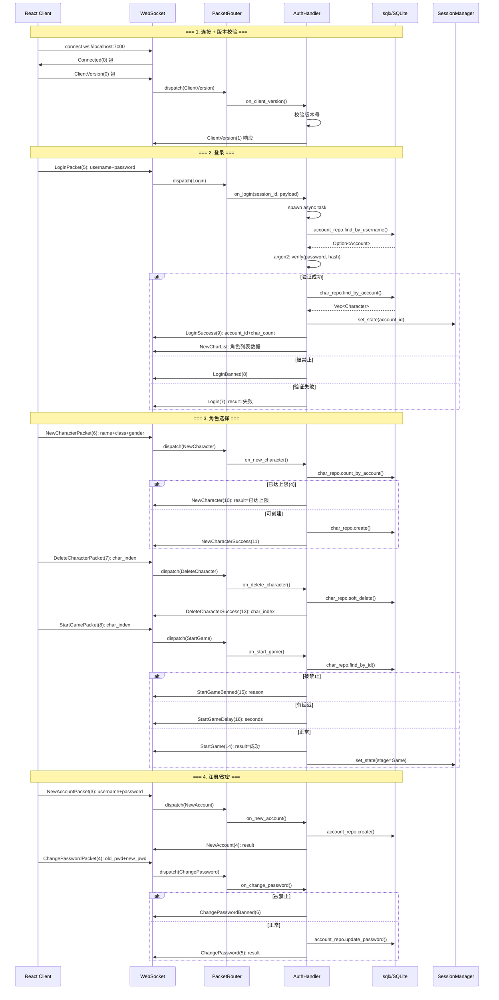
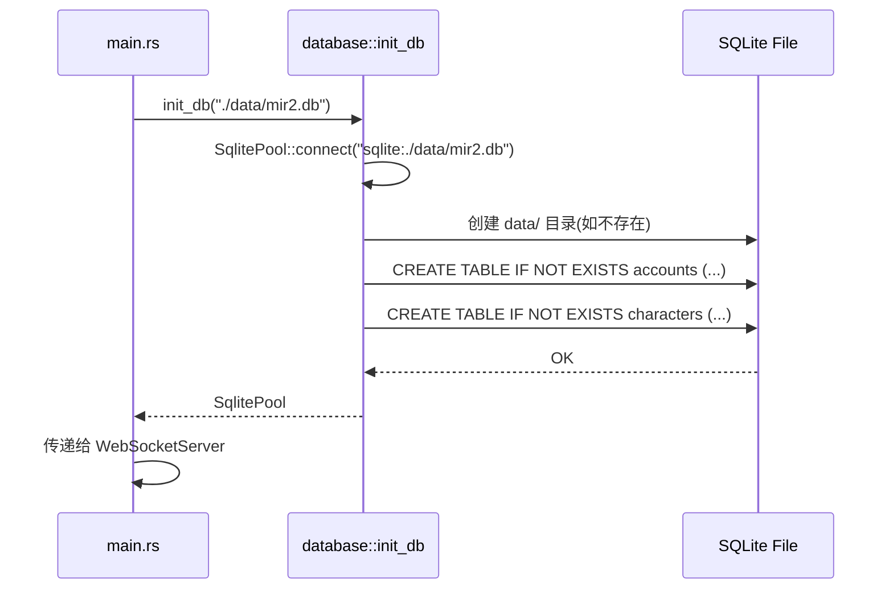
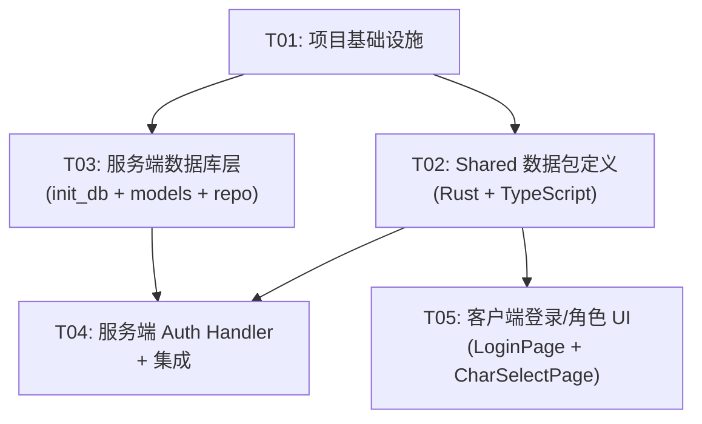
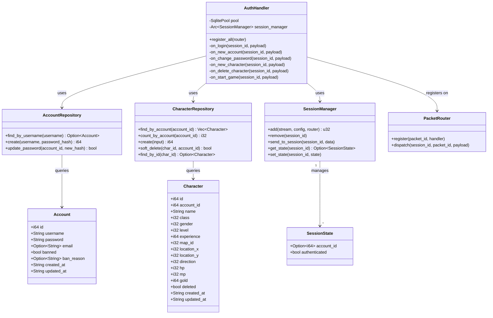

# 数据库初始化 + 登录认证 + 角色选择 — 架构设计文档

> **版本**: v1.0  
> **日期**: 2026-06-13  
> **作者**: Bob (Architect)  
> **状态**: 设计完成，待实现

---

## Part A: 系统设计

### 1. 实现方案 + 框架选型

#### 1.1 核心技术挑战

| 挑战 | 说明 | 解决方案 |
|------|------|---------|
| **同步 Handler → 异步 DB** | 当前 `PacketRouter` 的 handler 签名是 `fn(u32, &[u8])`（同步闭包），但 SQLite 查询需要异步执行 | Handler 闭包内 `tokio::spawn` 启动异步 task，不修改 `PacketRouter` |
| **密码安全存储** | 明文存储密码不安全，需要哈希 | `argon2` crate，验证时比对哈希 |
| **Session 状态追溯** | 登录后 session 需要关联 `account_id` | `SessionManager` 新增 `HashMap<u32, SessionState>` |
| **每账号最多 4 角色** | 创建角色前需计数检查 | repository 层提供 `count_by_account()` 方法 |

#### 1.2 框架/库选型

| 库 | 版本 | 用途 | 理由 |
|----|------|------|------|
| `sqlx` (sqlite) | 0.9 (已存在) | 异步 SQLite 访问 | 已在 workspace deps，支持 `runtime-tokio`，完美融入 tokio 生态 |
| `argon2` | 0.5 | 密码哈希 | Rust 标准 argon2 实现，安全性高，API 简洁 |

**不选 `rusqlite` 的理由**: rusqlite 是同步 API，需要在 `spawn_blocking` 中执行，增加复杂度。sqlx 已存在于 workspace 且直接在 async 上下文中使用，更简洁。

#### 1.3 架构模式

```
┌─────────────────────────────────────────────────┐
│  Server (Rust)                                   │
│  ┌──────────┐  ┌────────────┐  ┌─────────────┐  │
│  │ main.rs  │→ │ WebSocket  │→ │ PacketRouter │  │
│  │ (init DB)│  │ Server     │  │ (dispatch)   │  │
│  └──────────┘  └────────────┘  └──────┬───────┘  │
│       │                               │          │
│       ▼                               ▼          │
│  ┌──────────┐                   ┌────────────┐   │
│  │database/ │                   │ auth/      │   │
│  │- init_db │←─ SqlitePool ────│- handlers  │   │
│  │- models  │                   │ (spawn async)│  │
│  │- repo    │                   └────────────┘   │
│  └──────────┘                                    │
│       │                                          │
│       ▼                                          │
│  ┌──────────┐  ┌─────────────────────────┐       │
│  │data/     │  │SessionManager           │       │
│  │mir2.db   │  │- sessions: HashMap      │       │
│  └──────────┘  │- states: HashMap(u32→   │       │
│                │  SessionState)          │       │
│                └─────────────────────────┘       │
└─────────────────────────────────────────────────┘
         ▲ WebSocket (二进制包协议)
         ▼
┌─────────────────────────────────────────────────┐
│  Client (React + TypeScript)                     │
│  ┌──────────┐  ┌────────────┐  ┌─────────────┐  │
│  │App.tsx   │→ │LoginPage   │→ │CharSelect   │  │
│  │(stage    │  │(账号密码)  │  │Page(角色列表)│  │
│  │machine)  │  └────────────┘  └─────────────┘  │
│  └──────────┘                                    │
│  ┌──────────────────────────────────────┐        │
│  │ hooks/useGameState.ts                │        │
│  │ (GameStage: None→Login→SelectChar→   │        │
│  │  Loading→Game)                       │        │
│  └──────────────────────────────────────┘        │
└─────────────────────────────────────────────────┘
```

#### 1.4 同步→异步桥接模式

当前 `PacketRouter` handler 签名: `Box<dyn Fn(u32, &[u8]) + Send + Sync>`

桥接方案 — Handler 闭包内 spawn async task:

```rust
// 闭包捕获 Arc<Pool> + Arc<SessionManager>
// 闭包内:
tokio::spawn(async move {
    // ... async DB operations ...
    // ... response via session_manager.send_to_session() ...
});
// ❌ 注意！这里不能 await，因为闭包是同步的
// ✅ 正确：tokio::spawn 立即返回，不阻塞 dispatch
```

这种方式不需要修改 `PacketRouter` 或 handler 签名，保持了与现有系统的完全兼容。

---

### 2. 文件列表

#### Server 端 (Rust) — 新增/修改文件

| 文件路径 | 操作 | 职责 |
|---------|------|------|
| `Server/src/database/mod.rs` | **新增** | 数据库初始化模块：创建连接池、建表 |
| `Server/src/database/models.rs` | **新增** | 数据模型定义：`Account`, `Character` |
| `Server/src/database/repository.rs` | **新增** | Repository 层：`AccountRepository`, `CharacterRepository` |
| `Server/src/auth/mod.rs` | **新增** | Auth 认证模块：所有登录/角色 Handler 注册 |
| `Server/src/lib.rs` | **修改** | 添加 `pub mod database; pub mod auth;` |
| `Server/src/main.rs` | **修改** | 初始化 DB 后启动服务器，传递 pool |
| `Server/src/network/server.rs` | **修改** | 构造函数接受 `SqlitePool`，传递给 AuthHandler |
| `Server/src/network/session_manager.rs` | **修改** | 新增 `SessionState` 存储（account_id, stage） |
| `Server/src/network/handler.rs` | **不修改** | 保持现有 handler 不变 |

#### Shared 端 (Rust) — 修改文件

| 文件路径 | 操作 | 职责 |
|---------|------|------|
| `Shared/src/packets/client.rs` | **修改** | 新增客户端请求包结构体 |
| `Shared/src/packets/server.rs` | **修改** | 新增服务端响应包结构体 |

#### Client 端 (TypeScript/React) — 新增/修改文件

| 文件路径 | 操作 | 职责 |
|---------|------|------|
| `Client/src/network/packets/client_packets.ts` | **修改** | 新增登录/注册/角色操作客户端包 |
| `Client/src/network/packets/server_packets.ts` | **修改** | 新增服务端包解析器 |
| `Client/src/components/LoginPage.tsx` | **新增** | 登录/注册页面 UI |
| `Client/src/components/CharSelectPage.tsx` | **新增** | 角色选择/创建/删除页面 UI |
| `Client/src/hooks/useGameState.ts` | **新增** | 游戏阶段状态管理 hook |
| `Client/src/App.tsx` | **修改** | 重构为阶段驱动的 UI 切换 |

#### 配置/依赖文件

| 文件路径 | 操作 | 职责 |
|---------|------|------|
| `Cargo.toml` (workspace) | **修改** | 添加 `argon2` workspace dep |
| `Server/Cargo.toml` | **修改** | 引用 `argon2` |

---

### 3. 关键数据结构/接口定义

#### 3.1 Rust 端 — 数据模型

```rust
// ===== database/models.rs =====

/// 账号
#[derive(Debug, Clone, sqlx::FromRow)]
pub struct Account {
    pub id: i64,
    pub username: String,
    pub password: String,     // argon2 hash
    pub email: Option<String>,
    pub banned: bool,
    pub ban_reason: Option<String>,
    pub created_at: String,   // ISO 8601
    pub updated_at: String,   // ISO 8601
}

/// 角色
#[derive(Debug, Clone, sqlx::FromRow)]
pub struct Character {
    pub id: i64,
    pub account_id: i64,
    pub name: String,
    pub class: i32,           // MirClass as i32
    pub gender: i32,          // MirGender as i32
    pub level: i32,
    pub experience: i64,
    pub map_id: i32,
    pub location_x: i32,
    pub location_y: i32,
    pub direction: i32,
    pub hp: i32,
    pub mp: i32,
    pub gold: i64,
    pub deleted: bool,
    pub created_at: String,
    pub updated_at: String,
}

/// 没有角色的角色信息（用于 NewCharacterSuccess 的 char_info）
#[derive(Debug, Clone)]
pub struct CharacterInfo {
    pub index: u32,
    pub name: String,
    pub class: u8,
    pub gender: u8,
    pub level: u16,
    pub location_x: u32,
    pub location_y: u32,
    pub hp: u32,
    pub mp: u32,
    pub max_hp: u32,
    pub max_mp: u32,
}
```

#### 3.2 Rust 端 — Repository

```rust
// ===== database/repository.rs =====

use sqlx::SqlitePool;

pub struct AccountRepository {
    pool: SqlitePool,
}

impl AccountRepository {
    pub fn new(pool: SqlitePool) -> Self;
    
    /// 按用户名查找账号
    pub async fn find_by_username(&self, username: &str) -> Result<Option<Account>, sqlx::Error>;
    
    /// 创建新账号（已哈希的密码）
    pub async fn create(&self, username: &str, password_hash: &str) -> Result<i64, sqlx::Error>;
    
    /// 修改密码
    pub async fn update_password(&self, account_id: i64, new_hash: &str) -> Result<bool, sqlx::Error>;
}

pub struct CharacterRepository {
    pool: SqlitePool,
}

impl CharacterRepository {
    pub fn new(pool: SqlitePool) -> Self;
    
    /// 查询账号下的所有角色（未删除）
    pub async fn find_by_account(&self, account_id: i64) -> Result<Vec<Character>, sqlx::Error>;
    
    /// 查询某账号的角色数量（用于判断是否已达上限 4）
    pub async fn count_by_account(&self, account_id: i64) -> Result<i32, sqlx::Error>;
    
    /// 创建角色
    pub async fn create(&self, character: &NewCharacterInput) -> Result<i64, sqlx::Error>;
    
    /// 软删除角色
    pub async fn soft_delete(&self, char_id: i64, account_id: i64) -> Result<bool, sqlx::Error>;
    
    /// 按 ID 查找角色
    pub async fn find_by_id(&self, char_id: i64) -> Result<Option<Character>, sqlx::Error>;
}
```

#### 3.3 Rust 端 — Auth Handler

```rust
// ===== auth/mod.rs =====

use sqlx::SqlitePool;
use crate::network::session_manager::SessionManager;
use crate::network::handler::PacketRouter;

pub struct AuthHandler {
    pool: SqlitePool,
    session_manager: std::sync::Arc<SessionManager>,
}

impl AuthHandler {
    pub fn new(pool: SqlitePool, session_manager: std::sync::Arc<SessionManager>) -> Self;
    
    /// 注册所有 auth/login/character 相关 handler
    pub fn register_all(&self, router: &PacketRouter);
}
```

#### 3.4 Rust 端 — Session 状态扩展

```rust
// ===== network/session_manager.rs (新增) =====

/// 会话状态
#[derive(Debug, Clone, Default)]
pub struct SessionState {
    pub account_id: Option<i64>,
    pub authenticated: bool,
}

// SessionManager 新增字段:
//   states: RwLock<HashMap<u32, SessionState>>
// 新增方法:
//   pub async fn get_state(&self, session_id: u32) -> Option<SessionState>
//   pub async fn set_state(&self, session_id: u32, state: SessionState)
//   pub async fn remove_state(&self, session_id: u32)
```

#### 3.5 Rust 端 — 包结构体 (Shared)

```rust
// ===== packets/client.rs (新增) =====

/// 登录包 Opcode=5
/// 载荷: [username_len: u16 LE][username: u8[username_len]][password_len: u16 LE][password: u8[password_len]]
pub struct LoginClientPacket {
    pub username: String,
    pub password: String,
}

/// 新账号包 Opcode=3
/// 载荷: [username: u8…][password: u8…] (简单模式，无长度前缀？需要确认)
pub struct NewAccountClientPacket {
    pub username: String,
    pub password: String,
}

/// 修改密码包 Opcode=4
pub struct ChangePasswordClientPacket {
    pub old_password: String,
    pub new_password: String,
}

/// 新角色包 Opcode=6
/// 载荷: [name_len: u8?][name: u8[name_len]][class: u8][gender: u8]
pub struct NewCharacterClientPacket {
    pub name: String,
    pub class: u8,
    pub gender: u8,
}

/// 删除角色包 Opcode=7
/// 载荷: [char_index: u32 LE] (或 u8?)
pub struct DeleteCharacterClientPacket {
    pub char_index: u32,
}

/// 开始游戏包 Opcode=8
/// 载荷: [char_index: u32 LE]
pub struct StartGameClientPacket {
    pub char_index: u32,
}
```

```rust
// ===== packets/server.rs (新增) =====

/// Login 响应 Opcode=7: result u8
pub struct LoginResponsePacket { pub result: u8 }

/// LoginBanned Opcode=8: 空
pub struct LoginBannedPacket;

/// LoginSuccess Opcode=9: [account_id: u32 LE][char_count: u8]
pub struct LoginSuccessPacket { pub account_id: u32, pub char_count: u8 }

/// NewCharacter 响应 Opcode=10: result u8
pub struct NewCharacterResponsePacket { pub result: u8 }

/// NewCharacterSuccess Opcode=11: char_info (name+class+gender+level+…)
pub struct NewCharacterSuccessPacket { pub char_info: CharacterInfo }

/// DeleteCharacter 响应 Opcode=12: result u8
pub struct DeleteCharacterResponsePacket { pub result: u8 }

/// DeleteCharacterSuccess Opcode=13: char_index u32
pub struct DeleteCharacterSuccessPacket { pub char_index: u32 }

/// StartGame 响应 Opcode=14: result u8
pub struct StartGameResponsePacket { pub result: u8 }

/// StartGameBanned Opcode=15: reason string
pub struct StartGameBannedPacket { pub reason: String }

/// StartGameDelay Opcode=16: seconds u32
pub struct StartGameDelayPacket { pub seconds: u32 }

/// NewAccount 响应 Opcode=4: result u8
pub struct NewAccountResponsePacket { pub result: u8 }

/// ChangePassword 响应 Opcode=5: result u8
pub struct ChangePasswordResponsePacket { pub result: u8 }

/// ChangePasswordBanned Opcode=6: 空
pub struct ChangePasswordBannedPacket;
```

#### 3.6 Client 端 (TypeScript) — 包定义

```typescript
// client_packets.ts — 新增

// 登录包
export class LoginPacket implements ClientPacket {
    constructor(public username: string, public password: string) {}
    packet_id(): number { return ClientPacketIds.Login; }  // =5
    serialize(): ArrayBuffer { /* username_len+username+password_len+password */ }
}

// 注册包
export class NewAccountPacket implements ClientPacket {
    constructor(public username: string, public password: string) {}
    packet_id(): number { return ClientPacketIds.NewAccount; }  // =3
    serialize(): ArrayBuffer { /* username+password */ }
}

// 修改密码包
export class ChangePasswordPacket implements ClientPacket {
    constructor(public oldPwd: string, public newPwd: string) {}
    packet_id(): number { return ClientPacketIds.ChangePassword; }  // =4
}

// 创建角色包
export class NewCharacterPacket implements ClientPacket {
    constructor(public name: string, public classType: number, public gender: number) {}
    packet_id(): number { return ClientPacketIds.NewCharacter; }  // =6
}

// 删除角色包
export class DeleteCharacterPacket implements ClientPacket {
    constructor(public charIndex: number) {}
    packet_id(): number { return ClientPacketIds.DeleteCharacter; }  // =7
}

// 开始游戏包
export class StartGamePacket implements ClientPacket {
    constructor(public charIndex: number) {}
    packet_id(): number { return ClientPacketIds.StartGame; }  // =8
}
```

```typescript
// server_packets.ts — 新增接口/解析器

export interface ILoginResult { result: number }
export interface ILoginSuccess { account_id: number; char_count: number }
export interface ICharacterInfo {
    index: number; name: string; class: number;
    gender: number; level: number;
    location_x: number; location_y: number;
    hp: number; mp: number; max_hp: number; max_mp: number;
}
export interface INewCharacterResult { result: number }
export interface INewCharacterSuccess { char_info: ICharacterInfo }
export interface IDeleteCharacterResult { result: number }
export interface IDeleteCharacterSuccess { char_index: number }
export interface IStartGameResult { result: number }
export interface INewAccountResult { result: number }
export interface IChangePasswordResult { result: number }
```

#### 3.7 Client 端 — 游戏阶段状态

```typescript
// hooks/useGameState.ts

export type GameStage = 'none' | 'login' | 'select_char' | 'loading' | 'game';

export interface GameState {
    stage: GameStage;
    accountId: number | null;
    characters: ICharacterInfo[];
    error: string | null;
}

// 对外暴露方法:
// - requestLogin(username, password)
// - requestRegister(username, password)
// - requestNewCharacter(name, classType, gender)
// - requestDeleteCharacter(charIndex)
// - requestStartGame(charIndex)
// - requestChangePassword(oldPwd, newPwd)
```

---

### 4. 程序调用流程

#### 4.1 完整登录流程



#### 4.2 数据库初始化流程



---

### 5. 待明确事项

| # | 事项 | 状态 | 假设/建议 |
|---|------|------|----------|
| 1 | `LoginPacket` 载荷格式 | PRD 写 `username_len+username+password_len+password` vs 简单模式 | 采用 `[u16:username_len][username][u16:password_len][password]` 标准格式 |
| 2 | `NewAccountPacket` 和 `ChangePasswordPacket` 载荷格式 | PRD 写 `username+password` 无长度前缀 | 假设也是 `[u16:len][data]` 格式，与服务端解析一致 |
| 3 | 版本号具体值 | 未指定 | 假设客户端发送 `[1,0,0,0]` 版本，服务端校验 == `[1,0,0,0]` |
| 4 | `NewCharacterPacket` 的 name 长度前缀类型 | 未指定 u8 还是 u16 | 假设 u16 LE，与其他包一致 |
| 5 | 角色删除的表结构 `char_index` 对应 `characters.id` 还是 `ROW_NUMBER` | 未明确 | 假设 `char_index` = `characters.id` (i64 转为 u32 发送) |
| 6 | email 字段在注册时是否必填 | 未指定 | 假设可选，可先不填 |
| 7 | ClientVersion 校验失败的客户端行为 | 未指定 | 服务端发送 `Disconnect` 断开连接 |
| 8 | Login 结果的 result 值含义 | 未指定 | 假设 0=成功, 1=密码错误, 2=账号不存在 |

---

## Part B: 任务分解

### 6. 依赖包列表

#### Server Cargo.toml 需追加

```toml
# workspace Cargo.toml 追加
[workspace.dependencies]
argon2 = "0.5"

# Server/Cargo.toml 追加
[dependencies]
argon2.workspace = true
```

#### Client package.json 需追加

无新增依赖。已有 `@mui/material`、`react` 足够。

---

### 7. 任务列表 (按依赖排序，最多 5 个任务)

#### T01: 项目基础设施

| 字段 | 内容 |
|------|------|
| **Task ID** | T01 |
| **Task Name** | 项目基础设施 — 依赖声明 + 配置文件 + 文档 |
| **Priority** | P0 |
| **Source Files** | `Cargo.toml` (workspace), `Server/Cargo.toml`, `docs/arch-db-login-2026-06-13.md` |
| **Dependencies** | 无 |

**修改内容**:
1. **`Cargo.toml` (workspace)**: 在 `[workspace.dependencies]` 中添加 `argon2 = "0.5"`
2. **`Server/Cargo.toml`**: 在 `[dependencies]` 中添加 `argon2.workspace = true`
3. **`docs/arch-db-login-2026-06-13.md`**: 本文档

---

#### T02: Shared 数据包定义 (Rust + TypeScript)

| 字段 | 内容 |
|------|------|
| **Task ID** | T02 |
| **Task Name** | Shared 层 — 登录/角色数据包定义 (Rust Shared + TypeScript) |
| **Priority** | P0 |
| **Source Files** | `Shared/src/packets/client.rs`, `Shared/src/packets/server.rs`, `Client/src/network/packets/client_packets.ts`, `Client/src/network/packets/server_packets.ts` |
| **Dependencies** | T01 |

**修改内容**:

**`Shared/src/packets/client.rs`** — 新增 6 个客户端请求包结构体:

| 包 | Opcode | 载荷格式 |
|----|--------|---------|
| `LoginClientPacket` | 5 (ClientOpcode::Login) | `[username_len:u16][username][password_len:u16][password]` |
| `NewAccountClientPacket` | 3 (ClientOpcode::NewAccount) | `[username_len:u16][username][password_len:u16][password]` |
| `ChangePasswordClientPacket` | 4 (ClientOpcode::ChangePassword) | `[old_len:u16][old_pwd][new_len:u16][new_pwd]` |
| `NewCharacterClientPacket` | 6 (ClientOpcode::NewCharacter) | `[name_len:u16][name][class:u8][gender:u8]` |
| `DeleteCharacterClientPacket` | 7 (ClientOpcode::DeleteCharacter) | `[char_index:u32 LE]` |
| `StartGameClientPacket` | 8 (ClientOpcode::StartGame) | `[char_index:u32 LE]` |

每个包实现 `Packet` trait（encode 方法，packet_id 方法）。

**`Shared/src/packets/server.rs`** — 新增 11 个服务端响应包结构体:

| 包 | Opcode | 载荷格式 |
|----|--------|---------|
| `LoginResponsePacket` | 7 (ServerOpcode::Login) | `[result:u8]` |
| `LoginBannedPacket` | 8 | 空 |
| `LoginSuccessPacket` | 9 | `[account_id:u32 LE][char_count:u8]` |
| `NewCharacterResponsePacket` | 10 | `[result:u8]` |
| `NewCharacterSuccessPacket` | 11 | `[name_len:u16][name][class:u8][gender:u8][level:u16]...[全 char_info]` |
| `DeleteCharacterResponsePacket` | 12 | `[result:u8]` |
| `DeleteCharacterSuccessPacket` | 13 | `[char_index:u32 LE]` |
| `StartGameResponsePacket` | 14 | `[result:u8]` |
| `StartGameBannedPacket` | 15 | `[reason_len:u16][reason]` |
| `StartGameDelayPacket` | 16 | `[seconds:u32 LE]` |
| `NewAccountResponsePacket` | 4 | `[result:u8]` |
| `ChangePasswordResponsePacket` | 5 | `[result:u8]` |
| `ChangePasswordBannedPacket` | 6 | 空 |

每个包实现 `Packet` trait。

**`Client/src/network/packets/client_packets.ts`** — 新增 6 个客户端包类:
- `LoginPacket`, `NewAccountPacket`, `ChangePasswordPacket`
- `NewCharacterPacket`, `DeleteCharacterPacket`, `StartGamePacket`
- 每个实现 `ClientPacket` 接口 (`packet_id()`, `serialize()`)

**`Client/src/network/packets/server_packets.ts`** — 新增:
- 接口: `ILoginResult`, `ILoginSuccess`, `ICharacterInfo`, `INewCharacterResult`, `INewCharacterSuccess`, `IDeleteCharacterResult`, `IDeleteCharacterSuccess`, `IStartGameResult`, `INewAccountResult`, `IChangePasswordResult`
- 解析函数: 注册到 `parsers` Map 中
- 新增 `ClientVersion` 包解析器（已有 `ClientVersion` 包，但服务端版本响应需解析）

---

#### T03: 服务端数据库层

| 字段 | 内容 |
|------|------|
| **Task ID** | T03 |
| **Task Name** | 服务端 — 数据库初始化 + Model + Repository |
| **Priority** | P0 |
| **Source Files** | `Server/src/database/mod.rs`, `Server/src/database/models.rs`, `Server/src/database/repository.rs`, `Server/src/network/session_manager.rs` |
| **Dependencies** | T01 |

**修改内容**:

**`Server/src/database/mod.rs`** — 数据库初始化模块:
- `pub mod models; pub mod repository;`
- `pub async fn init_db(db_path: &str) -> Result<sqlx::SqlitePool, anyhow::Error>`
  1. 确保父目录存在（`fs::create_dir_all`）
  2. `SqlitePool::connect(&format!("sqlite:{db_path}"))`
  3. 调用 `run_migrations(&pool).await`
  4. 返回 pool
- `async fn run_migrations(pool: &SqlitePool) -> Result<(), sqlx::Error>`
  - `CREATE TABLE IF NOT EXISTS accounts (...)`
  - `CREATE TABLE IF NOT EXISTS characters (...)`
  - 建表 SQL 见下方

**accounts 表 SQL**:
```sql
CREATE TABLE IF NOT EXISTS accounts (
    id          INTEGER PRIMARY KEY AUTOINCREMENT,
    username    TEXT NOT NULL UNIQUE,
    password    TEXT NOT NULL,
    email       TEXT DEFAULT '',
    banned      INTEGER NOT NULL DEFAULT 0,
    ban_reason  TEXT DEFAULT '',
    created_at  TEXT NOT NULL DEFAULT (datetime('now')),
    updated_at  TEXT NOT NULL DEFAULT (datetime('now'))
)
```

**characters 表 SQL**:
```sql
CREATE TABLE IF NOT EXISTS characters (
    id           INTEGER PRIMARY KEY AUTOINCREMENT,
    account_id   INTEGER NOT NULL,
    name         TEXT NOT NULL UNIQUE,
    class        INTEGER NOT NULL DEFAULT 0,
    gender       INTEGER NOT NULL DEFAULT 0,
    level        INTEGER NOT NULL DEFAULT 1,
    experience   INTEGER NOT NULL DEFAULT 0,
    map_id       INTEGER NOT NULL DEFAULT 0,
    location_x   INTEGER NOT NULL DEFAULT 50,
    location_y   INTEGER NOT NULL DEFAULT 50,
    direction    INTEGER NOT NULL DEFAULT 0,
    hp           INTEGER NOT NULL DEFAULT 100,
    mp           INTEGER NOT NULL DEFAULT 50,
    gold         INTEGER NOT NULL DEFAULT 0,
    deleted      INTEGER NOT NULL DEFAULT 0,
    created_at   TEXT NOT NULL DEFAULT (datetime('now')),
    updated_at   TEXT NOT NULL DEFAULT (datetime('now')),
    FOREIGN KEY (account_id) REFERENCES accounts(id)
)
```

**`Server/src/database/models.rs`** — 数据模型:
- `Account` 结构体 (sqlx::FromRow)
- `Character` 结构体 (sqlx::FromRow)
- `CharacterInfo` 结构体（用于网络传输，非 DB 映射）
- `NewCharacterInput` 结构体（创建角色入参）

**`Server/src/database/repository.rs`** — Repository 层:
- `AccountRepository`:
  - `find_by_username(username) -> Option<Account>`
  - `create(username, password_hash) -> i64` (返回新 ID)
  - `update_password(account_id, new_hash) -> bool`
- `CharacterRepository`:
  - `find_by_account(account_id) -> Vec<Character>` (WHERE deleted=0)
  - `count_by_account(account_id) -> i32`
  - `create(input) -> i64`
  - `soft_delete(char_id, account_id) -> bool` (同时匹配 account_id 防越权)
  - `find_by_id(char_id) -> Option<Character>`

**`Server/src/network/session_manager.rs`** — 会话状态扩展:
- 新增 `SessionState` 结构体:
  ```rust
  #[derive(Debug, Clone, Default)]
  pub struct SessionState {
      pub account_id: Option<i64>,
      pub authenticated: bool,
  }
  ```
- `SessionManager` 新增字段: `states: RwLock<HashMap<u32, SessionState>>`
- 新增方法:
  - `get_state(session_id) -> Option<SessionState>`
  - `set_state(session_id, state)`
  - `remove_state(session_id)` (在 `remove()` 中联动调用)
  - 修改 `remove()` 方法，同时清理 state

---

#### T04: 服务端 Auth Handler + 集成

| 字段 | 内容 |
|------|------|
| **Task ID** | T04 |
| **Task Name** | 服务端 — Auth Handler 实现 + 服务端集成 |
| **Priority** | P0 |
| **Source Files** | `Server/src/auth/mod.rs`, `Server/src/lib.rs`, `Server/src/main.rs`, `Server/src/network/server.rs` |
| **Dependencies** | T02, T03 |

**修改内容**:

**`Server/src/lib.rs`** — 添加模块声明:
```rust
pub mod auth;
pub mod database;
```

**`Server/src/auth/mod.rs`** — Auth 认证模块 (核心，~200 行):
- `AuthHandler` 结构体:
  - 字段: `pool: SqlitePool`, `session_manager: Arc<SessionManager>`
  - `new(pool, session_manager) -> Self`
  - `register_all(router)` 注册以下 handler:

| Handler | Opcode | 功能 |
|---------|--------|------|
| `on_client_version` | ClientVersion (0) | 校验版本号 `[1,0,0,0]`；不一致发送 `Disconnect` |
| `on_login` | Login (5) | 解析 payload → 查 accounts 表 → argon2 验证 → 查角色列表 → 返回 `LoginResult`/`LoginSuccess`+角色列表 |
| `on_new_account` | NewAccount (3) | 解析 payload → 检查用户名是否重复 → argon2 hash → insert → 返回 `NewAccountResponse` |
| `on_change_password` | ChangePassword (4) | 解析 payload → 查账号 → argon2 verify old → hash new → update → 返回结果 |
| `on_new_character` | NewCharacter (6) | 检查是否已达 4 角色上限 → 角色名唯一 → insert → 返回 `NewCharacterSuccess` |
| `on_delete_character` | DeleteCharacter (7) | 软删除 → 返回 `DeleteCharacterSuccess` |
| `on_start_game` | StartGame (8) | 检查角色归属 → 检查是否 banned → 返回 `StartGame`/`StartGameBanned`/`StartGameDelay` |

每个 handler 实现模式:
```rust
let pool = self.pool.clone();
let sm = Arc::clone(&self.session_manager);
router.register(ClientOpcode::Login as u16, move |session_id, payload| {
    let pool = pool.clone();
    let sm = sm.clone();
    tokio::spawn(async move {
        // 1. 解析 payload → LoginClientPacket
        // 2. account_repo.find_by_username()
        // 3. argon2::verify()
        // 4. char_repo.find_by_account()
        // 5. encode response → sm.send_to_session()
    });
});
```

**`Server/src/main.rs`** — 修改启动流程:
```rust
async fn main() -> anyhow::Result<()> {
    // 1. 初始化 tracing
    // 2. 加载配置
    // 3. 初始化数据库
    let pool = database::init_db(&config.database.path).await?;
    tracing::info!("Database initialized at {}", config.database.path);
    // 4. 启动服务器（传入 pool）
    let mut ws_server = network::server::WebSocketServer::new(config.clone(), pool);
    // ...
}
```

**`Server/src/network/server.rs`** — 修改 `WebSocketServer`:
- 新增字段: `pool: SqlitePool`
- 构造函数 `new(config, pool)` 接受 pool
- `start()` 方法中:
  - 创建 `GameLogicHandler` 注册游戏 handler（不变）
  - 创建 `AuthHandler` 并 `register_all(&router)`
  ```rust
  let auth_handler = AuthHandler::new(
      self.pool.clone(),
      Arc::clone(&self.session_manager),
  );
  auth_handler.register_all(&router);
  ```

---

#### T05: 客户端登录/角色选择 UI

| 字段 | 内容 |
|------|------|
| **Task ID** | T05 |
| **Task Name** | 客户端 — 登录页面 + 角色选择页面 + 游戏阶段管理 |
| **Priority** | P0 |
| **Source Files** | `Client/src/components/LoginPage.tsx`, `Client/src/components/CharSelectPage.tsx`, `Client/src/hooks/useGameState.ts`, `Client/src/App.tsx` |
| **Dependencies** | T02 |

**修改内容**:

**`Client/src/hooks/useGameState.ts`** — 游戏阶段状态管理 hook:
```typescript
type GameStage = 'none' | 'login' | 'select_char' | 'loading' | 'game';

interface GameState {
    stage: GameStage;
    accountId: number | null;
    characters: ICharacterInfo[];
    error: string | null;
    // methods
    requestLogin(username: string, password: string): void;
    requestRegister(username: string, password: string): void;
    requestNewCharacter(name: string, classType: number, gender: number): void;
    requestDeleteCharacter(charIndex: number): void;
    requestStartGame(charIndex: number): void;
    requestChangePassword(oldPwd: string, newPwd: string): void;
}
```
- 通过 `useConnection().send()` 发送包
- 通过 `useConnection().onServerPacket()` 监听响应
- 内部管理 `useReducer` 状态机

**`Client/src/components/LoginPage.tsx`** — 登录/注册页面:
- **布局**: MUI `Container` + `Card` + `TextField` + `Button`
- **功能**:
  - 用户名 + 密码输入框
  - "登录" 按钮 → 调用 `requestLogin()`
  - "注册" 按钮 → 展开注册表单 → 调用 `requestRegister()`
  - "修改密码" 按钮 → 展开改密表单
  - 错误提示: `Alert` 组件显示 `error` 状态
  - 加载中: `CircularProgress` + 按钮 disabled
- **Props**: `onLogin(username, password)`, `onRegister(username, password)`, `onChangePassword(old, new)`, `error: string | null`

**`Client/src/components/CharSelectPage.tsx`** — 角色选择页面:
- **布局**: 角色列表 (Card/List) + 底部操作栏
- **功能**:
  - 显示已有角色: 名字、职业、等级
  - "开始游戏" 按钮 → 调用 `requestStartGame()`
  - "创建角色" 按钮 → 弹出 Dialog: 输入名字 + 选择职业 + 选择性别
  - "删除角色" 按钮 → 确认 Dialog → 调用 `requestDeleteCharacter()`
  - 每账号最多 4 角色，已达上限时创建按钮 disabled
- **Props**: `characters: ICharacterInfo[]`, `onStartGame(index)`, `onNewCharacter(name, class, gender)`, `onDeleteCharacter(index)`, `error: string | null`

**`Client/src/App.tsx`** — 重构为阶段驱动:
```typescript
function App() {
    const { stage, accountId, characters, error,
            requestLogin, requestRegister, requestChangePassword,
            requestNewCharacter, requestDeleteCharacter, requestStartGame } = useGameState();
    
    const renderStage = () => {
        switch (stage) {
            case 'none':
            case 'login':
                return <LoginPage onLogin={requestLogin} onRegister={requestRegister}
                                  onChangePassword={requestChangePassword} error={error} />;
            case 'select_char':
                return <CharSelectPage characters={characters} onStartGame={requestStartGame}
                                       onNewCharacter={requestNewCharacter}
                                       onDeleteCharacter={requestDeleteCharacter} error={error} />;
            case 'loading':
                return <LoadingPage />;
            case 'game':
                return <GamePage />;  // 后续实现
        }
    };
    
    return (
        <ThemeProvider theme={darkTheme}>
            <CssBaseline />
            {renderStage()}
        </ThemeProvider>
    );
}
```

---

### 8. 共享知识

| 约定 | 说明 |
|------|------|
| **错误码定义** | 所有响应包 `result: u8` 字段: `0=成功`, `1=失败(通用)`, `2=账号不存在`, `3=密码错误`, `4=已达上限`, `5=角色名重复` |
| **密码处理** | 密码在服务端使用 argon2 哈希存储，客户端明文传输（后续可加 TLS） |
| **时间格式** | 数据库中所有时间字段使用 ISO 8601 字符串 (`datetime('now')` SQLite 函数) |
| **软删除** | 角色删除使用 `deleted=1`，查询时 WHERE `deleted=0` |
| **Session 清理** | 断开连接时自动清除 session state（已在 `SessionManager::remove()` 中联动） |
| **包编码** | 所有字符串使用 `[u16 LE: length][UTF-8 bytes]` 格式编码 |
| **包解码** | 客户端包在 handler 中手动解析 payload 字节；服务端包使用 `PacketCodec::encode()` |
| **角色上限** | 每账号最多 4 个未删除角色 |
| **argon2 参数** | 使用默认参数 (Argon2id, m=19456, t=2, p=1) |
| **版本号** | 当前硬编码为 `[1, 0, 0, 0]` |

---

### 9. 任务依赖图



| 任务 | 依赖 | 预计文件数 | 预计代码量 |
|------|------|-----------|-----------|
| T01 | 无 | 3 | ~10 行 |
| T02 | T01 | 4 | ~400 行 |
| T03 | T01 | 4 | ~300 行 |
| T04 | T02, T03 | 4 | ~350 行 |
| T05 | T02 | 4 | ~500 行 |

**总计**: ~5 个任务, ~19 个文件变更, ~1560 行代码

---

## 附录: Mermaid 源码

### 类图


