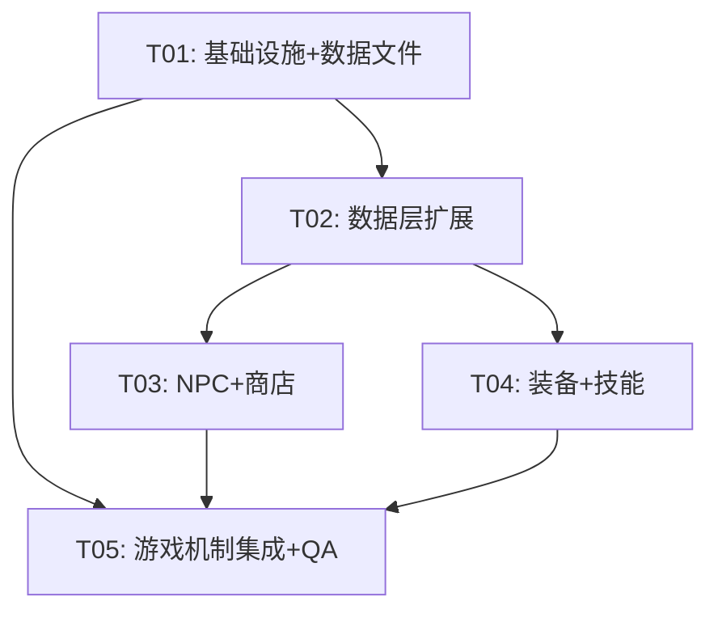

# Crystal Mir2 — Iteration 4 架构设计 + 任务分解

> **作者**: 高见远（架构师）
> **版本**: v1.0
> **日期**: 2025-07-17
> **状态**: 待评审

---

## 目录

1. [整体架构方案](#1-整体架构方案)
2. [详细设计：NPC + 商店系统](#2-详细设计npc--商店系统)
3. [详细设计：装备系统](#3-详细设计装备系统)
4. [详细设计：技能/魔法系统](#4-详细设计技能魔法系统)
5. [详细设计：地图 + 怪物扩展](#5-详细设计地图--怪物扩展)
6. [详细设计：QA 质量加固](#6-详细设计qa-质量加固)
7. [任务分解](#7-任务分解)
8. [实现顺序建议](#8-实现顺序建议)

---

## 1. 整体架构方案

### 1.1 功能依赖关系

```
功能1: NPC+商店系统  ────────────┐
                                  ├── 依赖背包系统（已有）
                                  ├── 依赖金币系统（已有）
                                  └── 依赖新网络包协议

功能2: 装备系统  ────────────────┐
                                  ├── 依赖背包系统（已有）
                                  ├── 依赖战斗系统（已有，需修改）
                                  ├── 依赖装备位枚举（Shared已有）
                                  ├── 依赖新网络包协议
                                  └── 依赖物品模板扩展（需新增属性）

功能3: 技能/魔法系统  ──────────┐
                                  ├── 依赖战斗系统（已有，需扩展）
                                  ├── 依赖角色属性系统
                                  ├── 依赖Spell枚举（Shared已有）
                                  └── 依赖新网络包协议

功能4: 地图+怪物扩展  ──────────┐
                                  ├── 依赖地图加载系统（已有）
                                  ├── 依赖怪物AI系统（已有）
                                  ├── 依赖掉落系统（已有）
                                  └── 依赖地图连通（已有）

功能5: QA质量加固  ─────────────┐
                                  ├── 贯穿所有功能
                                  ├── 依赖测试框架（已有cargo test / vitest）
                                  └── 修复已有TODO
```

### 1.2 新增/修改模块一览

| 层 | 模块 | 操作 | 说明 |
|----|------|------|------|
| Shared | `enum.rs` / `enums.ts` | 修改 | 新增 GameShopType/NPCScript 等枚举（如果在已有枚举中不存在） |
| Shared | `packets/client.rs` / `packets/server.rs` | 新增包 | NPC交互/商店买卖/装备穿戴/技能使用/装备属性 等包 |
| Shared | `net/packet_id.rs` | 修改 | 新增 ClientOpcode/ServerOpcode 枚举值 |
| Server | `npc/mod.rs` | **新增** | NPC管理+商店逻辑 |
| Server | `npc/template.rs` | **新增** | NPC模板（从JSON加载） |
| Server | `npc/shop.rs` | **新增** | 商店购买/出售逻辑 |
| Server | `equipment/mod.rs` | **新增** | 装备管理器（穿戴/卸下/属性计算/耐久） |
| Server | `skill/mod.rs` | **新增** | 技能管理器（学习/使用/熟练度） |
| Server | `config.rs` | 修改 | 新增 NPC/技能数据路径配置 |
| Server | `network/handler.rs` | 修改 | 注册新包处理器 |
| Server | `game/mod.rs` | 修改 | 安全区回血 + WorldState 新增 NPC/Equipment/Skill 管理器 |
| Server | `main.rs` | 修改 | 初始化 NPC/技能数据加载 |
| Server | `combat/mod.rs` | 修改 | 集成装备属性计算 + 技能伤害 |
| Server | `item/mod.rs` | 修改 | ItemTemplate 扩展装备属性字段（持久度/等级限制/职业限制等） |
| Server | `item/inventory.rs` | 修改 | InventorySlot 扩展持久度/装备位标记 |
| Server | `database/models.rs` | 修改 | UserItem 扩展装备位字段 |
| Server | `database/mod.rs` | 修改 | 新增 user_skills 表 |
| Server | `database/repository.rs` | 修改 | 新增 SkillRepository |
| Server | `monster/mod.rs` | 修改 | 支持新AI类型（逃跑/范围攻击） |
| Server | `monster/ai.rs` | 修改 | 扩展AI状态机 |
| Server | `map/mod.rs` | 修改 | 无需修改，已有地图加载完美支持新地图 |
| Client | `types/game.ts` | 修改 | GameWorldState 新增装备/技能/商店/NPC相关字段 |
| Client | `types/packets.ts` | 修改 | 新增包ID常量 |
| Client | `network/packets/server_packets.ts` | 修改 | 新增服务端包解析 |
| Client | `network/packets/client_packets.ts` | 修改 | 新增客户端包序列化 |
| Client | `hooks/useGameWorld.ts` | 修改 | 新增Action类型 + 新包监听 + 新操作 |
| Client | `components/GamePage.tsx` | 修改 | 集成商店/角色面板/技能面板/死亡画面 |
| Client | `components/ShopDialog.tsx` | **新增** | 商店界面组件 |
| Client | `components/CharacterPanel.tsx` | **新增** | 角色面板组件（装备+属性） |
| Client | `components/SkillPanel.tsx` | **新增** | 技能面板组件 |
| Client | `components/DeathScreen.tsx` | **新增** | 死亡画面组件 |
| Client | `components/GameHUD.tsx` | 修改 | NPC头顶名称渲染 |
| Client | `components/ActionBar.tsx` | 修改 | 技能快捷键支持 |

### 1.3 数据流说明（服务端 <-> 客户端交互流程）

```
NPC交互流程:
  客户端                                服务端
    │                                      │
    │─── ClientOpcode::CallNPC ──────────►  │  [NPC ID + 玩家位置校验]
    │                                      │  [检测距离，查找NPC模板]
    │◄── ServerOpcode::NPCGoods ──────────  │  [返回NPC出售物品列表+价格]
    │                                      │
    │─── ClientOpcode::BuyItem ───────────► │  [校验金币 → 扣钱 → 加物品到背包]
    │◄── ServerOpcode::GainedItem ─────────  │  [物品已添加]
    │◄── ServerOpcode::LoseGold ───────────  │  [金币变化]
    │                                      │
    │─── ClientOpcode::SellItem ──────────► │  [校验物品 → 加金币 → 移除物品]
    │◄── ServerOpcode::GainedGold ─────────  │  [金币变化]
    │◄── ServerOpcode::DeleteItem ─────────  │  [物品移除]

装备操作流程:
  客户端                                服务端
    │                                      │
    │─── ClientOpcode::EquipItem ─────────► │  [背包slot → 装备位]
    │                                      │  [校验等级/职业 → 移动物品]
    │◄── ServerOpcode::EquipItem ─────────  │  [装备成功]
    │◄── ServerOpcode::BaseStatsInfo ───────  │  [更新属性]
    │                                      │
    │─── ClientOpcode::RemoveItem ────────► │  [装备位 → 背包slot]
    │◄── ServerOpcode::RemoveSlotItem ────  │  [卸下成功]
    │◄── ServerOpcode::BaseStatsInfo ───────  │  [更新属性]

技能使用流程:
  客户端                                服务端
    │                                      │
    │─── ClientOpcode::MagicKey ──────────► │  [Spell ID + 目标方向]
    │                                      │  [校验MP → 冷却 → 熟练度增长]
    │                                      │  [战士: 角色攻击动画 + 伤害加成]
    │                                      │  [法师: 火球术远程伤害计算]
    │                                      │  [道士: 治愈术HP恢复]
    │◄── ServerOpcode::MagicCast ─────────  │  [技能施放动画]
    │◄── ServerOpcode::DamageIndicator ────  │  [伤害/治疗数值]
    │◄── ServerOpcode::MagicLeveled ───────  │  [熟练度升级通知]
```

---

## 2. 详细设计：NPC + 商店系统

### 2.1 新增/修改文件列表

**服务端 (Server/src/):**
| 文件 | 操作 | 说明 |
|------|------|------|
| `npc/mod.rs` | 新增 | NPC管理器核心 |
| `npc/template.rs` | 新增 | NPC模板结构体 + JSON加载 |
| `npc/shop.rs` | 新增 | 商店购买/出售逻辑 |
| `network/handler.rs` | 修改 | 注册 CallNPC/BuyItem/SellItem 处理器 |
| `network/session_manager.rs` | 修改 | SessionState 新增 current_npc_id 字段 |
| `game/mod.rs` | 修改 | WorldState 新增 NpcManager Arc |
| `main.rs` | 修改 | 加载 NPC 数据 |
| `config.rs` | 修改 | 新增 npc_data_path 配置 |

**共享 (Shared/src/):**
| 文件 | 操作 | 说明 |
|------|------|------|
| `packets/client.rs` | 修改 | 新增 CallNpcPacket, BuyItemPacket, SellItemPacket |
| `packets/server.rs` | 修改 | 新增 NPCGoodsPacket, NPCResponsePacket, NPCGoodsItem |
| `net/packet_id.rs` | 修改 | 新增 ClientOpcode::CallNPC 等 |

**客户端 (Client/src/):**
| 文件 | 操作 | 说明 |
|------|------|------|
| `components/ShopDialog.tsx` | 新增 | 商店UI弹窗 |
| `components/GamePage.tsx` | 修改 | 集成 ShopDialog, F键交互 |
| `hooks/useGameWorld.ts` | 修改 | 新增 OPEN_SHOP/CLOSE_SHOP action + callNpc/buyItem/sellItem |
| `types/game.ts` | 修改 | GameWorldState 新增 shopNpc/npcGoods/shopOpen |
| `types/packets.ts` | 修改 | 新增包ID |
| `network/packets/server_packets.ts` | 修改 | 新增 NPCGoods/NPCResponse 解析 |
| `network/packets/client_packets.ts` | 修改 | 新增 CallNpc/BuyItem/SellItem 包 |

**数据:**
| 文件 | 操作 | 说明 |
|------|------|------|
| `Server/data/npcs.json` | **新增** | NPC配置数据 |

### 2.2 数据结构和接口

#### Rust 服务端

```rust
// npc/template.rs
#[derive(Debug, Clone, Deserialize)]
pub struct NpcTemplate {
    pub id: u16,
    pub name: String,
    pub map_id: u16,
    pub x: i32,
    pub y: i32,
    pub image: u16,
    pub shop_type: ShopType,
    pub selling_items: Vec<u16>, // 物品ID列表
}

#[derive(Debug, Clone, Deserialize)]
pub enum ShopType {
    BuyOnly,     // 仅购买
    SellOnly,    // 仅出售
    BuyAndSell,  // 买卖
    Repair,      // 修理 (P2)
}

// npc/mod.rs
pub struct NpcManager {
    pub templates: HashMap<u16, NpcTemplate>,
    pub npcs_by_map: HashMap<u16, Vec<u16>>, // map_id -> [npc_id]
}

impl NpcManager {
    pub fn load_templates(&mut self, path: &str) -> Result<(), anyhow::Error>;
    pub fn get_npcs_near(&self, map_id: u16, x: i32, y: i32, range: i32) -> Vec<&NpcTemplate>;
    pub fn get_template(&self, id: u16) -> Option<&NpcTemplate>;
}

// npc/shop.rs
pub struct ShopSystem;

impl ShopSystem {
    /// 购买：校验金币 → 扣钱 → 物品进背包
    pub fn buy_item(
        npc: &NpcTemplate,
        item_template: &ItemTemplate,
        gold: &mut u64,
        inventory: &mut InventoryManager,
    ) -> ShopResult;
    
    /// 出售：校验物品 → 加金币 → 物品从背包移除
    pub fn sell_item(
        inv_slot: &InventorySlot,
        item_template: &ItemTemplate,
        gold: &mut u64,
        inventory: &mut InventoryManager,
        slot: usize,
    ) -> ShopResult;
}
```

#### TypeScript 客户端

```typescript
// types/game.ts 新增:
export interface ShopInfo {
  npcName: string;
  npcId: number;
  goods: ShopGoodsItem[];
  shopType: 'buy' | 'sell' | 'both';
}

export interface ShopGoodsItem {
  itemId: number;
  name: string;
  price: number;
  image: number;
  count: number;
}

// GameWorldState 新增字段:
shopOpen: boolean;
shopInfo: ShopInfo | null;
```

### 2.3 网络包协议设计

**新增服务器包 (Server → Client):**

| Opcode | 包名 | 载荷 |
|--------|------|------|
| NPCGoods(102) | NPCGoodsPacket | `[npc_id: u16][goods_count: u16]{[item_id: u16][price: u32][name_len: u16][name: u8[name_len]]}` |
| NPCResponse(93) | NPCResponsePacket | `[npc_id: u16][response: u8]` (0=成功, 1=距离太远, 2=金币不足等) |
| LoseGold(68) | LoseGoldPacket | `[amount: u32 LE]` |
| GainedGold(67) | GainedGoldPacket | `[amount: u32 LE]` |

**新增客户端包 (Client → Server):**

| Opcode | 包名 | 载荷 |
|--------|------|------|
| CallNPC(50) | CallNpcPacket | `[npc_id: u16 LE]` |
| BuyItem(51) | BuyItemPacket | `[npc_id: u16 LE][item_id: u16 LE][count: u16 LE]` |
| SellItem(52) | SellItemPacket | `[slot: u8][item_uid: u32 LE][count: u16 LE]` |

### 2.4 与已有系统的集成

- **NPC交互触发**：在 `GamePage.tsx` 的键盘处理中，按 F 键检测玩家附近是否有 NPC（通过服务端返回），发送 CallNPC 包
- **已有包复用**：`GainedItemPacket`/`ObjectRemovePacket`/`GainedGoldPacket`/`LoseGoldPacket` 可直接复用
- **距离检测**：服务端 `on_call_npc` 中复用 `distance_to` 逻辑，与拾取距离检测一致
- **NPC头顶名称**：P1 需求，通过 `GameHUD.tsx` 扩展 NPC 名称渲染

---

## 3. 详细设计：装备系统

### 3.1 新增/修改文件列表

**服务端 (Server/src/):**
| 文件 | 操作 | 说明 |
|------|------|------|
| `equipment/mod.rs` | **新增** | 装备管理器 (EquipmentManager) |
| `item/mod.rs` | 修改 | ItemTemplate 扩展持久度/装备位定位字段 |
| `item/inventory.rs` | 修改 | InventorySlot 扩展装备类型标记 |
| `combat/mod.rs` | 修改 | player_attack_monster 使用真实装备属性 |
| `network/handler.rs` | 修改 | 注册 EquipItem/RemoveItem 处理器 |
| `network/session_manager.rs` | 修改 | SessionState 新增装备管理器 |
| `game/mod.rs` | 修改 | WorldState 不直接管装备（装备在 SessionState 中） |

**共享 (Shared/src/):**
| 文件 | 操作 | 说明 |
|------|------|------|
| `packets/client.rs` | 修改 | EquipItemPacket, RemoveItemPacket 已有，无需新增 |
| `packets/server.rs` | 修改 | 新增 BaseStatsInfoPacket, EquipSlotItemPacket, DuraChangedPacket |
| `net/packet_id.rs` | 修改 | 已有 BaseStatsInfo(162)/EquipSlotItem(199)/DuraChanged(76) 等 |

**客户端 (Client/src/):**
| 文件 | 操作 | 说明 |
|------|------|------|
| `components/CharacterPanel.tsx` | **新增** | 角色面板UI（11个装备位 + 属性显示） |
| `components/GamePage.tsx` | 修改 | 集成 CharacterPanel |
| `hooks/useGameWorld.ts` | 修改 | 新增装备相关 Action + 操作 |
| `types/game.ts` | 修改 | GameWorldState 新增装备/属性字段 |
| `network/packets/server_packets.ts` | 修改 | 新增装备/属性包解析 |

### 3.2 数据结构和接口

#### Rust 服务端

```rust
// equipment/mod.rs
/// 装备管理器（每个玩家独立）
pub struct EquipmentManager {
    /// 11个装备位，索引对应 EquipmentSlot 枚举
    pub slots: [Option<EquippedItem>; 14], // 使用 EquipmentSlot 作为索引
}

#[derive(Debug, Clone)]
pub struct EquippedItem {
    pub uid: i64,         // 数据库 user_items.id
    pub item_id: u16,     // 物品模板ID
    pub durability: i32,
    pub max_durability: i32,
}

#[derive(Debug, Clone, Default)]
pub struct PlayerStats {
    pub dc_min: i32,
    pub dc_max: i32,
    pub mc_min: i32,      // 魔法攻击
    pub mc_max: i32,
    pub sc_min: i32,      // 道术攻击
    pub sc_max: i32,
    pub ac: i32,          // 防御
    pub mac: i32,         // 魔防
    pub accuracy: u32,    // 准确
    pub agility: u32,     // 敏捷
}

impl EquipmentManager {
    pub fn new() -> Self;
    
    /// 穿戴装备（背包slot → 装备位）
    pub fn equip(&mut self, inv_slot: usize, item: &InventorySlot, item_template: &ItemTemplate) -> EquipmentResult;
    
    /// 卸下装备（装备位 → 背包空格）
    pub fn unequip(&mut self, equip_slot: usize, inventory: &mut InventoryManager) -> EquipmentResult;
    
    /// 计算玩家总属性（基础 + 装备加成）
    pub fn calculate_stats(&self, base_level: u16, item_manager: &ItemManager) -> PlayerStats;
    
    /// 战斗中扣除耐久
    pub fn apply_durability_damage(&mut self, item_manager: &ItemManager) -> Vec<(usize, i32)>;
}
```

**ItemTemplate 扩展字段：**
```rust
// item/mod.rs — ItemTemplate 新增:
pub struct ItemTemplate {
    // ...已有字段...
    pub durability: u32,       // 最大持久度（新增，默认0）
    pub dc_min: i32,           // 已有
    pub dc_max: i32,           // 已有
    pub mc_min: i32,           // 魔法攻击最小（新增，默认0）
    pub mc_max: i32,           // 魔法攻击最大（新增，默认0）
    pub sc_min: i32,           // 道术攻击最小（新增，默认0）
    pub sc_max: i32,           // 道术攻击最大（新增，默认0）
    pub ac: i32,               // 已有
    pub mac: i32,              // 已有
    pub accuracy: u32,         // 已有
    pub agility: u32,          // 已有
    pub required_class: i32,   // 已有（用于职业限制）
    pub required_level: u16,   // 已有（用于等级限制）
}
```

#### TypeScript 客户端

```typescript
// types/game.ts 新增:
export interface EquipmentInfo {
  [EquipmentSlot.Weapon]?: EquippedItemInfo;
  [EquipmentSlot.Armour]?: EquippedItemInfo;
  [EquipmentSlot.Helmet]?: EquippedItemInfo;
  [EquipmentSlot.Necklace]?: EquippedItemInfo;
  [EquipmentSlot.RingL]?: EquippedItemInfo;
  [EquipmentSlot.RingR]?: EquippedItemInfo;
  [EquipmentSlot.BraceletL]?: EquippedItemInfo;
  [EquipmentSlot.BraceletR]?: EquippedItemInfo;
  [EquipmentSlot.Belt]?: EquippedItemInfo;
  [EquipmentSlot.Boots]?: EquippedItemInfo;
  [EquipmentSlot.Stone]?: EquippedItemInfo;
}

export interface EquippedItemInfo {
  uid: number;
  itemId: number;
  name: string;
  durability: number;
  maxDurability: number;
  image: number;
}

export interface PlayerStats {
  dcMin: number;
  dcMax: number;
  mcMin: number;
  mcMax: number;
  scMin: number;
  scMax: number;
  ac: number;
  mac: number;
  accuracy: number;
  agility: number;
}

// GameWorldState 新增字段:
equipment: EquipmentInfo;
playerStats: PlayerStats;
```

### 3.3 网络包协议设计

**已有包复用（Shared 已有定义，只需激活服务端发送逻辑）：**
- `ServerOpcode::EquipItem(38)` — 装备成功通知
- `ServerOpcode::RemoveSlotItem(41)` — 卸下成功通知
- `ServerOpcode::DuraChanged(76)` — 耐久变化通知
- `ServerOpcode::BaseStatsInfo(162)` — 属性信息通知

**Payload 格式：**
```
EquipItemPacket: [slot: u8][item_uid: u32 LE]  // slot = EquipmentSlot 索引
RemoveSlotItemPacket: [slot: u8]                // slot = EquipmentSlot 索引
DuraChangedPacket: [item_uid: u32 LE][current_dura: u32 LE][max_dura: u32 LE]
BaseStatsInfoPacket: [dc_min: i32][dc_max: i32][mc_min: i32][mc_max: i32][sc_min: i32][sc_max: i32][ac: i32][mac: i32][accuracy: u32][agility: u32]
```

### 3.4 与已有系统的集成

- **装备位映射**：复用 Shared `EquipmentSlot` 枚举（14种，但本迭代用前11种）
- **InventoryManager 修改**：`InventorySlot` 新增 `equipment_slot: Option<usize>` 标记装备穿戴位置
- **战斗系统集成**：`CombatSystem::player_attack_monster` 参数替换为 `PlayerStats` 结构体，移除硬编码值
- **物品模板集成**：`items.json` 扩展字段，已有物品默认值为0

---

## 4. 详细设计：技能/魔法系统

### 4.1 新增/修改文件列表

**服务端 (Server/src/):**
| 文件 | 操作 | 说明 |
|------|------|------|
| `skill/mod.rs` | **新增** | 技能管理器 |
| `skill/template.rs` | **新增** | 技能模板数据 |
| `skill/effects.rs` | **新增** | 技能效果实现（火球术/治愈术/基本剑术） |
| `combat/mod.rs` | 修改 | 技能伤害集成 |
| `network/handler.rs` | 修改 | 注册 MagicKey/Magic 处理器 |
| `network/session_manager.rs` | 修改 | SessionState 新增技能管理器 |
| `main.rs` | 修改 | 加载技能数据 |
| `config.rs` | 修改 | 新增 skill_data_path 配置 |

**数据库:**
| 文件 | 操作 | 说明 |
|------|------|------|
| `database/mod.rs` | 修改 | 新增 user_skills 表迁移 |
| `database/repository.rs` | 修改 | 新增 SkillRepository |
| `database/models.rs` | 修改 | 新增 UserSkill 模型 |

**客户端 (Client/src/):**
| 文件 | 操作 | 说明 |
|------|------|------|
| `components/SkillPanel.tsx` | **新增** | 技能面板UI |
| `components/GamePage.tsx` | 修改 | 集成 SkillPanel, F键技能快捷键 |
| `hooks/useGameWorld.ts` | 修改 | 新增技能 Action + useSkill |
| `components/ActionBar.tsx` | 修改 | 技能快捷键栏 |
| `types/game.ts` | 修改 | 新增技能相关类型 |
| `network/packets/server_packets.ts` | 修改 | 解析技能包 |
| `network/packets/client_packets.ts` | 修改 | 新增技能包序列化 |

**数据:**
| 文件 | 操作 | 说明 |
|------|------|------|
| `Server/data/skills.json` | **新增** | 技能配置数据 |

### 4.2 数据结构和接口

#### Rust 服务端

```rust
// skill/template.rs
#[derive(Debug, Clone, Deserialize)]
pub struct SkillTemplate {
    pub id: u16,               // Spell 枚举值
    pub name: String,
    pub spell: Spell,          // 复用 Shared::Spell
    pub required_class: MirClass,
    pub required_level: u16,   // 学习所需等级
    pub mp_cost: u32,          // MP消耗
    pub base_damage: i32,      // 基础伤害/治疗量
    pub damage_factor: f64,    // 等级加成系数
    pub icon: u16,
    pub description: String,
    pub is_passive: bool,      // 是否被动技能
    pub range: i32,            // 施法范围
}

// skill/mod.rs
pub struct SkillManager {
    pub skills: HashMap<u16, SkillState>,    // spell_id -> SkillState
    pub templates: HashMap<u16, SkillTemplate>,
}

#[derive(Debug, Clone)]
pub struct SkillState {
    pub spell_id: u16,
    pub level: u8,        // 0=未学习, 1-3=已学等级
    pub proficiency: u32, // 当前熟练度
}

impl SkillManager {
    /// 学习技能（校验等级条件）
    pub fn learn_skill(&mut self, spell_id: u16, player_level: u16, player_class: MirClass) -> SkillResult;
    
    /// 使用技能（消耗MP，增长熟练度）
    pub fn use_skill(&mut self, spell_id: u16, current_mp: &mut u32) -> SkillResult;
    
    /// 获取技能效果
    pub fn get_effect(&self, spell_id: u16) -> Option<SkillEffect>;
    
    /// 获取已学习技能列表
    pub fn get_learned_skills(&self) -> Vec<&SkillState>;
}

// skill/effects.rs
pub struct SkillEffects;

impl SkillEffects {
    /// 火球术：远程火系伤害 (MC + 技能等级 * 5) * 随机因子
    pub fn fireball_damage(mc: i32, skill_level: u8) -> i32;
    
    /// 治愈术：恢复HP (SC * 技能等级系数 + 固定值)
    pub fn healing_amount(sc: i32, skill_level: u8) -> u32;
    
    /// 基本剑术：被动提升准确和攻击力
    pub fn fencing_bonus(skill_level: u8) -> (i32, i32); // (accuracy_bonus, dc_bonus)
}
```

#### TypeScript 客户端

```typescript
// types/game.ts 新增:
export interface SkillInfo {
  spellId: number;
  name: string;
  level: number;           // 0=未学习, 1-3
  proficiency: number;
  maxProficiency: number;
  mpCost: number;
  icon: number;
  requiredLevel: number;
  isPassive: boolean;
  description: string;
  isLearned: boolean;
}

// GameWorldState 新增字段:
skills: SkillInfo[];
skillHotbar: (number | null)[];  // 快捷键栏 [F1, F2, F3, ...]
```

### 4.3 网络包协议设计

**新增/复用服务端包 (Server → Client):**

| Opcode | 包名 | 载荷 |
|--------|------|------|
| NewMagic(117) | NewMagicPacket | `[spell_id: u16][name_len: u16][name: u8[name_len]][level: u8][icon: u16][mp_cost: u32][range: u8][description_len][description]` |
| RemoveMagic(118) | RemoveMagicPacket | `[spell_id: u16 LE]` |
| MagicLeveled(119) | MagicLeveledPacket | `[spell_id: u16][new_level: u8][proficiency: u32]` |
| MagicCast(122) | MagicCastPacket | `[object_id: u32][spell_id: u16][target_x: i32][target_y: i32]` |

**客户端包 (Client → Server):**

| Opcode | 包名 | 载荷 |
|--------|------|------|
| MagicKey(57) | MagicKeyPacket | `[spell_id: u16 LE][direction: u8]` (快捷键施放) |
| Magic(58) | MagicPacket | `[spell_id: u16 LE][target_x: i32][target_y: i32]` (目标施放) |

### 4.4 与已有系统的集成

- **Spell 枚举复用**：Shared `Spell` 已有 FireBall=31, Healing=61, Fencing=1，直接使用
- **攻击系统集成**：MagicKey 包在 handler 中处理，Spell!=0 时触发技能效果而非普通攻击
- **技能数据持久化**：新增 `user_skills` 数据库表，角色登录时加载技能状态
- **熟练度公式**：Lv1需100点，Lv2需300点，Lv3需600点，每次使用+1~3点

---

## 5. 详细设计：地图 + 怪物扩展

### 5.1 新增/修改文件列表

**服务端 (Server/src/):**
| 文件 | 操作 | 说明 |
|------|------|------|
| `monster/mod.rs` | 修改 | 扩展AI行为字段 |
| `monster/ai.rs` | 修改 | 新增 flee/range_attack 行为 |
| `item/drops.rs` | 修改 | 改进掉落处理（掉落表JSON独立） |

**数据文件:**
| 文件 | 操作 | 说明 |
|------|------|------|
| `Server/data/monsters.json` | 修改 | 新增4种怪物 |
| `Server/data/maps/map_2.json` | **新增** | 天然洞穴 30×30 |
| `Server/data/maps/map_3.json` | **新增** | 沃玛寺庙 40×40 |
| `Server/data/drops.json` | **新增** | 怪物掉落表JSON |

**客户端改动极少：**
| 文件 | 操作 | 说明 |
|------|------|------|
| 无需改动 | — | 地图和怪物数据由服务端下发，客户端自动适配 |

### 5.2 数据结构

```rust
// monstser.json 扩展4种怪物：
// {"id":4,"name":"骷髅","level":8,"max_hp":120,...,"ai_type":"MeleeChase"}
// {"id":5,"name":"蝙蝠","level":6,"max_hp":60,...,"ai_type":"PatrolFlee"}
// {"id":6,"name":"沃玛战士","level":12,"max_hp":200,...,"ai_type":"AggressiveChase"}
// {"id":7,"name":"沃玛勇士","level":15,"max_hp":350,...,"ai_type":"BerserkChase"}

// MonsterTemplate 新增字段：
#[derive(Debug, Clone, Deserialize)]
pub struct MonsterTemplate {
    // ...已有字段...
    pub ai_type: MonsterAiType, // 新增
}

#[derive(Debug, Clone, Deserialize)]
pub enum MonsterAiType {
    Simple,          // 默认简单AI
    MeleeChase,      // 近战追击（骷髅/沃玛战士/沃玛勇士）
    PatrolFlee,      // 巡逻逃跑（蝙蝠）
    AggressiveChase, // 主动追击（沃玛战士）
    BerserkChase,    // 狂暴追击+范围攻击（沃玛勇士）
}
```

```rust
// drops.json 格式：
// {
//   "drops": [
//     {"monster_id":4,"rolls":[
//       {"item_id":0,"prob":0.3,"min":1,"max":2},
//       {"item_id":2,"prob":0.1,"min":1,"max":1}
//     ]},
//     {"monster_id":6,"rolls":[
//       {"item_id":2,"prob":0.3,"min":1,"max":1},
//       {"item_id":3,"prob":0.2,"min":1,"max":1}
//     ]}
//   ]
// }
```

### 5.3 地图连通关系

```
银杏村 (Map 0: 30×30)
  └── (28,15) ↔ (3,25)
银杏村外 (Map 1: 50×50)
  └── (入口需要确定坐标) ↔ (2, 2)      ← 天然洞穴入口在银杏村外
天然洞穴 (Map 2: ~30×30)  ← 新增
  └── (25, 25) ↔ (10, 38)              ← 沃玛寺庙在洞穴深处
沃玛寺庙 (Map 3: ~40×40)  ← 新增
```

### 5.4 与已有系统的集成

- **地图加载**：MapManager::load_all 自动加载 data/maps/ 目录下所有 JSON，无需修改代码
- **怪物AI扩展**：`MonsterAiType` 枚举 + ai.rs 中 match dispatch
- **掉落表**：ItemManager 已有 `load_drops()` 和 `get_drops_for_monster()`，只需新增独立 JSON 文件

---

## 6. 详细设计：QA 质量加固

### 6.1 安全区回血 (TODO: game/mod.rs:78)

```rust
// game/mod.rs start_tick_loop 中的 TODO 位置
// 在 tick 循环中每 10 tick 检查：

// 全局 tick 计数（在 WorldState 中新增）
pub fn start_tick_loop(&self) {
    let mut tick_count = 0u64;
    // ... 已有 loop ...
    loop {
        ticker.tick().await;
        tick_count += 1;
        
        // 怪物 AI tick
        // ... 已有 ...
        
        // 清理过期地面物品
        // ... 已有 ...
        
        // 安全区回血（每 10 tick ≈ 500ms）
        if tick_count % 10 == 0 {
            let session_manager = self.session_manager.clone(); // 需注入
            let map_manager = self.map_manager.clone();
            tokio::spawn(async move {
                // 遍历所有活跃会话
                // 检查玩家是否在安全区
                // 是则 HP += max_hp * 0.02 (每tick回复2%)
                // 同时 MP += max_mp * 0.02
            });
        }
    }
}
```

**修改点：** WorldState 需要持有 SessionManager 引用（或通过 Arc 注入）

### 6.2 死亡画面 (TODO: useGameWorld.ts:493)

```rust
// 服务端 on_attack 中怪物攻击玩家 → 玩家HP归零时：
// 1. 发送 Death 包
// 2. 设置玩家为死亡状态
// 3. 可选：发送复活选项

// 客户端 useGameWorld.ts 的 onDeath 处理器：
const onDeath = (_payload: ArrayBuffer) => {
  dispatch({ type: 'PLAYER_DEATH' });  // 新增 Action
};

// 新增 GameWorldState 字段:
isDead: boolean;

// GamePage.tsx 中:
{state.isDead && <DeathScreen onRevive={handleRevive} />}
```

### 6.3 TDD 测试清单

**Rust 单元测试 (Server):**
| 测试目标 | 位置 | 说明 |
|---------|------|------|
| NPC模板加载 & 商店购买 | `npc/mod.rs` tests mod | 测试JSON加载/buy/sell逻辑 |
| 装备穿戴 & 属性计算 | `equipment/mod.rs` tests mod | 测试equip/unequip/stats计算 |
| 装备耐久消耗 & 损坏 | `equipment/mod.rs` tests mod | 测试durability减少/损坏 |
| 技能学习 & 熟练度 | `skill/mod.rs` tests mod | 测试learn/proficiency升级 |
| 技能效果计算 | `skill/effects.rs` tests mod | 测试fireball/healing/fencing |
| 地图加载（已有补测） | `map/mod.rs` tests mod | 测试JSON解析/碰撞网格/连接点 |
| 怪物AI状态转换（已有补测） | `monster/ai.rs` tests mod | 测试Idle→Patrol→Chase→Attack |
| 战斗系统（已有补测） | `combat/mod.rs` tests mod | 测试hit_rate/damage公式 |
| 背包操作（已有补测） | `item/inventory.rs` tests mod | 测试add/remove/has_space |
| WebSocket处理器（已有补测） | `network/handler.rs` tests mod | 测试Walk/Attack/Chat等处理 |

**TypeScript 单元测试 (Client):**
| 测试目标 | 位置 | 说明 |
|---------|------|------|
| 商店UI交互 | `components/ShopDialog.test.tsx` | 渲染/点击购买/出售 |
| 角色面板渲染 | `components/CharacterPanel.test.tsx` | 装备位显示/属性显示 |
| 技能面板 | `components/SkillPanel.test.tsx` | 技能列表/学习按钮 |
| 新包编解码 | `network/packets/server_packets.test.ts` | 新包序列化/反序列化 |
| 游戏状态reducer | `hooks/useGameWorld.test.ts` | 新Action处理 |

---

## 7. 任务分解

### 7.1 所需包 (Required Packages)

```
Rust (Cargo.toml已有):
- serde, serde_json — JSON序列化
- tokio — 异步运行时
- sqlx — 数据库
- binrw — 二进制序列化
- fastrand — 随机数
- bitflags — 位标志
- tracing — 日志
- anyhow — 错误处理

TypeScript (package.json):
- react@^18.2.0 — UI框架
- @mui/material@^5.14.0 — MUI组件库
- pixi.js@^7.3.0 — 游戏渲染
- vitest — 测试框架 (新增)
- @testing-library/react — 组件测试 (新增)
- jsdom — DOM模拟 (新增)
```

### 7.2 任务列表 (Task List)

---

#### T01: 项目基础设施 + 数据文件配置

**源文件:**
- `Server/data/npcs.json` (**新增**)
- `Server/data/skills.json` (**新增**)
- `Server/data/drops.json` (**新增**)
- `Server/data/maps/map_2.json` (**新增** — 天然洞穴 30×30)
- `Server/data/maps/map_3.json` (**新增** — 沃玛寺庙 40×40)
- `Server/data/monsters.json` (**修改** — 新增4种怪物)
- `Server/data/items.json` (**修改** — 扩展装备字段: mc_min/mc_max/sc_min/sc_max/durability)
- `Config.toml` (**修改** — 新增 npc_data_path/skill_data_path 配置)
- `Server/src/config.rs` (**修改** — 新增配置字段)

**依赖:** 无
**优先级:** P0
**预计工作量:** 小

**说明:**
- 所有数据文件先行创建，含完整的 NPC 数据、技能数据、掉落表、新地图 JSON
- 怪物模板扩展 `ai_type` 字段
- 物品模板扩展装备属性字段（mc_min/mc_max/sc_min/sc_max/durability）
- 配置文件中增加 NPC 和技能数据的路径

---

#### T02: 服务端数据层扩展 + 测试先行

**源文件:**
- `Server/src/database/mod.rs` (**修改** — 新增 user_skills 表迁移)
- `Server/src/database/models.rs` (**修改** — 新增 UserSkill 模型)
- `Server/src/database/repository.rs` (**修改** — 新增 SkillRepository)
- `Server/src/item/mod.rs` (**修改** — ItemTemplate 扩展字段 + GroundItem 扩展)
- `Server/src/item/inventory.rs` (**修改** — InventorySlot 扩展 persistent 字段)
- `Server/src/test_helpers.rs` (**修改** — 扩展测试辅助函数)

**依赖:** T01
**优先级:** P0
**预计工作量:** 小

**QA写测试:**
- 测试 `SkillRepository` CRUD
- 测试 `InventorySlot` 扩展字段读写

---

#### T03: NPC + 商店系统完整实现 (服务端+客户端+包)

**源文件:**

**服务端:**
- `Server/src/npc/mod.rs` (**新增** — NpcManager + ShopSystem)
- `Server/src/npc/template.rs` (**新增** — NpcTemplate)
- `Server/src/npc/shop.rs` (**新增** — buy/sell 逻辑)
- `Server/src/network/handler.rs` (**修改** — 注册 CallNPC/BuyItem/SellItem)
- `Server/src/network/session_manager.rs` (**修改** — SessionState 新增当前NPC)
- `Server/src/game/mod.rs` (**修改** — WorldState 新增 NpcManager)
- `Server/src/main.rs` (**修改** — 加载 NPC 数据)

**Shared:**
- `Shared/src/packets/client.rs` (**修改** — CallNpcPacket/BuyItemPacket/SellItemPacket)
- `Shared/src/packets/server.rs` (**修改** — NPCGoodsPacket/NPCResponsePacket)
- `Shared/src/net/packet_id.rs` (**修改** — 激活已有 ClientOpcode::CallNPC/BuyItem/SellItem)

**客户端:**
- `Client/src/components/ShopDialog.tsx` (**新增**)
- `Client/src/components/GamePage.tsx` (**修改** — F键交互 + ShopDialog集成)
- `Client/src/hooks/useGameWorld.ts` (**修改** — 商店 Actions + callNpc/buyItem/sellItem)
- `Client/src/types/game.ts` (**修改** — shopOpen/shopInfo 等)
- `Client/src/types/packets.ts` (**修改** — 新包ID常量)
- `Client/src/network/packets/server_packets.ts` (**修改** — NPCGoods/NPCResponse 解析)
- `Client/src/network/packets/client_packets.ts` (**修改** — CallNpc/BuyItem/SellItem 序列化)

**依赖:** T02
**优先级:** P0
**预计工作量:** 大

**QA写测试 (TDD):**
- 服务端：NPC模板加载、buy_item逻辑、sell_item逻辑
- 客户端：ShopDialog渲染、商店UI交互
- 包协议：编解码测试

---

#### T04: 装备 + 技能系统 (服务端+客户端+包)

**源文件:**

**服务端 — 装备:**
- `Server/src/equipment/mod.rs` (**新增** — EquipmentManager + PlayerStats)
- `Server/src/combat/mod.rs` (**修改** — 集成PlayerStats计算)
- `Server/src/network/handler.rs` (**修改** — 注册 EquipItem/RemoveItem 使用真实装备逻辑)

**服务端 — 技能:**
- `Server/src/skill/mod.rs` (**新增** — SkillManager + SkillState)
- `Server/src/skill/template.rs` (**新增** — SkillTemplate)
- `Server/src/skill/effects.rs` (**新增** — 技能效果实现)
- `Server/src/network/handler.rs` (**修改** — 注册 MagicKey/Magic 处理器)
- `Server/src/network/session_manager.rs` (**修改** — SessionState 新增 skill/equipment)
- `Server/src/game/mod.rs` (**修改** — WorldState 或 SessionState 持有技能)
- `Server/src/main.rs` (**修改** — 加载技能数据)

**Shared:**
- `Shared/src/packets/server.rs` (**修改** — MagicLeveled/MagicCast/BaseStatsInfo 等包)
- `Shared/src/packets/client.rs` (**修改** — MagicKey/Magic 包)
- `Shared/src/net/packet_id.rs` (已有枚举值)

**客户端 — 装备:**
- `Client/src/components/CharacterPanel.tsx` (**新增**)
- `Client/src/components/GamePage.tsx` (**修改** — 集成 CharacterPanel)
- `Client/src/hooks/useGameWorld.ts` (**修改** — 装备Actions + equipItem/unequipItem)
- `Client/src/types/game.ts` (**修改** — equipment/playerStats 字段)

**客户端 — 技能:**
- `Client/src/components/SkillPanel.tsx` (**新增**)
- `Client/src/components/ActionBar.tsx` (**修改** — 技能快捷键栏)
- `Client/src/hooks/useGameWorld.ts` (**修改** — 技能Actions + useSkill)
- `Client/src/types/game.ts` (**修改** — skills/skillHotbar 字段)

**依赖:** T02
**优先级:** P0
**预计工作量:** 大

**QA写测试 (TDD):**
- 服务端：装备穿戴/卸下、属性计算、耐久消耗、技能学习/使用/熟练度增长、技能效果计算
- 客户端：CharacterPanel渲染、SkillPanel渲染、快捷键交互
- 包协议：装备/技能包编解码
- 已有系统补测：战斗系统公式、背包操作

---

#### T05: 游戏机制集成 + 质量加固 + 最终调试

**源文件:**
- `Server/src/game/mod.rs` (**修改** — 安全区回血逻辑 + 玩家死亡处理)
- `Server/src/combat/mod.rs` (**修改** — 怪物攻击时检查玩家死亡 → 发送Death包)
- `Server/src/network/handler.rs` (**修改** — on_attack 中集成装备属性 + 技能效果)
- `Client/src/hooks/useGameWorld.ts` (**修改** — onDeath 处理器 + PLAYER_DEATH action)
- `Client/src/components/GamePage.tsx` (**修改** — 集成 DeathScreen)
- `Client/src/components/DeathScreen.tsx` (**新增**)
- `Server/src/monster/ai.rs` (**修改** — 扩展新AI类型)
- `Server/src/item/drops.rs` (**修改** — 使用独立掉落表JSON)

**依赖:** T01, T03, T04
**优先级:** P0
**预计工作量:** 中

**QA写测试 (TDD):**
- 安全区回血逻辑测试
- 死亡流程测试（服务端发送Death包 → 客户端显示死亡画面 → 复活）
- 新怪物AI测试（逃跑/主动追击）
- 掉落表测试
- 已有系统补测：地图加载、怪物AI状态转换、WebSocket处理器

---

### 7.3 任务依赖图



### 7.4 共享知识 (Shared Knowledge)

- **包协议格式**: 所有二进制包使用 `[packet_id: u16 LE][payload_length: u16 LE][payload]` 格式，由 `PacketCodec` 统一处理
- **字符串编码**: 所有字符串使用 `u16 LE 长度前缀 + UTF-8` 格式
- **坐标系统**: 所有使用 `(i32, i32)` 曼哈顿距离
- **装备位映射**: 使用 `EquipmentSlot` 枚举作为装备数组索引
- **技能标识**: 使用 `Spell` 枚举值作为技能ID
- **枚举同步**: Rust `packet_id.rs` 的 ServerOpcode/ClientOpcode 值必须与 TypeScript `packets.ts` 的 ServerPacketIds/ClientPacketIds 严格一致
- **API响应**: 服务端所有操作结果通过专用包（而非通用result包）返回
- **测试约定**: Rust测试放在每个模块的 `#[cfg(test)] mod tests` 中；使用 `test_helpers.rs` 中的辅助函数

---

## 8. 实现顺序建议

### 推荐分批实现顺序

```
第一批 (T01 → T02):
  T01: 所有数据文件 + 配置 → 约0.5天
  T02: 数据层扩展 + 测试框架 → 约0.5天
  └── 这两批完成后，后续开发可并行进行

第二批 (T03 + T04 并行):
  T03: NPC + 商店系统 → 约2天
  T04: 装备 + 技能系统 → 约2天
  └── 这两个功能相对独立，可并行开发

第三批 (T05):
  T05: 游戏机制集成 + 质量加固 → 约1天
  └── 依赖前三批全部完成后开始

总计: 约 4~5 个工作日
```

### 实现原则

1. **TDD 先行**: 每个功能模块的测试在先，实现代码在后
2. **小步提交**: 每次修改应保持编译通过，避免大段代码一次性提交
3. **先核心后扩展**: P0 功能优先，P1/P2 视时间安排
4. **向后兼容**: 已有数据文件（items.json/monsters.json）只扩展字段，不修改已有记录结构
5. **复用现有包 ID**: 优先使用已有 ServerOpcode/ClientOpcode 枚举值（如 BaseStatsInfo/DuraChanged/NewMagic 等）
