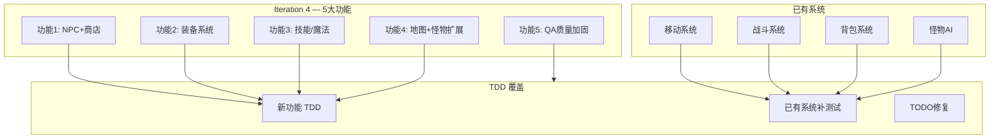

# Crystal Mir2 — Iteration 4 PRD

> **作者**: Alice（产品经理）
> **版本**: v1.0
> **日期**: 2025-07-17
> **状态**: 待评审

---

## 1. 项目信息

- **Language**: 中文
- **编程语言**: Rust（服务端）+ TypeScript/React/PixiJS（客户端）
- **项目名称**: crystal_mir2
- **原始需求**: 为 Crystal Mir2 传奇私服游戏的下一个大版本迭代（Iteration 4）新增 5 大功能：NPC+商店系统、装备系统、技能/魔法系统、地图+怪物扩展、QA 质量加固（TDD）

---

## 2. 产品目标

### 一句话概括

**将 Crystal Mir2 从"可移动打怪"的基础版本升级为"可买卖装备、可习得技能、可探索地牢"的核心体验版本，并通过 TDD 确保代码质量。**

### 三个正交目标

1. **丰富核心玩法循环**：通过 NPC 商店、装备系统、技能系统构建 "打怪→获得物品→买卖装备→学习技能→挑战更强怪物" 的完整循环
2. **扩展可探索内容**：新增 2 张地牢地图和 4 种新怪物，使游戏世界面积翻倍，提供怪物掉落表驱动的差异化战斗体验
3. **建立质量基线**：采用测试驱动开发（TDD），为新功能编写测试，为已有核心系统补测试，修复已知 TODO 遗留问题

---

## 3. 用户故事

### 功能1：NPC + 商店系统

| # | 用户故事 |
|---|---------|
| US1.1 | 作为玩家，我**可以**在银杏村中找到不同的 NPC（药店老板、武器商、杂货商），**以便**知道去哪里购买对应商品 |
| US1.2 | 作为玩家，我**可以**靠近 NPC 并按交互键触发对话/商店界面，**以便**浏览NPC出售的物品 |
| US1.3 | 作为玩家，我**可以**在商店界面中用金币购买物品（消耗金币→物品进入背包），**以便**获得需要的药水和装备 |
| US1.4 | 作为玩家，我**必须**看到自己的金币数量及背包物品列表，**以便**知悉当前经济状况做出购买/出售决策 |
| US1.5 | 作为玩家，我**可以**在商店界面出售背包中的物品（获得金币→物品移除），**以便**清理背包换取资金 |

### 功能2：装备系统

| # | 用户故事 |
|---|---------|
| US2.1 | 作为玩家，我**必须**能够将背包中的可装备物品穿戴到对应装备位（武器、衣服、头盔、项链、戒指×2、手镯×2、腰带、鞋子、宝石等），**以便**提升角色战斗力 |
| US2.2 | 作为玩家，我**必须**能够卸下已穿戴的装备，回到背包中，**以便**更换或出售装备 |
| US2.3 | 作为玩家，我**必须**看到装备前后角色属性（DC攻击、MC魔法、SC道术、AC防御、MAC魔防、准确、敏捷）的变化，**以便**评估装备价值 |
| US2.4 | 作为玩家，我**希望**装备有持久度（Durability），使用中会消耗，归零时损坏，**以便**增加装备经济系统的深度 |
| US2.5 | 作为玩家，我**可以**在角色面板中查看当前所有已穿戴装备和总属性，**以便**全面了解角色状态 |

### 功能3：技能/魔法系统

| # | 用户故事 |
|---|---------|
| US3.1 | 作为战士玩家，我**必须**达到指定等级后可以学习"基本剑术"，**以便**提升近战能力 |
| US3.2 | 作为法师玩家，我**必须**达到指定等级后可以学习"火球术"，**以便**拥有远程攻击手段 |
| US3.3 | 作为道士玩家，我**必须**达到指定等级后可以学习"治愈术"，**以便**战斗中恢复HP |
| US3.4 | 作为玩家，我**可以**按 F 键或点击技能图标使用已学习的技能，消耗 MP，**以便**在战斗中施放技能 |
| US3.5 | 作为玩家，我**必须**看到技能的熟练度/等级（3 级体系），使用越多效果越强，**以便**获得成长感 |

### 功能4：地图 + 怪物扩展

| # | 用户故事 |
|---|---------|
| US4.1 | 作为玩家，我**必须**能够从银杏村外进入"天然洞穴"（小型地牢），**以便**挑战更高难度的怪物 |
| US4.2 | 作为玩家，我**必须**能够从天然洞穴继续深入"沃玛寺庙"（中型地牢），**以便**挑战BOSS级怪物并获得更好装备 |
| US4.3 | 作为玩家，我**必须**在击杀怪物后看到不同的掉落结果（对应掉落表配置），**以便**获得探索和战斗的奖励感 |
| US4.4 | 作为玩家，我**希望**新怪物（骷髅、蝙蝠、沃玛战士、沃玛勇士）有不同的外观和行为，**以便**保持战斗的新鲜感 |

---

## 4. 需求池

### P0 — Must Have（本次迭代必须完成）

| ID | 需求 | 功能域 | 说明 |
|----|------|--------|------|
| R01 | NPC 数据可配置 | 商店系统 | NPC 位置、名称、出售物品列表通过 JSON 配置加载 |
| R02 | NPC 交互触发 | 商店系统 | 玩家靠近 NPC 按交互键（如F键或双击）弹出商店界面 |
| R03 | 商店购买功能 | 商店系统 | 点击 NPC 出售物品→校验金币→扣金币→物品进入背包 |
| R04 | 商店出售功能 | 商店系统 | 点击背包物品→校验物品→加金币→物品从背包移除 |
| R05 | 商店界面UI | 商店系统 | 显示 NPC 名称、出售物品列表（含价格）、背包物品列表、玩家金币 |
| R06 | 装备穿戴/卸下 | 装备系统 | 支持 14 个装备位的穿戴与卸下操作 |
| R07 | 装备属性加成 | 装备系统 | 装备穿戴后影响角色面板属性（DC/MC/SC/AC/MAC/准确/敏捷等） |
| R08 | 角色面板 UI | 装备系统 | 显示已穿戴装备和合计属性值 |
| R09 | 装备持久度基础 | 装备系统 | 装备有耐久值，战斗中消耗，归零损坏 |
| R10 | 技能学习 | 技能系统 | 达到等级条件后可学习对应技能 |
| R11 | 技能使用 | 技能系统 | 按F键或点击技能图标施放技能，消耗 MP |
| R12 | 技能等级/熟练度 | 技能系统 | 3 级熟练度体系，使用越多效果越强 |
| R13 | 3 个基础技能实现 | 技能系统 | 火球术（法师）、治愈术（道士）、基本剑术（战士） |
| R14 | 新增 2 张地图 | 地图扩展 | 天然洞穴（小型地牢）和沃玛寺庙（中型地牢）的地图 JSON 文件 |
| R15 | 新增 4 种怪物 | 怪物扩展 | 骷髅、蝙蝠、沃玛战士、沃玛勇士的数据定义和 AI 行为 |
| R16 | 怪物掉落表 | 怪物扩展 | 每种怪物配置掉落物品及概率，JSON 可配置 |
| R17 | 地图连通关系 | 地图扩展 | 银杏村外 ↔ 天然洞穴 ↔ 沃玛寺庙之间的连接点 |
| R18 | 安全区回血逻辑 | QA | 完成 TODO：玩家在安全区范围内自动恢复 HP/MP |
| R19 | 死亡画面处理 | QA | 完成 TODO：玩家死亡后显示死亡画面/复活选项 |
| R20 | TDD 新功能测试 | QA | 所有新功能采用 TDD：先写测试，再写实现 |

### P1 — Should Have（本次迭代建议完成）

| ID | 需求 | 功能域 | 说明 |
|----|------|--------|------|
| R21 | NPC 对话气泡/头顶标识 | 商店系统 | NPC 头顶显示名称和标识，区分不同功能 |
| R22 | 装备耐久UI显示 | 装备系统 | 背包和装备位中显示当前耐久/最大耐久 |
| R23 | 技能图标/冷却显示 | 技能系统 | 技能栏显示冷却中的半透明遮罩 |
| R24 | 背包右键菜单（使用/装备/出售） | 装备系统 | 背包物品右键弹出操作菜单 |
| R25 | 怪物掉落动画 | 怪物扩展 | 怪物死亡时掉落物品的视觉效果 |

### P2 — Nice to Have（本次迭代可选）

| ID | 需求 | 功能域 | 说明 |
|----|------|--------|------|
| R26 | 装备修理系统 | 装备系统 | NPC 提供装备修理服务（消耗金币恢复耐久） |
| R27 | 装备特修/祝福 | 装备系统 | 使用特定道具修复或强化装备 |
| R28 | 客户端拖动装备 | 装备系统 | 从背包拖动物品到装备位穿戴 |
| R29 | 技能升级特效 | 技能系统 | 技能升级时显示不同的施法特效 |
| R30 | 怪物图鉴 | 怪物扩展 | 客户端显示怪物信息和掉落预览 |

---

## 5. UI 设计稿描述

### 5.1 整体布局（游戏主界面）

```
┌─────────────────────────────────────────────────────────┐
│  [HP]░░░░░░░░░░░  Lv.7  银杏村           [小地图]      │
│  [MP]░░░░░░░░░░░  经验 ████████░░ 50%                   │
│                                                          │
│                    ┌──────────────┐                       │
│                    │  游戏画面     │                       │
│                    │  (PixiJS)    │                       │
│                    │              │                       │
│                    │   [NPC]      │                       │
│                    │   药店老板    │                       │
│                    │              │                       │
│                    └──────────────┘                       │
│                                                          │
│  [聊天框]                              [动作栏]          │
│  ┌─────────────────┐            ┌──────────────────┐     │
│  │ [系统] 欢迎来到  │            │ F1火球 F2治愈    │     │
│  │ 银杏村！         │            │ [背包][角色][技能]│     │
│  │ [玩家] 你好~     │            │  金币: 1000      │     │
│  └─────────────────┘            └──────────────────┘     │
└─────────────────────────────────────────────────────────┘
```

### 5.2 商店界面（弹窗）

```
┌─────────────── 药店老板 — 商店 ───────────────┐
│                                                │
│  ┌── NPCS出售 ───────────┐ ┌── 我的背包 ────┐  │
│  │ 金创药(小)    100G    │ │ 木剑           │  │
│  │ 魔法药(小)     80G    │ │ 布衣     [出售] │  │
│  │                      │ │ 金创药(小) [出售]│  │
│  │ [购买]  [购买]       │ │ 蜡烛     [出售] │  │
│  └────────────────────────┘ └────────────────┘  │
│                                                │
│  我的金币: 1000                                 │
│  [关闭]                                        │
└────────────────────────────────────────────────┘
```

### 5.3 角色面板（弹窗）

```
┌─────────────── 角色信息 ───────────────┐
│                                        │
│  角色名: 勇者   等级: 7                │
│  职业: 战士     性别: 男               │
│                                        │
│  ┌─ 装备 ──────────┐  属性:           │
│  │ 头盔: [空]      │  DC:  5-12       │
│  │ 项链: [空]      │  MC:  0-0        │
│  │ 武器: [木剑]    │  SC:  0-0        │
│  │ 衣服: [布衣]    │  AC:  2          │
│  │ 腰带: [空]      │  MAC: 1          │
│  │ 鞋子: [空]      │  准确: 5         │
│  │ 手镯L:[空]      │  敏捷: 10        │
│  │ 手镯R:[空]      │  持久: -         │
│  │ 戒指L:[空]      │                  │
│  │ 戒指R:[空]      │  [关闭]          │
│  │ 宝石: [空]      │                  │
│  └─────────────────┘                  │
└────────────────────────────────────────┘
```

### 5.4 技能面板（弹窗）

```
┌─────────────── 技能 ───────────────┐
│                                    │
│  可用技能点数: 0                   │
│                                    │
│  ┌─────────────────────────┐       │
│  │ [基本剑术] Lv.1 熟练:30%│       │
│  │  提高准确和攻击力      │       │
│  │  消耗: 无  (被动技能)  │       │
│  ├─────────────────────────┤       │
│  │ [火球术] Lv.0 未学习   │       │
│  │  远程火系攻击          │       │
│  │  消耗: 10MP  需求Lv.7  │       │
│  │  [学习] (灰色: 等级不足)│       │
│  ├─────────────────────────┤       │
│  │ [治愈术] Lv.0 未学习   │       │
│  │  恢复目标HP            │       │
│  │  消耗: 8MP  需求Lv.7   │       │
│  │  [学习] (灰色)          │       │
│  └─────────────────────────┘       │
│  [关闭]                            │
└────────────────────────────────────┘
```

### 5.5 死亡画面

```
┌──────────────────────────────────────┐
│                                      │
│                                      │
│            💀 你已死亡 💀            │
│                                      │
│           [ 原地复活 ]               │
│           [ 回城复活 ]               │
│                                      │
│                                      │
└──────────────────────────────────────┘
```

---

## 6. 地图连通关系

```
银杏村 (Map 0: 30×30)
  │ 出口: (28,15) → 银杏村外 (3,25)
  ▼
银杏村外 (Map 1: 50×50)
  │ 入口: (3,25) → 银杏村 (28,15)
  │ 出口: (某坐标) → 天然洞穴 (某坐标)
  ▼
天然洞穴 (Map 2: ~30×30) ← 新增
  │ 入口: (某坐标) → 银杏村外 (某坐标)
  │ 出口: (某坐标) → 沃玛寺庙 (某坐标)
  ▼
沃玛寺庙 (Map 3: ~40×40) ← 新增
  │ 入口: (某坐标) → 天然洞穴 (某坐标)
```

---

## 7. TDD 策略

本次迭代全程采用**测试驱动开发（TDD）**，具体流程如下：

### 7.1 每个功能的实现流程

```
PRD（产品经理） → 架构设计（架构师） → QA写测试 → 工程师实现 → QA验证
```

1. **PRD 阶段**（当前文档）：产品经理定义需求和验收标准
2. **架构设计阶段**：架构师进行技术设计
3. **QA 写测试阶段**：QA 根据 PRD 编写自动化测试用例（测试先行，必然失败）
4. **工程师实现阶段**：工程师编写实现代码直至测试全部通过
5. **QA 验证阶段**：QA 确认测试全部通过，执行集成测试

### 7.2 测试范围

| 测试类型 | 范围 | 工具 |
|---------|------|------|
| 单元测试（Rust） | 战斗系统、背包操作、装备属性计算、技能效果、怪物AI、地图加载 | `cargo test` |
| 单元测试（TS） | 客户端包编解码、状态管理 Reducer | Vitest |
| 集成测试（Rust） | WebSocket 协议、完整 NPC 买卖流程、装备穿戴流程 | `cargo test --test` |
| 集成测试（TS） | 连接建立、登录流程、背包UI交互 | Vitest + jsdom |

### 7.3 已有系统补测清单

| 系统 | 现有状态 | 补测要求 |
|------|---------|---------|
| 地图加载 | 无测试 | 测试地图文件解析、碰撞网格、连接点 |
| 怪物 AI | 无测试 | 测试 Idle→Patrol→Chase→Attack 状态转换 |
| 战斗系统 | 无测试 | 测试命中率计算、伤害公式、暴击逻辑 |
| 背包系统 | 无测试 | 测试添加/移除/查找/空间判断 |
| WebSocket 处理器 | 无测试 | 测试 Walk/Attack/Chat/Turn/PickUp/LogOut 处理 |

### 7.4 已有 TODO 完成计划

| TODO | 位置 | 处理方案 |
|------|------|---------|
| 安全区回血 | `Server/src/game/mod.rs:78` | 每 tick 检查玩家是否在安全区，自动恢复 HP/MP |
| 死亡画面 | `Client/src/hooks/useGameWorld.ts:493` | 死亡时显示死亡弹窗，提供复活选项 |

---

## 8. 待确认问题

| # | 问题 | 建议 | 影响 |
|---|------|------|------|
| Q1 | NPC 交互触发方式？ | 建议：靠近 NPC 后按 F 键（同时作为技能快捷键）或双击 NPC | UI 交互设计 |
| Q2 | 装备位具体是哪些？ | 建议：武器/衣服/头盔/项链/戒指L/戒指R/手镯L/手镯R/腰带/鞋子/宝石（11个），预留勋章/马牌等 | Shared 枚举扩展 |
| Q3 | 技能熟练度增长公式？ | 建议：每次使用 +1~3，Lv1需100，Lv2需300，Lv3需600 | 游戏平衡 |
| Q4 | 怪物掉落表格式？ | 建议 JSON 格式：`[{"monster_id":2,"drops":[{"item_id":0,"prob":0.5,"min":1,"max":3}]}]` | 数据配置 |
| Q5 | 新地图尺寸？ | 建议：天然洞穴 30×30，沃玛寺庙 40×40 | 地图文件制作 |
| Q6 | 新怪物 AI 行为？ | 骷髅=近战追击、蝙蝠=巡逻+逃跑、沃玛战士=主动追击、沃玛勇士=强力近战+范围攻击 | AI 框架扩展 |
| Q7 | 新地图的刷新怪物配置？ | 天然洞穴刷新骷髅+蝙蝠，沃玛寺庙刷新沃玛战士+沃玛勇士 | 地图配置 |
| Q8 | 装备穿戴是否有职业/等级限制？ | 建议：继承已有 items.json 中的 required_class/required_level 字段 | 装备系统规则 |
| Q9 | 技能学习是否需要 NPC？ | 建议初级阶段直接面板学习（满足等级条件即可），后续NPC学习系统可作为P2 | 技能获取方式 |
| Q10 | 火球术/治愈术的伤害/治疗公式？ | 建议：火球术伤害= (MC + 技能等级系数) × 随机因子；治愈术回复= (SC × 技能等级系数) + 固定值 | 游戏平衡 |

---

## 附录：本次迭代范围示意图



---

*本文档由 Alice（产品经理）撰写，待架构师评审和技术细化。*
