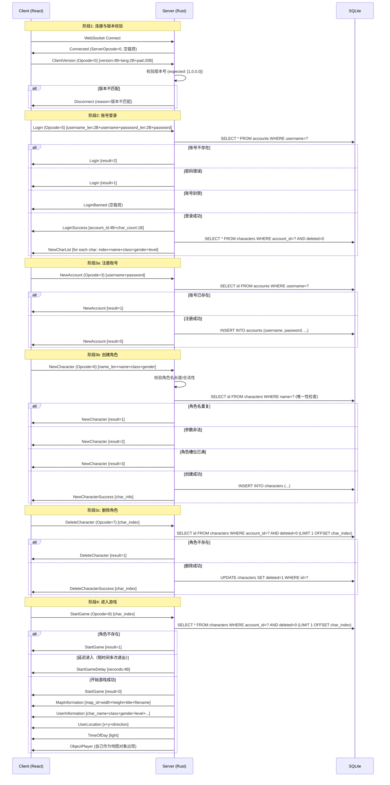

# PRD: 数据库层 + 登录认证 + 角色选择功能

## 1. 产品目标

为 crystal-mir2 项目实现完整的数据库初始化、账号登录认证、注册、角色管理（创建/删除/选择）的核心登录流程，覆盖从客户端连接到进入游戏世界的完整链路。

---

## 2. 用户故事

| 编号 | As a... | I want... | So that... |
|------|---------|-----------|------------|
| US-01 | 玩家 | 输入账号密码登录游戏 | 验证身份并进入游戏主界面 |
| US-02 | 新玩家 | 注册新游戏账号 | 创建账号并开始游戏 |
| US-03 | 玩家 | 查看账号下的所有角色 | 选择要使用的角色进入游戏 |
| US-04 | 玩家 | 创建新角色（选择职业/性别/名字） | 建立属于自己的游戏角色 |
| US-05 | 玩家 | 删除不再使用的角色 | 释放角色槽位并重新创建 |
| US-06 | 玩家 | 选择角色后点击开始游戏 | 进入游戏世界开始冒险 |
| US-07 | 玩家 | 修改账号密码 | 保障账号安全 |

---

## 3. 需求池

### P0 — 核心流程（必须实现）

| 需求 ID | 描述 | 说明 |
|---------|------|------|
| R-001 | 数据库初始化 | 服务端启动时自动创建 `./data/mir2.db`，建立 accounts 表和 characters 表 |
| R-002 | 客户端版本校验 | 客户端连接后发送 ClientVersion 包，服务端校验版本号，不匹配则断开 |
| R-003 | 账号登录 | 处理 Login 包，查询 accounts 表验证密码，返回 LoginSuccess（含角色列表）或 Login 失败 |
| R-004 | 角色列表加载 | 登录成功后服务端通过 NewCharList 包返回该账号下的所有角色 |
| R-005 | 创建角色 | 处理 NewCharacter 包，校验参数后插入 characters 表，返回 NewCharacterSuccess |
| R-006 | 删除角色 | 处理 DeleteCharacter 包，逻辑删除或物理删除角色，返回 DeleteCharacterSuccess |
| R-007 | 开始游戏 | 处理 StartGame 包，服务端返回 StartGame + MapInformation + UserInformation + UserLocation 等包进入游戏世界 |

### P1 — 账号管理

| 需求 ID | 描述 | 说明 |
|---------|------|------|
| R-008 | 账号注册 | 处理 NewAccount 包，校验账号唯一性并插入 accounts 表，返回 NewAccount 响应 |
| R-009 | 修改密码 | 处理 ChangePassword 包，验证旧密码并更新为新密码，返回 ChangePassword 响应 |

### P2 — 体验优化

| 需求 ID | 描述 | 说明 |
|---------|------|------|
| R-010 | 密码哈希存储 | 使用 bcrypt/argon2 对密码进行哈希存储，不存储明文 |
| R-011 | 会话阶段管理 | 在 Session 上维护 `GameStage` 状态，禁止跨阶段消息（未登录不能发游戏包） |
| R-012 | 角色名唯一性 | 跨账号全局唯一角色名（传奇2原版规则） |
| R-013 | 登录失败限制 | 连续登录失败 N 次后临时锁定账号 N 分钟 |

---

## 4. 数据结构

### 4.1 accounts 表

```sql
CREATE TABLE IF NOT EXISTS accounts (
    id          INTEGER PRIMARY KEY AUTOINCREMENT,
    username    TEXT NOT NULL UNIQUE,          -- 账号名，全局唯一
    password    TEXT NOT NULL,                  -- 密码（bcrypt/argon2 哈希）
    email       TEXT DEFAULT '',                -- 邮箱（预留）
    banned      INTEGER NOT NULL DEFAULT 0,     -- 是否封禁 (0=正常, 1=封禁)
    ban_reason  TEXT DEFAULT '',                 -- 封禁原因
    created_at  TEXT NOT NULL DEFAULT (datetime('now')),
    updated_at  TEXT NOT NULL DEFAULT (datetime('now'))
);

CREATE INDEX idx_accounts_username ON accounts(username);
```

### 4.2 characters 表

```sql
CREATE TABLE IF NOT EXISTS characters (
    id          INTEGER PRIMARY KEY AUTOINCREMENT,
    account_id  INTEGER NOT NULL,               -- 所属账号 ID
    name        TEXT NOT NULL UNIQUE,            -- 角色名，全局唯一
    class       INTEGER NOT NULL,                -- MirClass (0=Warrior, 1=Wizard, 2=Taoist, 3=Assassin)
    gender      INTEGER NOT NULL,                -- MirGender (0=Male, 1=Female)
    level       INTEGER NOT NULL DEFAULT 1,      -- 等级
    experience  INTEGER NOT NULL DEFAULT 0,      -- 当前经验值
    map_id      INTEGER NOT NULL DEFAULT 0,      -- 当前所在地图 ID
    location_x  INTEGER NOT NULL DEFAULT 0,      -- 当前坐标 X
    location_y  INTEGER NOT NULL DEFAULT 0,      -- 当前坐标 Y
    direction   INTEGER NOT NULL DEFAULT 0,      -- 当前方向
    hp          INTEGER NOT NULL DEFAULT 100,    -- 当前生命值
    mp          INTEGER NOT NULL DEFAULT 50,     -- 当前魔法值
    gold        INTEGER NOT NULL DEFAULT 0,      -- 金币数量
    deleted     INTEGER NOT NULL DEFAULT 0,      -- 软删除标记 (0=正常, 1=已删除)
    created_at  TEXT NOT NULL DEFAULT (datetime('now')),
    updated_at  TEXT NOT NULL DEFAULT (datetime('now')),
    FOREIGN KEY (account_id) REFERENCES accounts(id)
);

CREATE INDEX idx_characters_account_id ON characters(account_id);
CREATE INDEX idx_characters_name ON characters(name);
```

### 4.3 默认角色初始数据

| 职业 | 等级 | HP | MP | 地图 ID | 坐标 |
|------|------|----|----|---------|------|
| Warrior | 1 | 100 | 50 | 0 (比奇省) | (100, 100) |
| Wizard | 1 | 80 | 100 | 0 (比奇省) | (100, 100) |
| Taoist | 1 | 90 | 75 | 0 (比奇省) | (100, 100) |
| Assassin | 1 | 85 | 60 | 0 (比奇省) | (100, 100) |

---

## 5. 包协议定义

### 5.1 服务端缺失包定义（需在 Shared/src/packets/server.rs 新增）

以下服务端回复包已定义在 ServerOpcode 中，但尚未实现 Rust 包结构体：

| Packet ID | 操作码 | 包结构 | 说明 |
|-----------|--------|--------|------|
| Login | 7 | `[result: u8]` | 登录失败时发送（result=1 密码错误，2 账号不存在，3 已封禁） |
| LoginBanned | 8 | 空载荷 | 账号已被封禁 |
| LoginSuccess | 9 | `[account_id: u32 LE][char_count: u8]`+角色列表 | 登录成功后发送，之后紧跟 NewCharList |
| NewCharacter | 10 | `[result: u8]` | 创建角色失败（result=1 名字重复，2 参数非法） |
| NewCharacterSuccess | 11 | `[char_info...]` | 创建成功，返回新角色信息 |
| DeleteCharacter | 12 | `[result: u8]` | 删除失败 |
| DeleteCharacterSuccess | 13 | `[char_index: u8]` | 删除成功，返回被删除角色的槽位索引 |
| StartGame | 14 | `[result: u8]` | 开始游戏结果 |
| StartGameBanned | 15 | `[reason_len: u16 LE][reason: u8[...]]` | 被禁止进入游戏 |
| StartGameDelay | 16 | `[seconds: u32 LE]` | 需等待 N 秒后才能进入游戏 |
| NewAccount | 4 | `[result: u8]` | 注册结果（result=0 成功，1 账号已存在） |
| ChangePassword | 5 | `[result: u8]` | 修改密码结果 |
| ChangePasswordBanned | 6 | 空载荷 | 账号被封禁不允许改密 |
| NewCharList | - | 不定长 | 角色列表包，需分配新的 ServerOpcode 或合并到 LoginSuccess |

### 5.2 客户端缺失包定义（需在 Client/src/network/packets/ 新增）

| Packet ID | 操作码 | 序列化格式 | 说明 |
|-----------|--------|-----------|------|
| LoginPacket | 5 | `[username_len: u16 LE][username: u8[...]][password_len: u16 LE][password: u8[...]]` | 登录 |
| NewAccountPacket | 3 | `[username_len: u16 LE][username: u8[...]][password_len: u16 LE][password: u8[...]]` | 注册 |
| ChangePasswordPacket | 4 | `[old_pwd_len: u16 LE][old_pwd: u8[...]][new_pwd_len: u16 LE][new_pwd: u8[...]]` | 改密 |
| NewCharacterPacket | 6 | `[name_len: u16 LE][name: u8[...]][class: u8][gender: u8]` | 创建角色 |
| DeleteCharacterPacket | 7 | `[char_index: u8]` | 删除角色 |
| StartGamePacket | 8 | `[char_index: u8]` | 开始游戏 |

---

## 6. 数据流（时序图）



---

## 7. UI 设计稿

### 7.1 登录界面

```
+-----------------------------------------------------+
|  ⚔️  Crystal Mir2  |  连接状态: 已连接 [⚙]         |
+-----------------------------------------------------+
|                                                      |
|               ╔═══════════════════╗                  |
|               ║     🔥 CRYSTAL   ║                  |
|               ║       MIR 2      ║                  |
|               ╚═══════════════════╝                  |
|                                                      |
|           ┌──────────────────────────┐               |
|           │  账号   [____________]    │               |
|           └──────────────────────────┘               |
|           ┌──────────────────────────┐               |
|           │  密码   [____________]    │               |
|           └──────────────────────────┘               |
|                                                      |
|           [     登  录     ]                         |
|                                                      |
|           [       注册新账号       ]                  |
|                                                      |
|              忘记密码？(改密入口)                     |
|                                                      |
|              版本 v1.0.0                             |
+-----------------------------------------------------+
```

**交互说明**：
- 页面加载后自动连接 WebSocket
- 连接成功后显示"已连接"状态
- 输入账号密码，点击"登录"发送 LoginPacket
- 登录成功 → 切换到角色选择界面
- 登录失败 → 显示错误提示（密码错误/账号不存在/已封禁）
- "注册新账号" → 切换到注册界面
- 改密入口 → 展开/切换到改密表单

### 7.2 角色选择界面

```
+-----------------------------------------------------+
|  ⚔️  Crystal Mir2  |  [注销]    [⚙]               |
+-----------------------------------------------------+
|                                                      |
|  欢迎回来，Player_A                                   |
|                                                      |
|  ┌────────────────────────────────────────┐          |
|  │  [头像]  角色名: 战士小王               │          |
|  │           职业: ⚔️ Warrior  等级: Lv.35 │          |
|  │           性别: ♂ Male                  │          |
|  │                               [进入游戏]│          |
|  └────────────────────────────────────────┘          |
|                                                      |
|  ┌────────────────────────────────────────┐          |
|  │  [头像]  角色名: 法师小张               │          |
|  │           职业: 🔮 Wizard    等级: Lv.22 │          |
|  │           性别: ♂ Male                  │          |
|  │                              [进入游戏] │          |
|  └────────────────────────────────────────┘          |
|                                                      |
|  [+ 创建角色]    [🗑 删除角色]                       |
|                                                      |
+-----------------------------------------------------+
```

**交互说明**：
- 顶部显示当前登录的账号名
- 角色卡片列表最多 4 个角色槽位
- 每个角色卡片显示：头像占位图、名字、职业（带图标）、等级
- 每个角色右侧"进入游戏"按钮 → 发送 StartGame 包
- "+ 创建角色" → 弹出创建角色对话框（选择名字+职业+性别）
- "🗑 删除角色" → 先选中角色，再点击删除，弹出确认对话框
- "注销" → 返回登录界面，断开或保持连接

### 7.3 注册界面

```
+-----------------------------------------------------+
|  ⚔️  Crystal Mir2  |  连接状态: 已连接 [⚙]         |
+-----------------------------------------------------+
|                                                      |
|               ╔═══════════════════╗                  |
|               ║    注册新账号      ║                  |
|               ╚═══════════════════╝                  |
|                                                      |
|           ┌──────────────────────────┐               |
|           │  账号   [____________]    │               |
|           └──────────────────────────┘               |
|           ┌──────────────────────────┐               |
|           │  密码   [____________]    │               |
|           └──────────────────────────┘               |
|           ┌──────────────────────────┐               |
|           │确认密码 [____________]    │               |
|           └──────────────────────────┘               |
|                                                      |
|           [     注  册     ]                         |
|                                                      |
|           [  已有账号？返回登录  ]                    |
+-----------------------------------------------------+
```

### 7.4 创建角色对话框

```
┌────────────────────────────────┐
│         创建新角色              │
│                                │
│  角色名  [______________]      │
│                                │
│  职业:                          │
│  (○) Warrior  ( ) Wizard       │
│  ( ) Taoist   ( ) Assassin     │
│                                │
│  性别:                          │
│  (●) Male     ( ) Female       │
│                                │
│          [创建] [取消]          │
└────────────────────────────────┘
```

---

## 8. 校验规则

### 8.1 账号规则

| 规则 | 限制 | 说明 |
|------|------|------|
| 用户名长度 | 3 ~ 16 个字符 | 字母、数字、下划线 |
| 密码长度 | 6 ~ 32 个字符 | 可见 ASCII 字符 |
| 用户名唯一 | 全局唯一 | 不区分大小写 |
| 修改密码 | 新旧密码不能相同 | - |

### 8.2 角色规则

| 规则 | 限制 | 说明 |
|------|------|------|
| 角色名长度 | 3 ~ 14 个字符（中文 1~8） | 中英文、数字 |
| 角色名唯一 | 全局唯一 | 传奇2原版规则 |
| 角色名非法字符 | 不含特殊符号 | 服务端正则校验 `^[\u4e00-\u9fa5a-zA-Z0-9]+$` |
| 每账号角色数 | ≤ 4 个 | 传奇2原版规则 |
| 创建最小间隔 | 无限制 | - |
| 职业选择 | Warrior/Wizard/Taoist/Assassin | 从 MirClass 枚举选择 |
| 性别选择 | Male/Female | 从 MirGender 枚举选择 |
| 删除确认 | 需要二次确认 | 客户端弹确认框 |

### 8.3 版本校验规则

| 规则 | 值 | 说明 |
|------|-----|------|
| 期望客户端版本 | `[1, 0, 0, 0]` | 硬编码或配置 |
| 语言字段 | 0=中文, 1=英文 | 预留多语言支持 |

---

## 9. 服务端模块设计建议

### 9.1 新增模块结构

```
Server/src/
├── main.rs              # 入口：初始化 Config + Database + WebSocket
├── lib.rs               # pub mod 声明
├── config.rs            # 现有配置加载
├── database/
│   ├── mod.rs           # pub mod 声明
│   ├── init.rs          # 数据库初始化（建表）
│   ├── accounts.rs      # accounts 表 CRUD 操作
│   └── characters.rs    # characters 表 CRUD 操作
├── network/
│   ├── mod.rs           # 现有
│   ├── server.rs        # 现有
│   ├── session.rs       # 现有
│   ├── session_manager.rs  # 现有
│   └── handler.rs       # 需扩展：注册 Login/NewAccount/NewCharacter 等 handler
└── auth/
    ├── mod.rs           # 认证逻辑模块
    └── password.rs      # 密码哈希与验证
```

### 9.2 关键变更点

1. **main.rs**: 初始化数据库连接池（sqlx::SqlitePool），传入 WebSocketServer
2. **WebSocketServer**: 接收 Pool 参数，传递给 SessionManager 和 Handler
3. **Session**: 添加 `account_id`、`game_stage` 字段维护会话状态
4. **handler.rs**: 注册新的 handler（Login, NewAccount, ChangePassword, NewCharacter, DeleteCharacter, StartGame, ClientVersion）
5. **PacketRouter**: 当前 Handler 签名 `fn(u32, &[u8])` 需扩展以支持异步数据库操作。
   建议方案：Handler 内部 spawn tokio task 进行异步数据库查询，通过 SessionManager 发送响应

---

## 10. 待确认问题

| 编号 | 问题 | 建议 |
|------|------|------|
| Q-01 | NewCharList 是否需要分配一个新的 ServerOpcode 值，还是作为 LoginSuccess 的尾部数据？ | 建议拆分为独立包，便于客户端独立监听和解析 |
| Q-02 | 密码哈希目前选哪种算法？bcrypt 还是 argon2？ | 建议 argon2（更安全），如果编译有难度可降级为 bcrypt |
| Q-03 | 角色删除是物理删除（DELETE）还是软删除（deleted 标志）？ | 建议软删除（`deleted=1`），保留数据便于后续恢复和审计 |
| Q-04 | 开始游戏后的 UserInformation 包结构具体包含哪些字段？ | 需参考原客户端协议实现，至少包含：角色名/职业/性别/等级/经验值/HP/MP/金币/坐标等 |
| Q-05 | StartGameDelay 的延迟阈值是多少秒？连续进出游戏的判定标准？ | 建议首次无延迟，30秒内再次进出则延迟 3 秒 |
| Q-06 | 密码修改是否需要验证就旧密码？ | 需要验证旧密码 |
| Q-07 | 客户端版本号 expected 是否应在 Config.toml 中可配？ | 建议配置化，便于后续版本迭代 |
| Q-08 | 角色创建时初始装备是否自动发放？ | TBD — 本次 PRD 暂不涉及装备系统，后续迭代补充 |
| Q-09 | 数据库迁移策略：后续表结构变更如何处理？ | 建议用 sqlx::migrate! 或简单版本号表 + 增量 SQL 脚本 |
| Q-10 | Handler 异步化方案：当前 handler 签名是同步的 `fn(u32, &[u8])`，但数据库查询是异步的。如何改造？ | 方案 A：handler 内部 spawn tokio task 处理异步逻辑；方案 B：将 handler 改为 async fn 并调整 PacketRouter |
