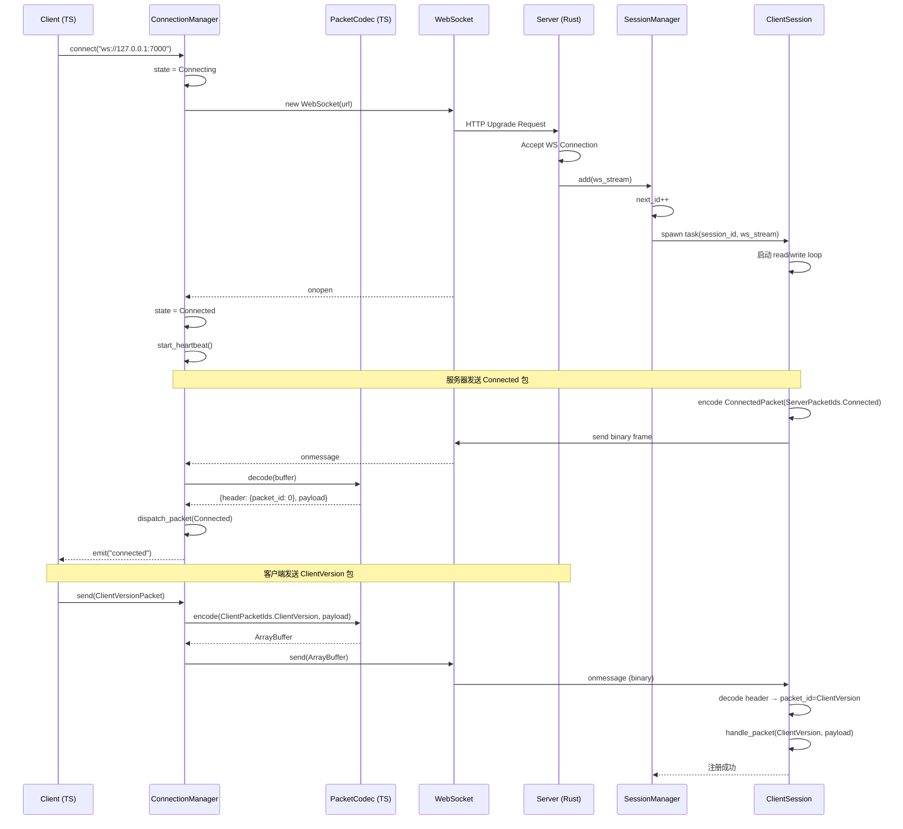
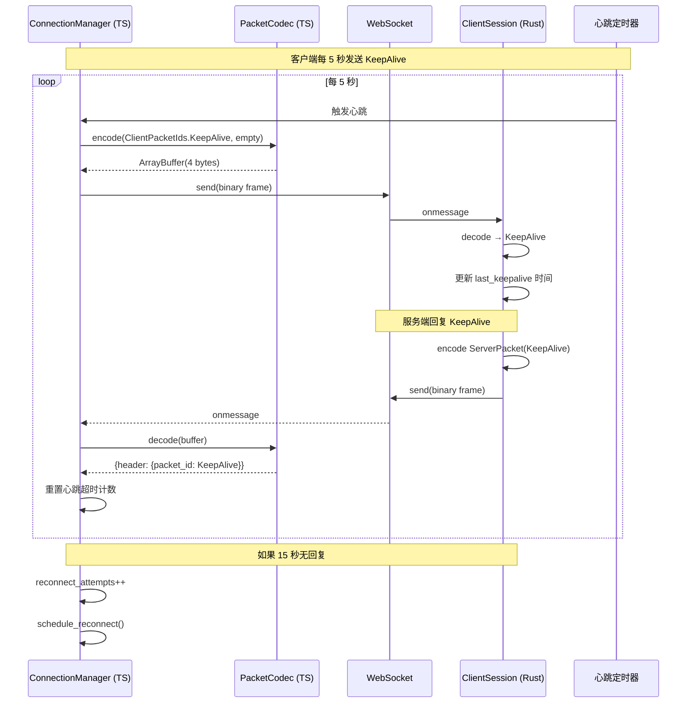
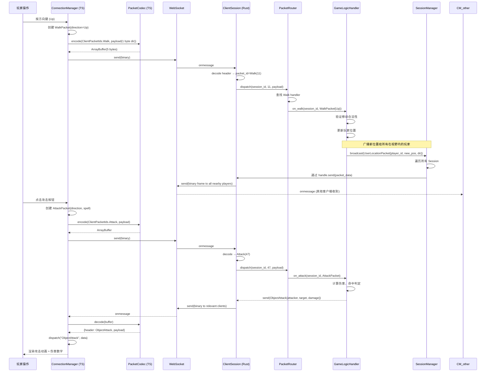
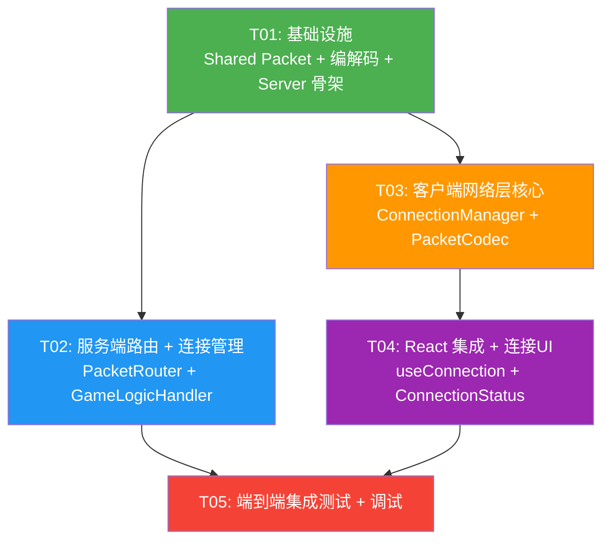

# Crystal Mir2 — T02 网络层 + 协议编解码架构设计

> **作者**: Bob (Architect)  
> **项目**: Crystal Mir2 传奇2游戏服务端重写  
> **阶段**: T02 — 网络层与包协议  
> **日期**: 2025-07  

---

## 目录

1. [Part A: 系统设计](#part-a-系统设计)
   - [1. 实现方案](#1-实现方案)
   - [2. 文件列表](#2-文件列表)
   - [3. 数据结构和接口（类图）](#3-数据结构和接口类图)
   - [4. 程序调用流程（时序图）](#4-程序调用流程时序图)
   - [5. 待明确事项](#5-待明确事项)
2. [Part B: 任务分解](#part-b-任务分解)
   - [6. 依赖包列表](#6-依赖包列表)
   - [7. 任务列表](#7-任务列表)
   - [8. 共享知识](#8-共享知识)
   - [9. 任务依赖图](#9-任务依赖图)

---

# Part A: 系统设计

## 1. 实现方案

### 1.1 核心技术挑战

| 挑战 | 说明 | 解决策略 |
|------|------|----------|
| **二进制兼容** | 包格式必须与原始 Crystal 服务端兼容（小端 u16 PacketID + u16 Length + 变长 Payload） | 两端严格基于同一规范编解码，单元测试验证二进制一致性 |
| **大量 Packet 类型** | ServerPacketIds 279 个 + ClientPacketIds 152 个 = 431 个包类型 | 采用 Packet ID 分发 + 注册表模式，避免巨型 match 表达式 |
| **并发连接管理** | 服务端需同时管理数百个 WebSocket 连接 | Tokio 异步 + Session Actor 模型 |
| **浏览器兼容** | 浏览器原生 WebSocket 只支持文本/二进制帧，需手动管理字节序 | 使用 DataView + ArrayBuffer，严格按照小端序编码 |

### 1.2 框架选型

#### Rust 服务端

| 组件 | 技术选型 | 理由 |
|------|----------|------|
| **异步运行时** | Tokio（已有） | 项目已配置，业界标准 |
| **WebSocket** | tokio-tungstenite（已有） | workspace 已依赖，成熟稳定 |
| **二进制序列化** | binrw（已有） | Shared crate 中所有枚举已加 derive，无缝扩展 |
| **连接管理** | 自定义 Session Actor（tokio::select + mpsc） | 轻量，无需额外框架，每个 Session 一个 tokio task |
| **错误处理** | thiserror（已有） | 已配置，统一错误类型 |

#### TypeScript 客户端

| 组件 | 技术选型 | 理由 |
|------|----------|------|
| **WebSocket** | 浏览器原生 WebSocket API | 无需第三方库，已在所有现代浏览器支持 |
| **二进制编解码** | DataView / ArrayBuffer | 原生 API，手动控制字节序，性能优异 |
| **事件分发** | 自定义 EventEmitter 模式 | 轻量，与 React 松耦合 |

### 1.3 架构模式

采用 **Actor + Registry** 模式：

- **服务端**: 每个客户端连接 → 一个 `ClientSession` Actor（独立 tokio task），通过 `mpsc` channel 接收消息，通过 `tokio-tungstenite::WebSocketStream` 发送。`SessionManager` 作为中心注册表管理所有 Actor。
- **客户端**: `ConnectionManager` 封装 WebSocket 生命周期（连接、重连、心跳、消息分发），对外暴露 `connect()` / `send()` / `on()` 接口供上层游戏逻辑调用。

### 1.4 包协议格式（二进制兼容）

```
┌─────────────────────────────────────────────┐
│  PacketID: u16 (小端)  —  2 bytes            │
│  Length:   u16 (小端)  —  2 bytes (载荷长度)  │
│  Payload:  [u8; Length]  —  变长              │
└─────────────────────────────────────────────┘
总最小长度: 4 bytes（空载荷）
```

> **注意**: `Length` 只包含 Payload 的字节数，不包含 PacketID 和 Length 本身。

---

## 2. 文件列表

### 2.1 Rust 端（Shared + Server）

```
Shared/src/
├── lib.rs                          # [修改] 添加 pub mod packets; pub mod net;
├── enums.rs                        # [不变] 已有 59 个枚举
├── types.rs                        # [不变] 已有 Point, StatRange, Stats
├── packets/
│   ├── mod.rs                      # [新增] Packet trait 定义，PacketCodec，PacketID 枚举
│   ├── client.rs                   # [新增] 客户端→服务端包结构体（Walk, Attack, Chat, Magic 等）
│   ├── server.rs                   # [新增] 服务端→客户端包结构体（UserLocation, ObjectPlayer, Chat 等）
│   └── handshake.rs                # [新增] 握手包（ClientVersion, Connected, ServerVersion）
├── net/
│   ├── mod.rs                      # [新增] 网络模块入口
│   ├── packet_id.rs                # [新增] ServerOpcode / ClientOpcode 枚举（对应 packets.ts）
│   └── error.rs                    # [新增] 网络错误类型

Server/src/
├── main.rs                         # [修改] 启动 WS 服务器
├── lib.rs                          # [修改] 添加 pub mod network;
├── config.rs                       # [不变] 已有配置
├── network/
│   ├── mod.rs                      # [新增] 网络模块入口
│   ├── server.rs                   # [新增] WebSocket 监听、Accept 循环
│   ├── session.rs                  # [新增] ClientSession Actor（单连接生命周期）
│   ├── session_manager.rs          # [新增] SessionManager 全局注册表
│   └── handler.rs                  # [新增] 包分发处理（PacketID → handler 映射）
```

### 2.2 TypeScript 端（Client）

```
Client/src/
├── main.tsx                        # [不变]
├── App.tsx                         # [修改] 集成 ConnectionManager，添加连接状态 UI
├── types/
│   ├── enums.ts                    # [不变] 已有 20+ const enum
│   └── packets.ts                  # [不变] 已有 ServerPacketIds / ClientPacketIds
├── network/
│   ├── index.ts                    # [新增] 网络模块导出
│   ├── connection.ts               # [新增] ConnectionManager 类（WS 连接管理）
│   ├── codec.ts                    # [新增] PacketCodec 编解码（DataView 实现）
│   ├── packets/
│   │   ├── index.ts                # [新增] 包注册表导出
│   │   ├── server_packets.ts       # [新增] 服务端→客户端包接口定义（IUserLocation, IObjectPlayer 等）
│   │   └── client_packets.ts       # [新增] 客户端→服务端包接口定义 + 序列化函数
│   └── types.ts                    # [新增] 网络层类型定义（PacketHeader, ConnectionState 等）
├── hooks/
│   └── useConnection.ts            # [新增] React Hook，封装 ConnectionManager
└── components/
    └── ConnectionStatus.tsx        # [新增] 连接状态指示器组件
```

---

## 3. 数据结构和接口（类图）

### 3.1 Rust 端核心类图

```mermaid
classDiagram
    %% ===== Shared/Packets =====
    class Packet {
        <<trait>>
        +packet_id() u16
        +read(buf: &mut Cursor~u8~) Result~Self~
        +write(&self, buf: &mut Vec~u8~) Result~()~
    }
    note for Packet "所有具体包实现此 trait"

    class PacketCodec {
        +encode(packet: &dyn Packet) Vec~u8~
        +decode(buf: &[u8]) Result~(u16, Vec~u8~)~
        -read_header(buf: &[u8]) Result~(u16, u16)~
    }
    note for PacketCodec "PacketID + Length 解析"

    class ServerPacketId {
        <<enum u16>>
        Connected = 0
        ClientVersion = 1
        Disconnect = 2
        KeepAlive = 3
        ... ~279 个
    }
    class ClientPacketId {
        <<enum u16>>
        ClientVersion = 0
        Disconnect = 1
        KeepAlive = 2
        ... ~152 个
    }

    class ClientPacket {
        <<trait>>
        +packet_id() ClientPacketId
    }
    class ServerPacket {
        <<trait>>
        +packet_id() ServerPacketId
    }

    Packet <|.. ClientPacket
    Packet <|.. ServerPacket

    %% 客户端→服务端包示例
    class WalkPacket {
        +direction: MirDirection
        +packet_id() ClientPacketId
        +read(buf: &mut Cursor~u8~) Result~Self~
        +write(&self, buf: &mut Vec~u8~) Result~()~
    }
    class AttackPacket {
        +direction: MirDirection
        +spell: Spell
        +packet_id() ClientPacketId
        +read(buf: &mut Cursor~u8~) Result~Self~
        +write(&self, buf: &mut Vec~u8~) Result~()~
    }
    class ChatPacket {
        +message: String
        +packet_id() ClientPacketId
        +read(buf: &mut Cursor~u8~) Result~Self~
        +write(&self, buf: &mut Vec~u8~) Result~()~
    }
    class KeepAlivePacket {
        +packet_id() ClientPacketId
        +read(buf: &mut Cursor~u8~) Result~Self~
        +write(&self, buf: &mut Vec~u8~) Result~()~
    }
    ClientPacket <|.. WalkPacket
    ClientPacket <|.. AttackPacket
    ClientPacket <|.. ChatPacket
    ClientPacket <|.. KeepAlivePacket

    %% 服务端→客户端包示例
    class UserLocationPacket {
        +location: Point
        +direction: MirDirection
        +packet_id() ServerPacketId
        +read(buf: &mut Cursor~u8~) Result~Self~
        +write(&self, buf: &mut Vec~u8~) Result~()~
    }
    class ObjectPlayerPacket {
        +object_id: u32
        +name: String
        +class: MirClass
        +gender: MirGender
        +location: Point
        +direction: MirDirection
        +packet_id() ServerPacketId
        +read(buf: &mut Cursor~u8~) Result~Self~
        +write(&self, buf: &mut Vec~u8~) Result~()~
    }
    class ServerMessagePacket {
        +message: String
        +chat_type: ChatType
        +packet_id() ServerPacketId
        +read(buf: &mut Cursor~u8~) Result~Self~
        +write(&self, buf: &mut Vec~u8~) Result~()~
    }
    class ConnectedPacket {
        +packet_id() ServerPacketId
        +read(buf: &mut Cursor~u8~) Result~Self~
        +write(&self, buf: &mut Vec~u8~) Result~()~
    }
    ServerPacket <|.. UserLocationPacket
    ServerPacket <|.. ObjectPlayerPacket
    ServerPacket <|.. ServerMessagePacket
    ServerPacket <|.. ConnectedPacket

    class NetError {
        <<enum>>
        +IoError(std::io::Error)
        +BinReadError(binrw::Error)
        +InvalidPacketId(u16)
        +ConnectionClosed
        +PacketTooLarge(u16)
    }

    PacketCodec --> Packet : 使用
    PacketCodec ..> NetError : 产生

    %% ===== Server/Network =====
    class SessionManager {
        -sessions: HashMap~u32, ClientSessionHandle~
        -next_id: AtomicU32
        +add(connection: WebSocketStream) ClientSessionHandle
        +remove(session_id: u32)
        +broadcast(packet: &dyn ServerPacket)
        +get(session_id: u32) Option~ClientSessionHandle~
        +session_count() usize
    }

    class ClientSession {
        -session_id: u32
        -ws_stream: WebSocketStream
        -rx: mpsc::Receiver~Vec~u8~~
        +run() Result~()~
        +handle_packet(packet_id: u16, payload: &[u8])
        +send_raw(data: Vec~u8~)
        -send_packet(packet: &dyn Packet)
        +close()
    }
    note for ClientSession "一个 Tokio task 管理一个连接"

    class ClientSessionHandle {
        -session_id: u32
        -tx: mpsc::Sender~Vec~u8~~
        +send(packet: &dyn Packet)
        +close()
    }

    class PacketRouter {
        +register_handler(packet_id: u16, handler: fn(session, payload))
        +dispatch(session_id: u32, packet_id: u16, payload: &[u8])
    }
    note for PacketRouter "注册表模式分发"

    class GameLogicHandler {
        +on_walk(session_id: u32, packet: WalkPacket)
        +on_attack(session_id: u32, packet: AttackPacket)
        +on_chat(session_id: u32, packet: ChatPacket)
        +on_keep_alive(session_id: u32, packet: KeepAlivePacket)
    }

    SessionManager --> ClientSession : 管理
    ClientSession --> ClientSessionHandle : 创建
    SessionManager --> ClientSessionHandle : 返回给外部
    ClientSession ..> PacketCodec : 使用
    ClientSession ..> PacketRouter : 使用
    PacketRouter --> GameLogicHandler : 路由到
    GameLogicHandler ..> SessionManager : 通过 Handle 回发
    ClientSessionHandle --> ClientSession : 通过 mpsc 通信
```



### 3.2 TypeScript 端核心类图

```mermaid
classDiagram
    class ConnectionState {
        <<enum>>
        +Disconnected
        +Connecting
        +Connected
        +Reconnecting
    }

    class ConnectionManager {
        -url: string
        -ws: WebSocket | null
        -state: ConnectionState
        -listeners: Map~string, Function[]~
        -reconnect_timer: number | null
        -reconnect_attempts: number
        -heartbeat_interval: number | null
        +connect(url: string): void
        +disconnect(): void
        +send(packet: ClientPacket): void
        +on(event: string, cb: Function): void
        +off(event: string, cb: Function): void
        -on_open(): void
        -on_message(ev: MessageEvent): void
        -on_close(): void
        -on_error(): void
        -schedule_reconnect(): void
        -start_heartbeat(): void
        -stop_heartbeat(): void
        -dispatch_packet(header: PacketHeader, payload: ArrayBuffer): void
        +get_state(): ConnectionState
    }
    note for ConnectionManager "单例模式，管理 WS 生命周期"

    class PacketCodec {
        <<static>>
        +encode(packet_id: u16, payload: ArrayBuffer): ArrayBuffer
        +decode(buffer: ArrayBuffer): PacketParseResult
        +create_header(packet_id: u16, length: u16): ArrayBuffer
        +read_header(buffer: ArrayBuffer): PacketHeader
    }
    note for PacketCodec "DataView 实现，小端序"

    class PacketHeader {
        +packet_id: number
        +length: number
    }

    class PacketParseResult {
        +header: PacketHeader
        +payload: ArrayBuffer
    }

    class ClientPacket {
        <<interface>>
        +packet_id(): number
        +serialize(): ArrayBuffer
    }

    class WalkPacket {
        +direction: MirDirection
        +packet_id(): number
        +serialize(): ArrayBuffer
    }

    class AttackPacket {
        +direction: MirDirection
        +spell: Spell
        +packet_id(): number
        +serialize(): ArrayBuffer
    }

    class ServerPacketTypes {
        <<interface>>
        +UserLocation: IUserLocation
        +ObjectPlayer: IObjectPlayer
        +Chat: IServerMessage
        +Connected: IConnected
    }

    class IUserLocation {
        <<interface>>
        +location: {x: number, y: number}
        +direction: MirDirection
    }
    class IObjectPlayer {
        <<interface>>
        +object_id: number
        +name: string
        +class: MirClass
        +gender: MirGender
        +location: {x: number, y: number}
        +direction: MirDirection
    }

    class useConnection {
        +state: ConnectionState
        +connect(url: string): void
        +disconnect(): void
        +send(packet: ClientPacket): void
        +on_server_packet(id: ServerPacketIds, handler): void
    }
    note for useConnection "React Hook，封装 ConnectionManager"

    PacketCodec --> PacketHeader : 解析
    PacketCodec --> PacketParseResult : 产出
    ConnectionManager --> PacketCodec : 使用编解码
    ConnectionManager --> ConnectionState : 维护状态
    ClientPacket <|.. WalkPacket : 实现
    ClientPacket <|.. AttackPacket : 实现
    useConnection --> ConnectionManager : 包装
    ServerPacketTypes --> IUserLocation : 定义
    ServerPacketTypes --> IObjectPlayer : 定义
```

---

## 4. 程序调用流程（时序图）

### 4.1 客户端连接建立握手流程



### 4.2 心跳包收发流程



### 4.3 玩家移动/攻击包收发流程



---

## 5. 待明确事项

| 编号 | 问题 | 影响 |
|------|------|------|
| Q1 | 原始 Crystal 服务端包载荷的精确二进制布局（各字段顺序、字符串编码方式） | 影响所有 pack/unpack 实现，需参考原版 C# 源码或抓包 |
| Q2 | 心跳超时阈值具体数值（服务端主动断开空闲连接的时间） | 影响客户端重连策略 |
| Q3 | 字符串字段编码 — 原始 Crystal 使用的是 ASCII / UTF-8 / 带长度前缀？ | 影响编解码实现 |
| Q4 | 包载荷中是否包含尾部填充字节（padding）？ | 影响解析逻辑 |
| Q5 | 本次 T02 阶段是否只实现部分关键包（KeepAlive, Walk, Attack, Chat, UserLocation, ObjectPlayer）作为最小可用协议，还是需要一次性实现所有 431 个包？ | 影响任务范围和实现顺序 |

**假设**: 字符串编码默认使用 **带长度前缀的 UTF-8**（2 字节 u16 长度 + 变长 UTF-8 数据），与 `binrw` 的默认方式一致。

---

# Part B: 任务分解

## 6. 依赖包列表

### 6.1 Rust 端（Cargo.toml 新增依赖）

**workspace Cargo.toml** — 已有依赖已覆盖：
```
# 以下已在 workspace.dependencies 中，无需新增：
# tokio, futures-util, tokio-tungstenite, binrw, 
# serde, tracing, anyhow, thiserror
```

**Shared/Cargo.toml** — 新增依赖：
```
# 无需新增，binrw + serde 已配置
```

**Server/Cargo.toml** — 无需新增，所有依赖已在 workspace 中。

### 6.2 TypeScript 端（package.json 新增依赖）

```
# 无需新增第三方包
# 浏览器原生 WebSocket + DataView 均为标准 API
```

---

## 7. 任务列表

> **⚠️ 任务总数上限 5 个，按依赖关系排列**

### T01 — 项目基础设施

| 字段 | 值 |
|------|-----|
| **Task ID** | T01 |
| **名称** | 基础设施：Shared Packet 定义 + 编解码核心 + Server 网络框架骨架 |
| **优先级** | P0 |
| **依赖** | 无 |

**源文件（新增/修改）**:
- `Shared/src/lib.rs` — 添加 `pub mod packets; pub mod net;`
- `Shared/src/packets/mod.rs` — `Packet` trait, `PacketCodec`, 包协议常量和错误类型
- `Shared/src/packets/client.rs` — 客户端→服务端包结构体（Walk, Attack, Chat, KeepAlive 等初始集）
- `Shared/src/packets/server.rs` — 服务端→客户端包结构体（UserLocation, ObjectPlayer, ServerMessage, Connected 等初始集）
- `Shared/src/packets/handshake.rs` — 握手类包（ClientVersion, Connected）
- `Shared/src/net/mod.rs` — 网络模块入口
- `Shared/src/net/packet_id.rs` — `ServerOpcode` / `ClientOpcode` 枚举（对应 packets.ts）
- `Shared/src/net/error.rs` — `NetError` 枚举（binrw/io/invalid-packet-id 等）
- `Server/src/lib.rs` — 添加 `pub mod network;`
- `Server/src/network/mod.rs` — 网络模块入口
- `Server/src/network/server.rs` — `WebSocketServer` struct（监听端口、accept 循环骨架）
- `Server/src/network/session.rs` — `ClientSession` struct（连接 read/write loop 骨架）
- `Server/src/network/session_manager.rs` — `SessionManager`（注册表 + add/remove/broadcast）
- `Server/src/main.rs` — 添加 `server::network::start()` 调用，在配置端口启动 WS 服务

**交付物**: 
- 完整的 Packet trait 定义，PacketCodec 实现（小端 u16 header 解析）
- 10 个核心包结构体（Walk, Attack, Chat, KeepAlive, Connected, ClientVersion, UserLocation, ObjectPlayer, ServerMessage, Disconnect）
- ServerOpcode / ClientOpcode 枚举（包含所有 279+152 个 ID）
- WebSocket Server 能启动监听，accept 连接，创建 Session
- Session 能收发二进制帧并正确解析 PacketID + Length

---

### T02 — 服务端包路由 + 连接生命管理

| 字段 | 值 |
|------|-----|
| **Task ID** | T02 |
| **名称** | 服务端：PacketRouter + GameLogicHandler + Session 完整生命周期 |
| **优先级** | P0 |
| **依赖** | T01 |

**源文件（新增/修改）**:
- `Server/src/network/handler.rs` — `PacketRouter`（注册表模式分发） + `GameLogicHandler`（Walk/Attack/Chat 等处理函数桩）
- `Server/src/network/session.rs` — 完善：心跳超时检测、优雅关闭、异常断开重连处理
- `Server/src/network/session_manager.rs` — 完善：广播（给所有/附近玩家）、按 ID 查询、连接计数
- `Server/src/network/server.rs` — 完善：优雅关闭（signal 处理）、TLS 可选支持

**交付物**:
- PacketRouter 支持 handler 注册和 dispatch
- GameLogicHandler 包含 Walk/Attack/Chat/KeepAlive 的处理函数（可简化为日志 + 回复）
- Session 支持 15 秒心跳超时断开
- SessionManager 支持 broadcast（遍历所有 session 发送）
- 服务器支持 Ctrl+C 优雅关闭所有连接

---

### T03 — 客户端网络层核心

| 字段 | 值 |
|------|-----|
| **Task ID** | T03 |
| **名称** | 客户端：ConnectionManager + PacketCodec + 包类型定义 |
| **优先级** | P0 |
| **依赖** | T01 |

**源文件（新增/修改）**:
- `Client/src/network/index.ts` — 模块导出
- `Client/src/network/codec.ts` — `PacketCodec`（encode/decode 使用 DataView 小端序）
- `Client/src/network/connection.ts` — `ConnectionManager`（连接、重连、心跳、消息派发）
- `Client/src/network/types.ts` — `ConnectionState` 枚举、`PacketHeader`/`PacketParseResult` 接口
- `Client/src/network/packets/index.ts` — 包注册表导出
- `Client/src/network/packets/client_packets.ts` — `WalkPacket`、`AttackPacket`、`ChatPacket` 等客户端包类（含 `serialize()`）
- `Client/src/network/packets/server_packets.ts` — `IUserLocation`、`IObjectPlayer`、`IServerMessage` 等服务端包接口定义 + 反序列化函数

**交付物**:
- PacketCodec 能正确编解码二进制包（小端 u16 PacketID + u16 Length + payload）
- ConnectionManager 支持 connect/disconnect/自动重连（指数退避）
- 5 秒心跳 KeepAlive 定时发送
- 服务端包反序列化函数（Connected, UserLocation, ObjectPlayer, ServerMessage, KeepAlive, Disconnect）
- 客户端包序列化方法（Walk, Attack, Chat, KeepAlive, ClientVersion, LogOut）

---

### T04 — React 集成 + 连接状态 UI

| 字段 | 值 |
|------|-----|
| **Task ID** | T04 |
| **名称** | 客户端：React Hooks + 连接状态组件 + App 集成 |
| **优先级** | P1 |
| **依赖** | T03 |

**源文件（新增/修改）**:
- `Client/src/hooks/useConnection.ts` — React Hook，封装 ConnectionManager 单例，暴露 state/send/on_server_packet
- `Client/src/components/ConnectionStatus.tsx` — MUI Chip 显示连接状态（绿色 Connected / 黄色 Connecting / 红色 Disconnected）
- `Client/src/App.tsx` — 集成 ConnectionStatus，初始化 useConnection，连接至服务器

**交付物**:
- useConnection Hook（React state 驱动 ConnectionManager 状态）
- ConnectionStatus 组件（MUI Chip + 颜色指示）
- App 启动后自动连接 `ws://localhost:7000`
- 断开自动重连并更新 UI

---

### T05 — 端到端集成测试 + 调试工具

| 字段 | 值 |
|------|-----|
| **Task ID** | T05 |
| **名称** | 端到端集成测试 + 日志与调试 |
| **优先级** | P1 |
| **依赖** | T02, T04 |

**源文件（修改）**:
- `Server/src/main.rs` — 添加更详细启动日志（打印绑定地址、已注册 handler 列表）
- `Server/src/network/server.rs` — 添加连接/断连日志
- `Server/src/network/session.rs` — 添加包收发调试日志（tracing::trace!）
- `Server/Cargo.toml` — 可选添加 `tracing-subscriber` 增强配置
- `Client/src/network/connection.ts` — 添加 on/off 日志事件
- `Client/src/App.tsx` — 添加简单日志面板（显示最近收到的包、连接事件）

**交付物**:
- 端到端验证：客户端连接 → 握手 → 心跳 → 发送 Walk → 服务端回复 → 客户端渲染
- 服务端 tracing 日志（info: 连接/断连, debug: 包收发, trace: 字节级）
- 客户端简单日志面板（最近的包类型和时间戳）
- 测试指南文档

---

## 8. 共享知识

### 8.1 字节序约定

| 项目 | 约定 |
|------|------|
| **字节序** | **小端（Little-Endian）** — 与原始 Crystal 服务端兼容 |
| Rust 端 | `binrw` 属性 `#[brw(little)]`（枚举已有） |
| TS 端 | `DataView.getUint16(offset, **true**)` / `DataView.setUint16(offset, value, **true**)` |

### 8.2 包协议格式

```
所有包: [PacketID: u16 LE][Length: u16 LE][Payload: u8[Length]]

- PacketID: 操作码，对应 ServerPacketIds / ClientPacketIds
- Length: Payload 部分的字节数（不包含 PacketID 和 Length 本身）
- Payload: 包体数据
```

### 8.3 Packet ID 映射规则

| 源 | 类型 | 命名规则 |
|----|------|----------|
| Rust ServerOpcode | `enum u16` | 值与 TS `ServerPacketIds` 一致 |
| Rust ClientOpcode | `enum u16` | 值与 TS `ClientPacketIds` 一致 |
| TS ServerPacketIds | `const enum` | 值必须与 Rust ServerOpcode 一致 |
| TS ClientPacketIds | `const enum` | 值必须与 Rust ClientOpcode 一致 |

> **验证方式**: 两端各有一个恒等测试，确保枚举值 1:1 匹配。

### 8.4 字符串编码

| 场景 | 编码方式 |
|------|----------|
| 包中字符串 | **2 字节 u16 长度前缀 + UTF-8 编码数据** |
| Rust 端 | `binrw` 默认行为即可 |
| TS 端 | `TextEncoder.encode()` → `u16 length + bytes` |

### 8.5 错误处理约定

| 层 | 错误类型 | 处理方式 |
|----|----------|----------|
| **Rust 网络层** | `NetError` | 使用 `thiserror` 定义，`?` 传播 |
| **Rust Session** | 解析失败 | 日志警告 + 断开连接 |
| **Rust Session** | 非法 PacketID | 日志警告 + 丢弃包 |
| **TS 网络层** | 连接断开 | 触发 `close` 事件 → 自动重连 |
| **TS 网络层** | 解析失败 | `console.warn` + 丢弃该帧 |
| **心跳超时** | 服务端 15 秒无回复 | 主动断开 + 重连 |

### 8.6 Session ID 管理

| 项目 | 约定 |
|------|------|
| Session ID 类型 | `u32` |
| 分配方式 | 从 1 开始递增（SessionManager 内部 AtomicU32） |
| Session ID 0 | 保留，无效 |

### 8.7 TS 客户端 ConnectionManager 事件

```
"connected"       — 连接建立成功（收到 ServerPacketIds.Connected）
"disconnected"    — 连接断开
"reconnecting"    — 正在重连
"packet"          — 收到任何包（通用事件，参数: {packet_id, payload}）
"error"           — 连接错误
+ 每个 ServerPacketIds 名称作为独立事件名（如 "KeepAlive", "UserLocation"）
```

---

## 9. 任务依赖图



### 实现顺序建议

```
T01 (基础设施) ──┬──→ T02 (服务端路由) ──┐
                 │                       ├──→ T05 (端到端集成)
                 └──→ T03 (客户端核心) ──→ T04 (React 集成) ──┘
```

- **T01** 是所有后续任务的基础，必须最先完成
- **T02** 和 **T03** 可并行开发（分别由 Rust 和 TS 开发者推进）
- **T04** 依赖 T03，而 **T05** 依赖 T02 和 T04（需两端就绪才能端到端测试）
